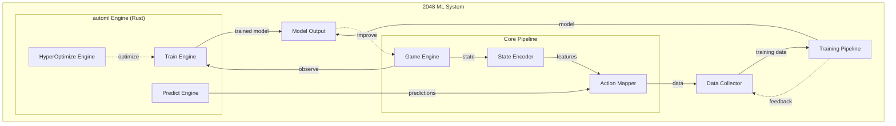

# 2048 ML System — Project Overview

> **Project:** 2048 Machine Learning System
> **Version:** 1.0.0
> **Author:** Evintkoo
> **Created:** 2026-09-22
> **Status:** Planning

---

## 1. Purpose

This project builds a machine learning system that uses the Evintkoo/automl framework (Rust-based AutoML) to find the maximum achievable score ceiling for each candidate algorithm in the 2048 game. The system serves as both a practical application and a research platform for evaluating automl capabilities on sequential decision-making problems.

## 2. Goals

1. **Primary:** Find the maximum score ceiling for each candidate algorithm using the automl module
2. **Evaluation:** Benchmark the ceiling capability of automl to determine its actual quality on sequential decision-making problems
3. **Research:** Identify which machine learning algorithm achieves the highest score ceiling in the 2048 game

## 3. Scope

### In Scope
- 2048 game environment creation and simulation
- State representation and feature engineering
- Action space definition and encoding
- Model training using automl engine
- Data collection and management
- Benchmarking and evaluation
- Research report using IMRD standard

### Out of Scope
- Using automl via frontend to run training (CLI/API only)
- Game UI development (headless simulation only)
- Model deployment as a web service
- Mobile or desktop application wrappers

## 4. Architecture Overview

## 5. Technology Stack

| Component | Technology |
|-----------|-----------|
| AutoML Framework | automl v1.0.0 (Rust) |
| Language | Rust (primary), Python (scripts) |
| Game Engine | Custom Rust implementation |
| Data Format | CSV/Parquet (via polars) |
| Training | automl TrainEngine |
| Optimization | HyperOptX (TPE, Bayesian, Grid) |
| Evaluation | Custom benchmarking suite |

## 6. Dependencies

- **automl submodule:** `https://github.com/Evintkoo/automl`
  - Path: `/Users/evintleovonzko/Documents/projects/evint/2048-ml/automl`
  - Provides: TrainEngine, TrainingConfig, ModelType, HyperOptX, InferenceEngine

## 7. Key Constraints

1. Must use **only** the automl module for ML training (no external ML libraries)
2. Must not use automl via frontend (CLI/API only)
3. All training must be reproducible (seed-based)
4. System must collect data for research validation

## 8. Success Criteria

### Tier 1: Minimum Viable Milestone
- Determine each model's score ceiling (maximum achievable score) through systematic evaluation
- Establish baseline ceilings for Random Forest, Gradient Boosting, XGBoost, and other candidates
- Full data pipeline from game simulation to trained model works end-to-end
- Automated model selection identifies a viable algorithm

### Tier 2: Intermediate Milestone
- Identify the top-performing model by ceiling comparison
- Training pipeline is fully automated and reproducible
- Model comparison demonstrates clear ceiling differences between algorithms
- Training pipeline is fully automated and reproducible
- Model comparison demonstrates clear performance differences between algorithms

### Tier 3: Advanced Milestone
- The highest-ceiling model achieves score ≥ 2048 in meaningful trials
- Benchmark results demonstrate automl capability on sequential decision-making
- Comprehensive IMRD research report published
- Benchmark results demonstrate meaningful automl capability on sequential games
- Comprehensive IMRD research report published with validated findings

### Tier 4: Stretch Goal
- The best model's ceiling approaches theoretical maximum (2048 tile or beyond)
- Statistical evidence shows one algorithm significantly outperforms others
- Research findings contribute to understanding of automl on sequential decision-making
- Best model identified and documented with strong statistical evidence
- Research findings contribute to understanding of automl on sequential decision-making

### Non-Negotiable Criteria (All Tiers)
- Automated model selection identifies best algorithm
- Comprehensive IMRD research report published
- Benchmark results demonstrate automl capability on sequential games
