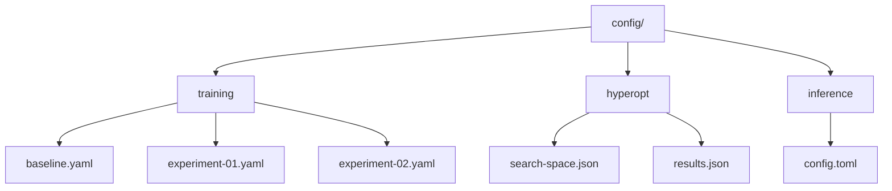

# AutoML Configuration

## 1. Overview

The automl framework provides `TrainingConfig` and `OptimizationConfig` structures that must be configured for the 2048 game training pipeline. This document defines the configurations used throughout the project.

## 2. Training Configuration

### 2.1 Base Configuration

```rust
use automl::{TrainingConfig, TaskType, ModelType};

let config = TrainingConfig::new(TaskType::Regression, "score")
    .with_model(ModelType::Auto)  // Auto-select best model
    .with_cv(5)                    // 5-fold cross-validation
    .with_random_state(42)         // Reproducible
    .with_max_depth(6)             // Tree depth limit
    .with_n_estimators(100)        // Ensemble size
    .with_learning_rate(0.1)       // Boosting rate
    .with_validation_split(0.2);   // 80/20 split
```

### 2.2 Task Type for 2048

Since 2048 is a game where the goal is to maximize the score, the task type is **Regression**:

| Property | Value | Rationale |
|----------|-------|-----------|
| TaskType | `Regression` | Score is a continuous value |
| Target | `score` | Maximum tile value achieved |
| Metric | `r2` / `rmse` | Standard regression metrics |
| Validation | 5-fold CV | Robust evaluation |

### 2.3 Model Type Strategy

```rust
// Phase 1: Auto-selection
ModelType::Auto

// Phase 2: Top candidates
vec![ModelType::GradientBoosting, ModelType::RandomForest, ModelType::XGBoost]

// Phase 3: Fine-tuning
ModelType::GradientBoosting  // Best for sequential decisions
```

## 3. Hyperparameter Optimization Configuration

```rust
use automl::{OptimizationConfig, SearchSpace, Parameter, ParameterType};

let opt_config = OptimizationConfig::default()
    .with_direction(OptimizeDirection::Maximize)
    .with_n_trials(100)
    .with_n_jobs(None)
    .with_pruner(MedianPruner::new());

let mut search_space = SearchSpace::new();
search_space.add(Parameter::new("n_estimators", ParameterType::Int(50, 300)));
search_space.add(Parameter::new("max_depth", ParameterType::Int(3, 10)));
search_space.add(Parameter::new("learning_rate", ParameterType::Float(0.01, 0.5)));
search_space.add(Parameter::new("subsample", ParameterType::Float(0.5, 1.0)));
search_space.add(Parameter::new("colsample_bytree", ParameterType::Float(0.5, 1.0)));
```

## 4. Inference Configuration

```rust
use automl::InferenceConfig;

let infer_config = InferenceConfig::default()
    .with_batch_size(64)
    .with_use_caching(true)
    .with_num_threads(4);
```

## 5. Configuration Files

All configurations will be stored in `config/` directory:



## 6. Configuration Versioning

All configuration changes will be tracked via git. Configuration files will include:

- **Version:** Semantic version of the config schema
- **Timestamp:** ISO 8601 timestamp
- **Author:** User who made the change
- **Notes:** Rationale for configuration choices
