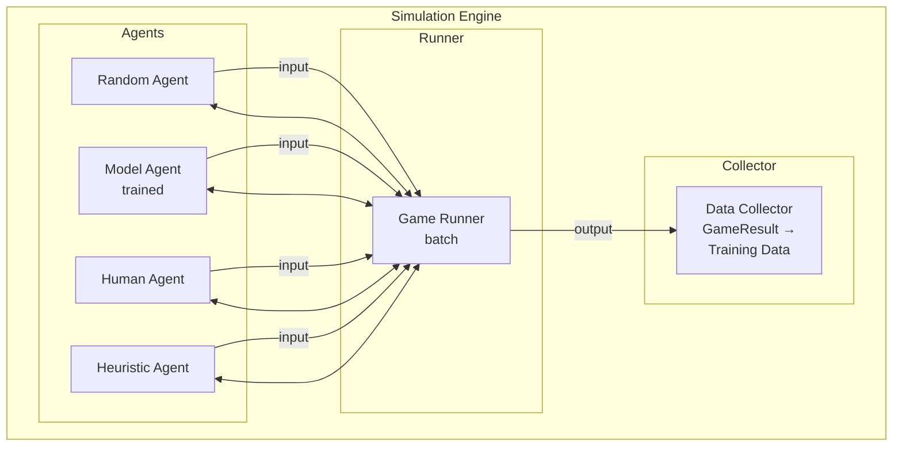

# Simulation Engine

## 1. Purpose

The simulation engine runs thousands of 2048 games to generate training data for the ML model. It supports different agent strategies for data collection.

## 2. Architecture



## 3. Agent Types

### 3.1 Random Agent

```rust
pub struct RandomAgent {
    rng: ChaCha8Rng,
}

impl Agent for RandomAgent {
    fn select_move(&self, board: &Board) -> Direction {
        let valid = board.get_valid_moves();
        valid[self.rng.gen_range(0..valid.len())]
    }
}
```

**Purpose:** Baseline comparison, data generation when no model is available.

### 3.2 Model Agent

```rust
pub struct ModelAgent {
    model: InferenceEngine,  // automl model
}

impl Agent for ModelAgent {
    fn select_move(&self, board: &Board) -> Direction {
        let features = board_features(board);
        let outputs = self.model.predict(&features);
        output_to_action(&outputs)
    }
}
```

**Purpose:** Trained model evaluates board states and selects moves.

### 3.3 Heuristic Agent

```rust
pub struct HeuristicAgent {
    strategy: HeuristicStrategy,
}

impl Agent for HeuristicAgent {
    fn select_move(&self, board: &Board) -> Direction {
        match self.strategy {
            HeuristicStrategy::Monotonicity => best_monotonic_move(board),
            HeuristicStrategy::Corner => best_corner_move(board),
            HeuristicStrategy::Empty => best_empty_tile_move(board),
        }
    }
}
```

**Purpose:** Baseline heuristic comparison.

## 4. Batch Simulation

```rust
pub struct SimulationBatch {
    pub n_games: usize,
    pub agent: Box<dyn Agent>,
    pub config: BatchConfig,
}

impl SimulationBatch {
    pub fn run(&self) -> Vec<GameResult> {
        (0..self.n_games)
            .map(|_| self.run_single_game())
            .collect()
    }
    
    pub fn run_parallel(&self) -> Vec<GameResult> {
        use rayon::prelude::*;
        (0..self.n_games)
            .into_par_iter()
            .map(|_| self.run_single_game())
            .collect()
    }
}
```

## 5. Game Recording

Every game records the complete state history:

```rust
pub struct GameRecord {
    pub game_id: Uuid,
    pub agent_type: AgentType,
    pub start_time: DateTime<Utc>,
    pub end_time: DateTime<Utc>,
    pub final_result: GameResult,
    pub move_history: Vec<MoveRecord>,     // Each move + state
    pub board_history: Vec<BoardSnapshot>,  // Board at each step
    pub score_history: Vec<u64>,           // Score progression
}
```

## 6. Performance Metrics

```rust
pub struct SimulationMetrics {
    pub total_games: usize,
    pub games_played: usize,
    pub avg_score: f64,
    pub max_score: u64,
    pub median_score: u64,
    pub games_reaching_2048: usize,
    pub games_reaching_4096: usize,
    pub avg_moves_per_game: f64,
    pub avg_game_duration_ms: u64,
}
```

## 7. Configuration

```rust
pub struct SimulationConfig {
    pub n_games: usize,            // Default: 10000
    pub parallel: bool,             // Default: true
    pub threads: usize,             // Default: num_cpus
    pub seed: u64,                  // For reproducibility
    pub agent: AgentType,           // Random, Model, Heuristic
    pub log_level: LogLevel,
    pub output_format: OutputFormat, // JSON, CSV, Parquet
}
```

## 8. Data Output

```rust
// Output structure for training data
pub struct TrainingSample {
    pub state_features: [f64; 24],    // Board features + score + move count
    pub action: u8,                   // Direction (0-3)
    pub reward: f64,                  // Score delta or final score
    pub next_state: [f64; 24],        // Next board state
    pub done: bool,                   // Game over flag
}
```

