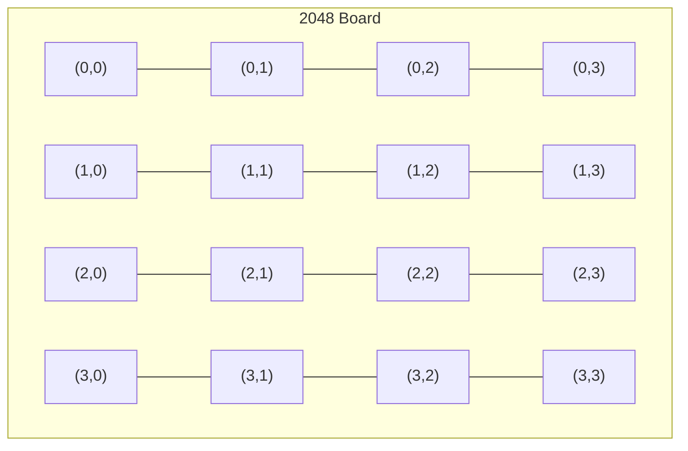

# Visualization (Debug/Inspection Only)

## 1. Scope

Visualization is limited to debugging and data inspection purposes. No web-based frontend is used per project constraints.

## 2. Terminal Visualization

### 2.1 Board Rendering



```rust
fn render_board(board: &Board) -> String {
    let mut output = String::new();
    output.push_str("+------+------+------+------+\n");
    for row in &board.grid {
        output.push_str("|");
        for cell in row {
            match cell {
                Some(val) => output.push_str(&format!("{:>5}|", val)),
                None => output.push_str("     |"),
            }
        }
        output.push_str("\n+------+------+------+------+\n");
    }
    output.push_str(&format!("Score: {}\n", board.score));
    output
}
```

### 2.2 Score Chart (Text-based)

```rust
fn render_score_chart(scores: &[u64]) -> String {
    // ASCII bar chart of score progression
}
```

### 2.3 Move Sequence Visualization

```rust
fn render_moves(moves: &[Direction], scores: &[u64]) -> String {
    // Timeline of moves with score changes
}
```

## 3. Data Export Visualization

### 3.1 SVG Board States

```rust
fn export_board_svg(board: &Board, path: &str) -> Result<()> {
    // Generate SVG file for board visualization
}
```

### 3.2 Training Progress Chart

```rust
fn export_training_chart(metrics: &[TrainingMetric], path: &str) -> Result<()> {
    // Generate chart showing score over training iterations
}
```

## 4. Dashboard Data (JSON)

```rust
pub struct DashboardData {
    pub current_game: Option<GameState>,
    pub statistics: GameStatistics,
    pub model_performance: ModelPerformance,
    pub benchmark_results: BenchmarkResults,
}

// Serialized to JSON for external visualization tools
```

## 5. Not Required

Per the project scope:
- No interactive web dashboard
- No real-time visualization
- No browser-based UI
- No mobile visualization app

All visualization outputs are static files (SVG, CSV, JSON) for external analysis tools.
