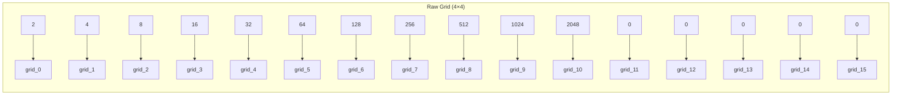

# Feature Extraction

## 1. Purpose

Extract meaningful features from the raw board state that the ML model can use to predict the best move.

## 2. Raw Features (16 dimensions)

The raw grid values flattened to a 16-dimensional vector:



## 3. Derived Features (9 additional dimensions)

### 3.1 Empty Tiles Count

```rust
fn empty_count(grid: &[u8; 16]) -> usize {
    grid.iter().filter(|&&v| v == 0).count()
}
```

**Rationale:** More empty tiles = more future options = better position.

### 3.2 Max Tile (Log)

```rust
fn max_tile_log(grid: &[u8; 16]) -> f64 {
    let max = grid.iter().copied().max().unwrap_or(0);
    if max > 0 { (max as f64).log2() / 13.0 } else { 0.0 }
}
```

**Rationale:** Normalized log-scale of the highest tile value.

### 3.3 Monotonicity

```rust
fn monotonicity(grid: &[u8; 16]) -> f64 {
    // Row monotonicity (each row sorted ascending or descending)
    // Column monotonicity (each column sorted ascending or descending)
    // Score: proportion of rows/columns that are monotonic
    let row_score = calculate_row_monotonicity(grid);
    let col_score = calculate_col_monotonicity(grid);
    (row_score + col_score) / 2.0
}
```

**Rationale:** Monotonic boards tend to perform better in 2048.

### 3.4 Smoothness

```rust
fn smoothness(grid: &[u8; 16]) -> f64 {
    // Average absolute difference between adjacent tiles
    // Lower = smoother = better
    let mut diff_sum = 0;
    for i in 0..4 {
        for j in 0..4 {
            if j < 3 { diff_sum += (grid[i*4+j] as i32 - grid[i*4+j+1] as i32).abs(); }
            if i < 3 { diff_sum += (grid[i*4+j] as i32 - grid[(i+1)*4+j] as i32).abs(); }
        }
    }
    1.0 / (1.0 + diff_sum as f64 / 100.0)  // Normalized
}
```

**Rationale:** Smoother boards have fewer merge opportunities wasted on large differences.

### 3.5 Corner Value

```rust
fn corner_value(grid: &[u8; 16]) -> f64 {
    // Value at top-left corner (most important corner)
    let val = grid[0] as f64;
    val / 2048.0  // Normalized
}
```

**Rationale:** Keeping the max tile in a corner is a common optimal strategy.

### 3.6 Available Moves

```rust
fn available_moves(grid: &[u8; 16]) -> usize {
    // Count directions that would change the board
    // 0-4 possible moves
}
```

### 3.7 Merges Available

```rust
fn merges_available(grid: &[u8; 16]) -> usize {
    // Count pairs of adjacent equal tiles
}
```

### 3.8 Score Normalized

```rust
fn score_normalized(score: u64) -> f64 {
    (score as f64) / 1000000.0  // Max theoretical score
}
```

### 3.9 Move Count Normalized

```rust
fn move_count_norm(moves: u64) -> f64 {
    (moves as f64) / 1000.0
}
```

## 4. Complete Feature Vector (25 dimensions)

```
[grid_0, grid_1, ..., grid_15, empty_count, max_tile_log, 
 monotonicity, smoothness, corner_value, available_moves, 
 merges_available, score_normalized, move_count_norm]
```

## 5. Feature Importance Analysis

```rust
// After training, check which features the model found important
pub struct FeatureImportance {
    pub grid_importance: [f64; 16],      // Per-cell importance
    pub derived_importance: [f64; 9],     // Per-derived-feature importance
    pub total_importance: [f64; 25],       // Combined
}
```

## 6. Feature Engineering Strategies

| Strategy | Features | Purpose |
|----------|----------|---------|
| Raw grid | 16 | Direct board representation |
| Statistical | 5 | Board statistics |
| Strategic | 4 | Monotonicity, smoothness, etc. |
| Combined | 25 | All features together |
| Reduced | 10 | PCA-selected features |

## 7. Feature Normalization Pipeline

```rust
use automl::preprocessing::{DataPreprocessor, PreprocessingConfig};

let preprocessor = DataPreprocessor::new(
    PreprocessingConfig::default()
        .with_scaler_type(ScalerType::Standard)  // Z-score normalization
);
let features = preprocessor.fit_transform(&raw_features)?;
```
