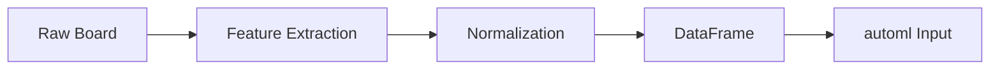

# State Encoding

## 1. Encoding Strategy

The board state must be encoded in a format compatible with the automl framework's `TrainingConfig` and `DataFrame` input.

## 2. Encoding Formats

### 2.1 CSV Format (for automl training)

```csv
grid_0,grid_1,...,grid_15,empty_count,max_tile_log,monotonicity,smoothness,corner_value,available_moves,merges_available,score_normalized,move_count_norm,action,score
2,4,8,16,32,64,128,256,512,1024,2048,0,0,0,0,8,4.5,0.8,0.9,0.5,2,0.0004,0.3,1,2048
```

### 2.2 Parquet Format (for large datasets)

```rust
use polars::prelude::*;

fn create_dataframe(states: &[BoardStateML], actions: &[u8], scores: &[u64]) -> DataFrame {
    // Create polars DataFrame from collected data
}
```

### 2.3 JSON Format (for debugging)

```json
{
  "state": {
    "grid": [2, 4, 8, 16, 32, 64, 128, 256, 512, 1024, 2048, 0, 0, 0, 0, 0],
    "score": 4092,
    "empty_count": 5,
    "max_tile_log": 11.0,
    "monotonicity": 0.8
  },
  "action": 1,
  "score": 2048,
  "game_over": false
}
```

## 3. Encoding Pipeline



## 4. Board to Feature Conversion

```rust
pub fn board_to_encoding(board: &Board) -> [f64; 25] {
    let mut encoding = [0.0f64; 25];
    
    // Grid values (normalized to 0-1 range)
    for i in 0..16 {
        encoding[i] = board.grid[i / 4][i % 4].unwrap_or(0) as f64 / 65536.0;
    }
    
    // Derived features
    encoding[16] = board.empty_cells() as f64 / 16.0;
    encoding[17] = (board.max_tile() as f64 + 1.0).log2() / 13.0;
    encoding[18] = board.monotonicity();
    encoding[19] = board.smoothness();
    encoding[20] = board.corner_value() as f64 / 65536.0;
    encoding[21] = board.valid_moves().len() as f64 / 4.0;
    encoding[22] = (board.score + 1) as f64 / 1_000_000.0;
    encoding[23] = board.possible_merges() as f64 / 16.0;
    encoding[24] = board.move_count as f64 / 1000.0;
    
    encoding
}
```

## 5. Data Type Mapping for automl

| Feature Type | automl Type | Range |
|-------------|-------------|-------|
| Grid values | Float64 | 0.0 - 1.0 |
| Count features | Float64 | 0.0 - 1.0 |
| Score | Float64 | 0.0 - 1.0 |
| Action (target) | Float64 | 0.0 - 3.0 |
| Final score | Float64 | 0.0 - max |

## 6. Target Encoding (Action → Direction)

```rust
// Action is encoded as a float representing the direction
pub enum ActionEncoding {
    Up = 0.0,
    Down = 1.0,
    Left = 2.0,
    Right = 3.0,
}

// For regression (predicting continuous direction)
// Output layer: 4 neurons (one per direction)
// Best action = argmax of outputs
```

## 7. Encoding Validation

```rust
pub fn validate_encoding(encoding: &[f64; 25]) -> Result<()> {
    // All values must be finite
    // Grid values must be in [0, 1]
    // Count features must be in [0, 1]
    // No NaN or Infinity
    encoding.iter().all(|&v| v.is_finite()).then_some(()).ok_or(...)
}
```

## 8. Encoding for Different Model Types

| Model Type | Input Format | Notes |
|------------|-------------|-------|
| Linear Models | Normalized [f64; 25] | Requires normalization |
| Tree Models | Any numeric | Handles raw values |
| Neural Networks | Normalized [f64; 25] | Strictly requires normalization |
| SVM | Normalized | Requires scaling |
| KNN | Normalized | Distance-based, needs scaling |

## 9. State Serialization

```rust
// Save encoded states for later use
pub fn save_encoded_states(states: &[BoardStateML], path: &str) -> Result<()> {
    let df = create_dataframe(states)?;
    df.write_parquet(path, &ParquetWriteOptions::default())?;
}

// Load encoded states
pub fn load_encoded_states(path: &str) -> Result<DataFrame> {
    let df = read_parquet(path)?;
    Ok(df)
}
```
