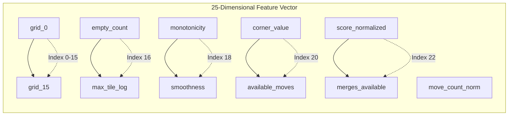

# Score as Feature

## 1. Concept

The current score provides context for the board state, helping the model understand the game progression and make better decisions.

## 2. Score Features

### 2.1 Raw Score

```rust
pub struct ScoreFeatures {
    pub current_score: f64,            // Normalized current score
    pub score_delta: f64,              // Score gained last turn
    pub avg_score_per_move: f64,       // Running average
    pub score_momentum: f64,           // Rate of score change
}
```

### 2.2 Normalized Score

```rust
fn normalize_score(score: u64) -> f64 {
    // Log10 normalization for better model performance
    (score as f64 + 1.0).log10() / 5.0  // Max theoretical ~1,300,000
}
```

## 3. Score in Feature Vector

Score is one component of the 25-dimensional feature vector:



> **Note:** The feature vector is structured as follows:
> - **Indices 0-15**: Grid values (raw tile values)
> - **Index 16**: Empty tile count
> - **Index 17**: Max tile (log)
> - **Index 18**: Monotonicity
> - **Index 19**: Smoothness
> - **Index 20**: Corner value
> - **Index 21**: Available moves
> - **Index 22**: Score (normalized) ← Score as feature
> - **Index 23**: Merges available
> - **Index 24**: Move count (normalized)

## 4. Score vs. Target Distinction

| Aspect | Score as Feature | Score as Target |
|--------|-----------------|-----------------|
| Purpose | Input context | Output prediction |
| When used | Current game state | Final game outcome |
| Direction | Input to model | Model predicts this |
| Normalization | Log10 | Same |
| Training role | X (input) | y (output) |

## 5. Score Progression Features

```rust
pub struct ScoreProgression {
    pub scores: Vec<f64>,                // Score after each move
    pub deltas: Vec<f64>,                // Score change per move
    pub moving_avg: Vec<f64>,            // Moving average
    pub acceleration: Vec<f64>,          // Rate of acceleration
}
```

## 6. Score-Based Heuristics

Use score to guide model training:

```rust
// Filter training samples by score
let high_score_samples: Vec<_> = all_samples
    .into_iter()
    .filter(|s| s.target_score > 2048.0)
    .collect();

// Weight samples by score
let weighted_samples: Vec<_> = all_samples
    .iter()
    .map(|s| (s, s.current_score as f64))
    .collect();
```

## 7. Score in Model Evaluation

The model's prediction quality is evaluated against the score:

```rust
// Regression evaluation
let mse = mean_squared_error(predicted_scores, actual_scores);
let r2 = r_squared(predicted_scores, actual_scores);
```

## 8. Score Distribution Analysis

```rust
pub fn analyze_score_distribution(scores: &[u64]) -> ScoreDistribution {
    ScoreDistribution {
        count: scores.len(),
        mean: scores.iter().sum::<u64>() as f64 / scores.len() as f64,
        median: median(scores),
        std_dev: std_dev(scores),
        skewness: skewness(scores),
        kurtosis: kurtosis(scores),
    }
}
```
