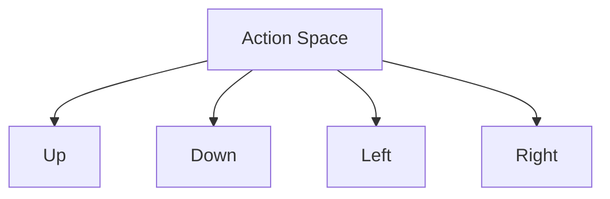

# Action Space Definition

## 1. Overview

The action space defines all possible moves that can be taken in the 2048 game. The ML model outputs a prediction from this space.

## 2. Discrete Actions

The 2048 game has exactly 4 possible actions:



| Action | Value | Description |
|--------|-------|-------------|
| Up | 0 | Shift all tiles upward |
| Down | 1 | Shift all tiles downward |
| Left | 2 | Shift all tiles leftward |
| Right | 3 | Shift all tiles rightward |

## 3. Action Space Properties

- **Size**: 4 discrete actions
- **Type**: Categorical / Discrete
- **Deterministic**: Each action produces a deterministic board transformation
- **Constraints**: Some actions may be invalid if they don't change the board state

## 4. Action Validity

Not all actions are valid at every state:

```rust
pub fn valid_actions(grid: &[u8; 16]) -> Vec<u8> {
    let mut valid = Vec::new();
    for action in 0..4 {
        if would_change_board(grid, action) {
            valid.push(action);
        }
    }
    valid
}
```

## 5. Action Space for automl

The action space is encoded as a classification target for automl models:

```rust
pub struct ActionSpaceConfig {
    pub num_actions: usize,          // 4
    pub action_type: ActionType,     // Discrete
    pub encoding: EncodingType,      // One-hot or Integer
}
```

## 6. Relationship to 04-Actions Directory

The action space definition feeds into:
- `03-State/` modules that consume action outputs
- `04-Actions/02-Space/` for constraint validation
- `04-Actions/03-Mapping/` for model-output-to-action conversion
