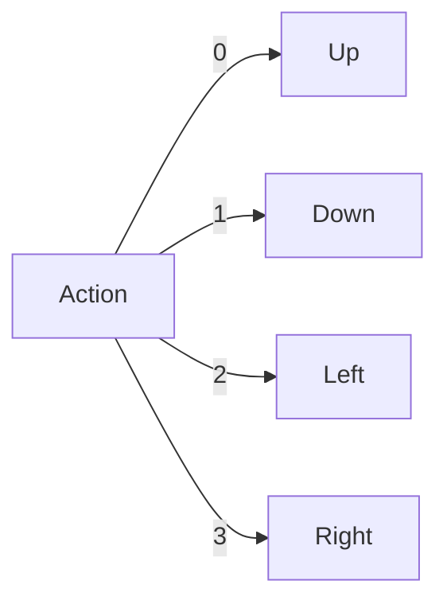
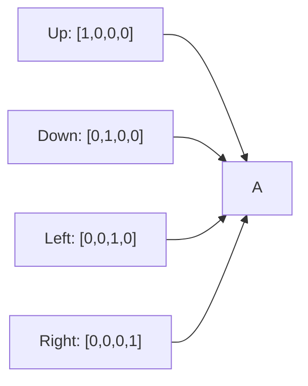

# Action Encoding

## 1. Purpose

Encode the discrete 2048 actions into formats compatible with the automl framework.

## 2. Encoding Strategies

### 2.1 Integer Encoding



| Integer | Direction |
|---------|-----------|
| 0 | Up |
| 1 | Down |
| 2 | Left |
| 3 | Right |

### 2.2 One-Hot Encoding

Each action is represented as a 4-dimensional binary vector:



```rust
pub fn one_hot_encode(action: u8) -> [f64; 4] {
    let mut encoding = [0.0f64; 4];
    encoding[action as usize] = 1.0;
    encoding
}
```

### 2.3 Binary Encoding

```rust
pub fn binary_encode(action: u8) -> [f64; 2] {
    match action {
        0 => [0.0, 0.0], // Up
        1 => [0.0, 1.0], // Down
        2 => [1.0, 0.0], // Left
        3 => [1.0, 1.0], // Right
        _ => panic!("Invalid action"),
    }
}
```

## 3. Encoding for automl

```rust
pub struct ActionEncodingConfig {
    pub method: EncodingMethod,    // Integer, OneHot, Binary
    pub num_classes: usize,        // 4
}
```

## 4. Decoding Model Output

```rust
pub fn decode_action(encoding: &[f64]) -> u8 {
    match encoding.len() {
        1 => encoding[0] as u8,
        4 => encoding.iter().position_max() as u8,
        _ => panic!("Invalid encoding length"),
    }
}
```

## 5. Path References

- `03-State/04-Encoding/` - State encoding for comparison
- `03-State/` modules that use action encodings as targets
