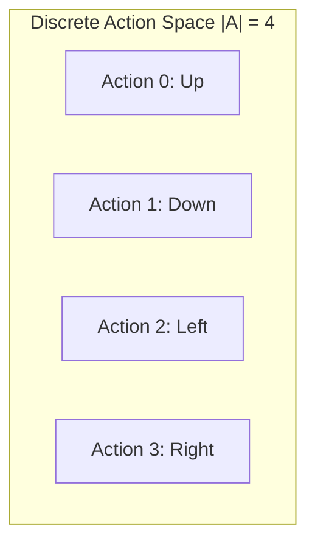

# Discrete Actions

## 1. Overview

The 2048 game operates on a discrete action space with exactly 4 possible moves.

## 2. Action Definitions



## 3. Action Characteristics

| Action | ID | Tile Movement | Merge Direction |
|--------|----|---------------|-----------------|
| Up | 0 | Tiles shift up | Merge downward |
| Down | 1 | Tiles shift down | Merge upward |
| Left | 2 | Tiles shift left | Merge rightward |
| Right | 3 | Tiles shift right | Merge leftward |

## 4. Action Execution

```rust
pub struct DiscreteAction {
    pub id: u8,                    // 0-3
    pub direction: Direction,
    pub tile_shift: ShiftPattern,
    pub merge_direction: MergeDir,
}

impl DiscreteAction {
    pub fn execute(&self, board: &mut Board) -> BoardResult {
        // Apply tile shifting and merging
        // Return result with new board state
    }
}
```

## 5. Discrete Action Properties

- **Finite**: Exactly 4 actions
- **Deterministic**: Same action always produces same result from same state
- **Discrete**: No continuous parameters
- **Categorical**: Suitable for classification models

## 6. Discrete Actions for automl

```rust
pub struct DiscreteActionConfig {
    pub num_actions: usize,        // 4
    pub action_type: ActionTypeEnum, // Discrete
    pub output_layer: OutputLayer,   // Softmax or Argmax
}
```

## 7. Path References

- `04-Actions/01-Action/` - Action encoding and mapping
- `04-Actions/03-Mapping/` - Policy and decision mapping
- `03-State/` - State representation that actions modify
