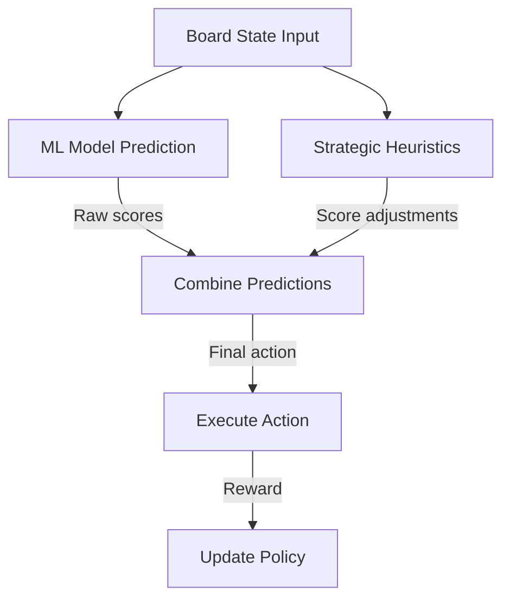
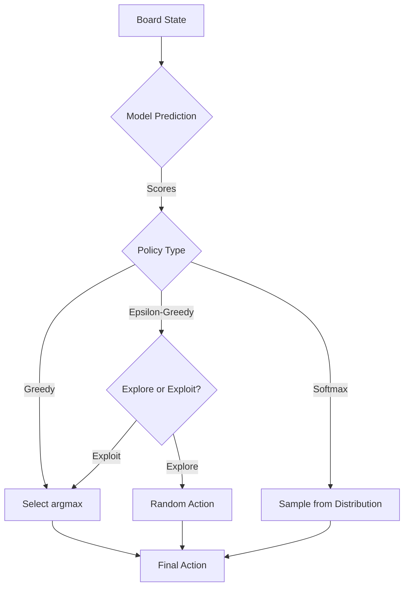

# Action Decision Policy

## 1. Overview

Define the policy that maps board states to actions, combining model predictions with strategic heuristics.

## 2. Policy Architecture



## 3. Policy Types

### 3.1 Greedy Policy

Always select the action with the highest predicted score:

```rust
pub struct GreedyPolicy {
    pub model: MLModel,
}

impl GreedyPolicy {
    pub fn decide(&self, state: &[f64; 25]) -> u8 {
        let scores = self.model.predict(state);
        select_action(&scores)
    }
}
```

### 3.2 Epsilon-Greedy Policy

Balance exploration and exploitation:

```rust
pub struct EpsilonGreedyPolicy {
    pub model: MLModel,
    pub epsilon: f64,
}

impl EpsilonGreedyPolicy {
    pub fn decide(&self, state: &[f64; 25]) -> u8 {
        if fast_rand() < self.epsilon {
            // Explore: random action
            rand::random::<u8>() % 4
        } else {
            // Exploit: best predicted action
            let scores = self.model.predict(state);
            select_action(&scores)
        }
    }
}
```

### 3.3 Softmax Policy

Sample actions from a probability distribution:

```rust
pub struct SoftmaxPolicy {
    pub model: MLModel,
    pub temperature: f64,
}

impl SoftmaxPolicy {
    pub fn decide(&self, state: &[f64; 25]) -> u8 {
        let scores = self.model.predict(state);
        sample_action(&scores, self.temperature)
    }
}
```

## 4. Policy Decision Flow



## 5. Composite Policy

Combine multiple policy signals:

```rust
pub struct CompositePolicy {
    pub model_policy: MLPolicy,
    pub heuristic_policy: HeuristicPolicy,
    pub weights: [f64; 2],         // Model vs heuristic weight
}

impl CompositePolicy {
    pub fn decide(&self, state: &[f64; 25]) -> u8 {
        let model_score = self.model_policy.score(state);
        let heuristic_score = self.heuristic_policy.score(state);
        let combined = self.weights[0] * model_score + self.weights[1] * heuristic_score;
        select_best_action(&combined)
    }
}
```

## 6. Path Integration

- `03-State/` provides the state features for policy decisions
- `04-Actions/01-Action/` defines the action space and encoding
- `04-Actions/02-Space/` provides constraint validation
- `04-Actions/03-Mapping/01-model-output-to-action.md` handles raw model output conversion
