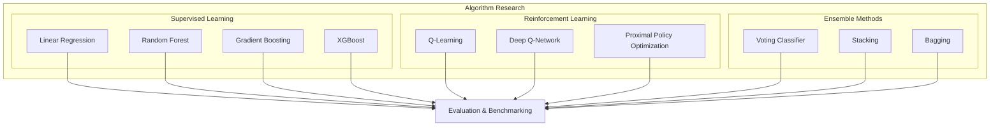
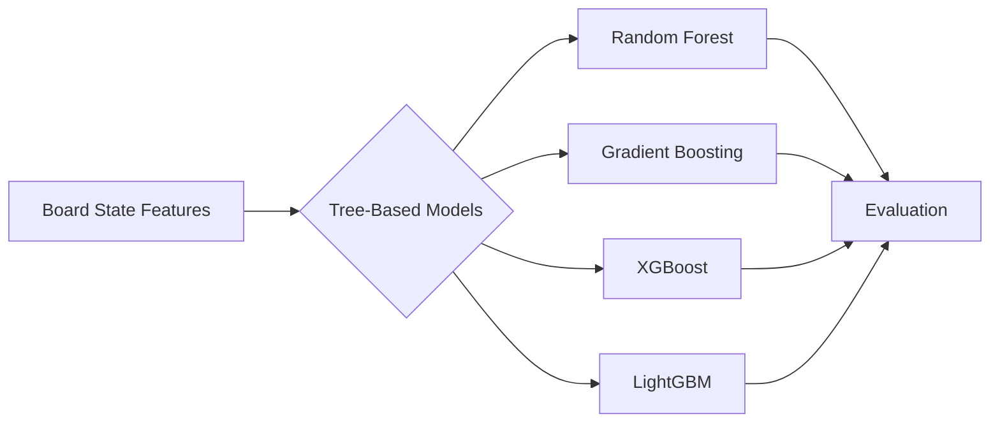
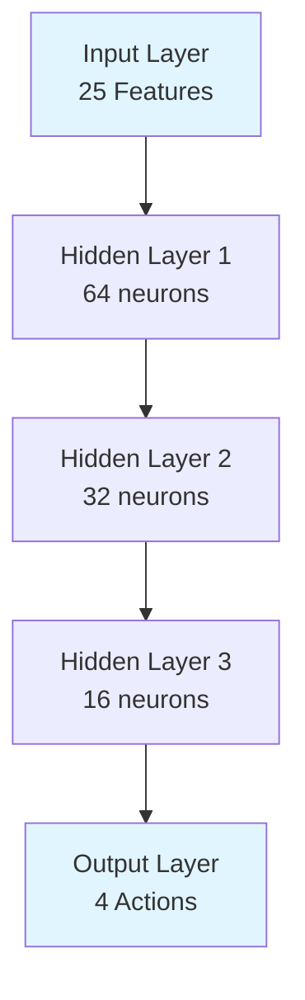
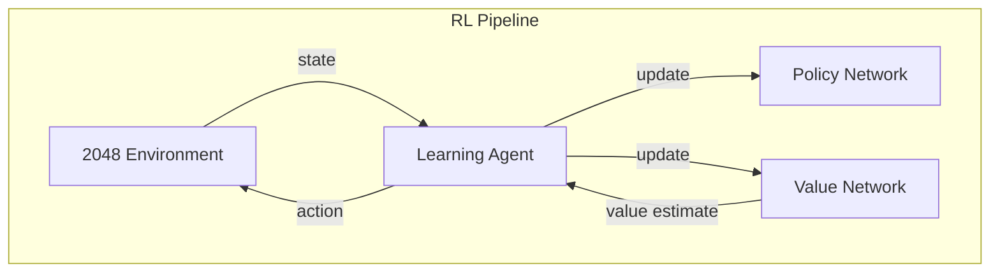
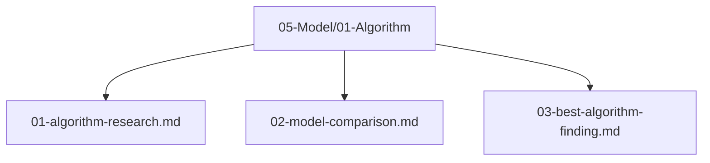

# Algorithm Research

## 1. Purpose

Identify and research machine learning algorithms suitable for the 2048 game. The goal is to find the best algorithm that can learn optimal play strategies through supervised and reinforcement learning approaches.

## 2. Research Scope

Investigate algorithms across three categories: supervised learning, reinforcement learning, and ensemble methods.

## 3. Algorithm Candidates

### 3.1 Tree-Based Models

Tree-based models are strong candidates due to their ability to handle non-linear relationships in board state features.

### 3.2 Neural Network Models

Neural networks can capture complex patterns in board states and learn sequential decision-making strategies.

### 3.3 Reinforcement Learning Approaches

## 4. Evaluation Criteria

| Criterion | Weight | Description |
|-----------|--------|-------------|
| Score Achievement | 40% | Final game score |
| Training Speed | 20% | Time to convergence |
| Inference Speed | 20% | Move prediction time |
| Generalization | 20% | Performance on unseen boards |

## 5. Research References

All algorithm research findings will be documented in `05-Model/01-Algorithm/`:

## 6. Next Steps

1. Train and benchmark candidate algorithms
2. Compare model performance metrics
3. Select the best performing algorithm
4. Document findings in `05-Model/01-Algorithm/03-best-algorithm-finding.md`
