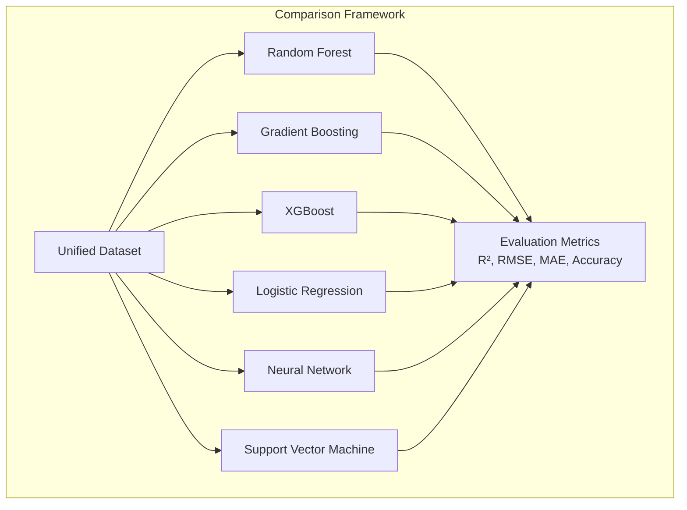
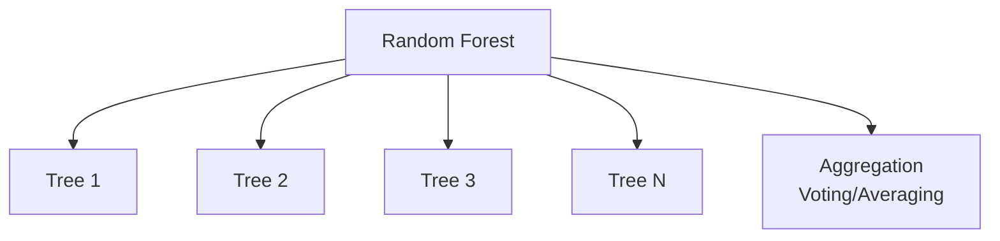
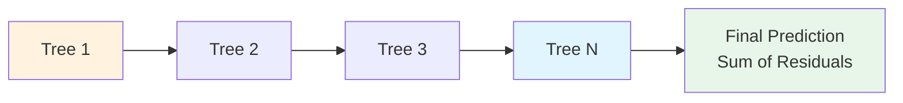
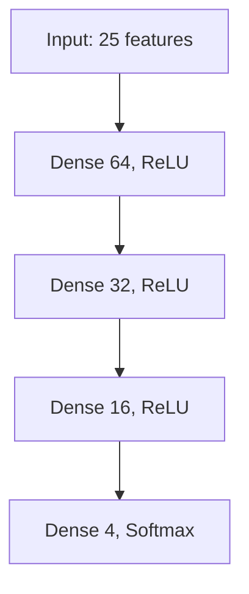
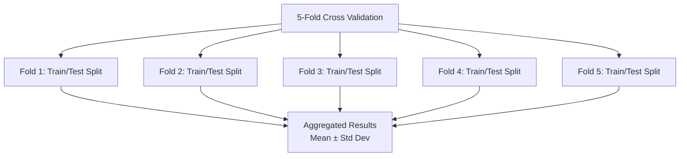
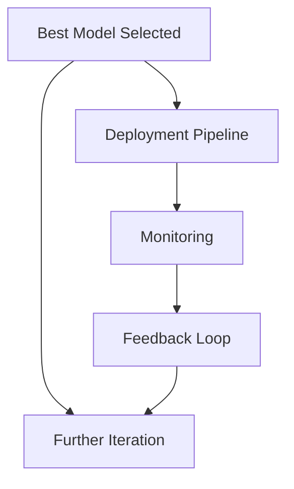

# Model Comparison

## 1. Purpose

Compare multiple machine learning algorithms to determine which performs best for the 2048 game prediction task.

## 2. Comparison Framework

All models will be evaluated using the same dataset, features, and metrics to ensure fair comparison.

## 3. Models Under Comparison

### 3.1 Random Forest

### 3.2 Gradient Boosting

### 3.3 Neural Network

## 4. Comparison Metrics

| Model | R² Score | RMSE | Training Time | Inference Time | Notes |
|-------|----------|------|---------------|----------------|-------|
| Random Forest | — | — | — | — | Baseline |
| Gradient Boosting | — | — | — | — | Strong candidate |
| XGBoost | — | — | — | — | High performance |
| Neural Network | — | — | — | — | Sequential learning |
| Logistic Regression | — | — | — | — | Linear baseline |
| SVM | — | — | — | — | Kernel-based |

## 5. Cross-Validation Results

## 6. Key Findings

## 7. Conclusion

Based on the comparison results, the best model will be selected and documented in `05-Model/01-Algorithm/03-best-algorithm-finding.md`.
