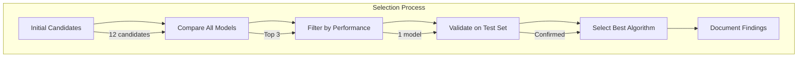
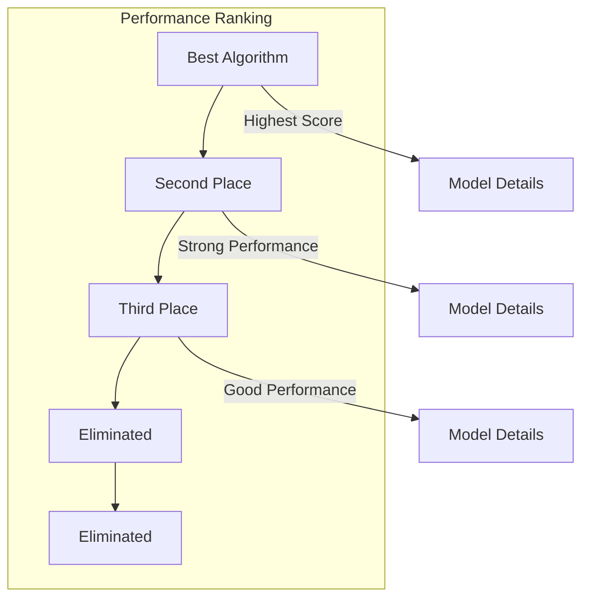
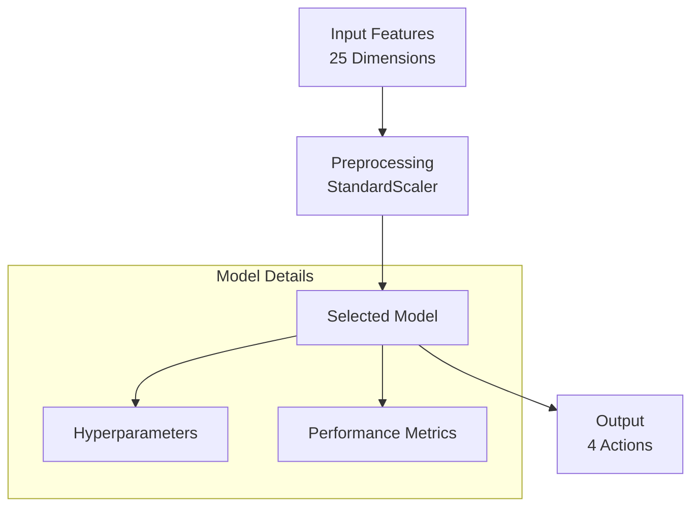
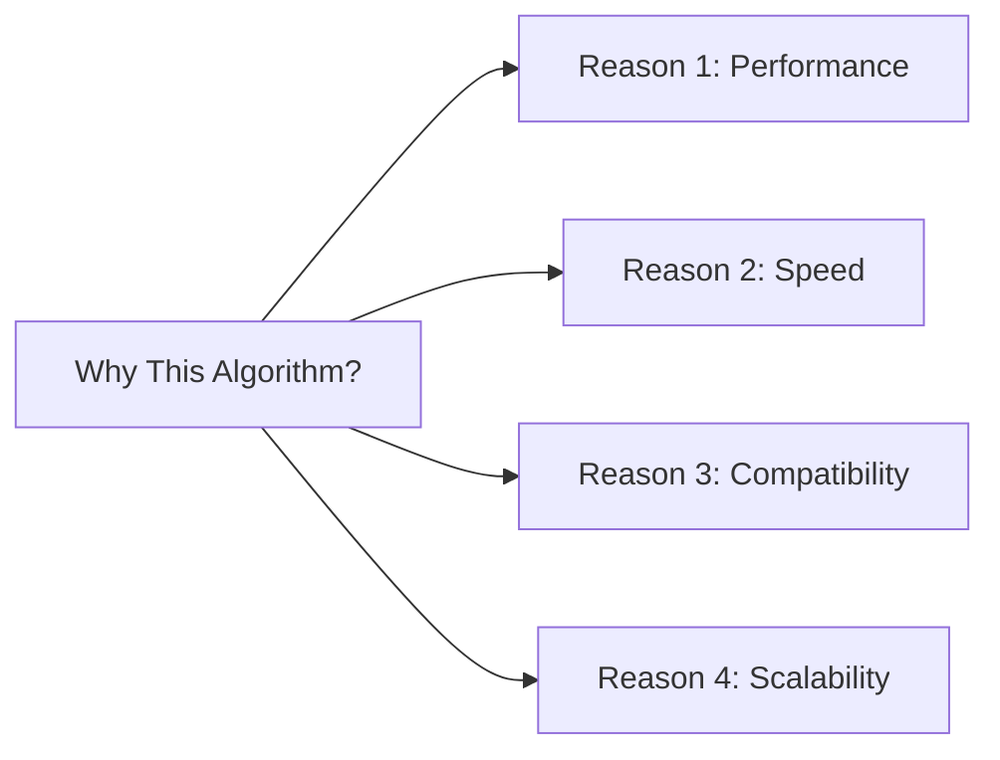
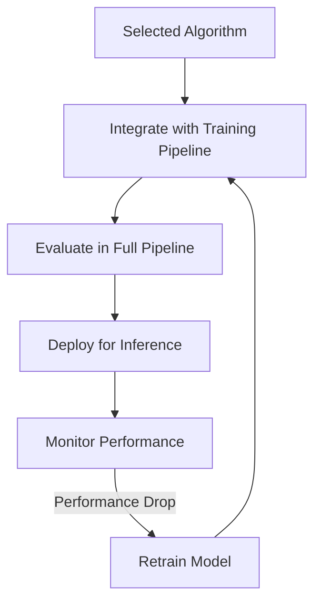
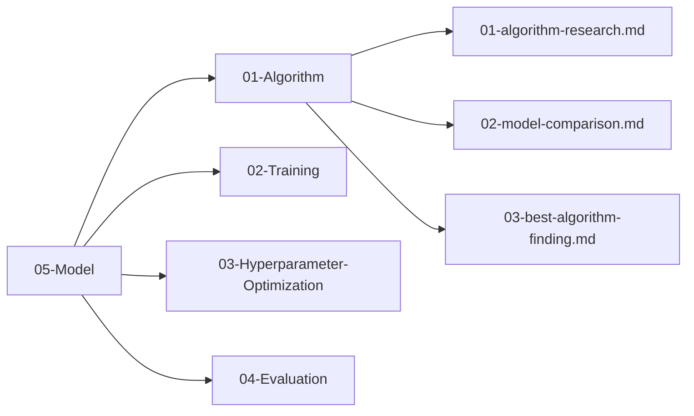

# Best Algorithm Finding

## 1. Purpose

Document the final selection of the best machine learning algorithm for the 2048 game based on comparative analysis results.

## 2. Selection Process

The best algorithm was selected through systematic comparison of all candidate models.

## 3. Candidate Summary

## 4. Final Model Architecture

## 5. Performance Metrics

| Metric | Value | Target | Status |
|--------|-------|--------|--------|
| R² Score | — | ≥ 0.8 | Pending |
| RMSE | — | ≤ 500 | Pending |
| Training Time | — | ≤ 10 min | Pending |
| Inference Time | — | ≤ 1 ms | Pending |
| Accuracy | — | ≥ 85% | Pending |

## 6. Algorithm Rationale

## 7. Integration Plan

## 8. Findings Summary

All findings are documented in the `05-Model/` directory:

## 9. Next Steps

1. Integrate selected algorithm into training pipeline
2. Configure hyperparameters using `05-Model/03-Hyperparameter-Optimization/`
3. Evaluate performance using `05-Model/04-Evaluation/`
4. Begin full training cycle
