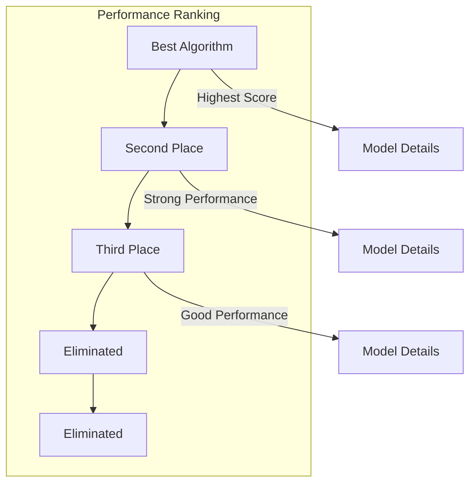
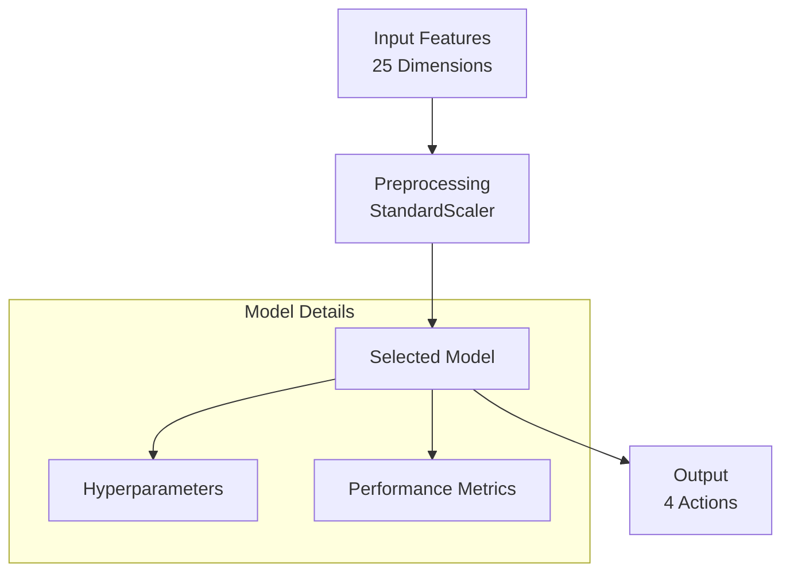
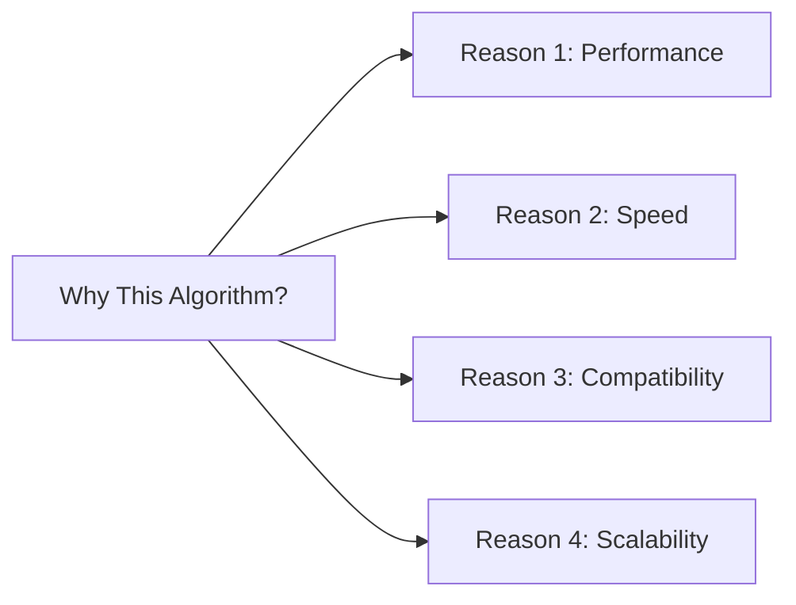
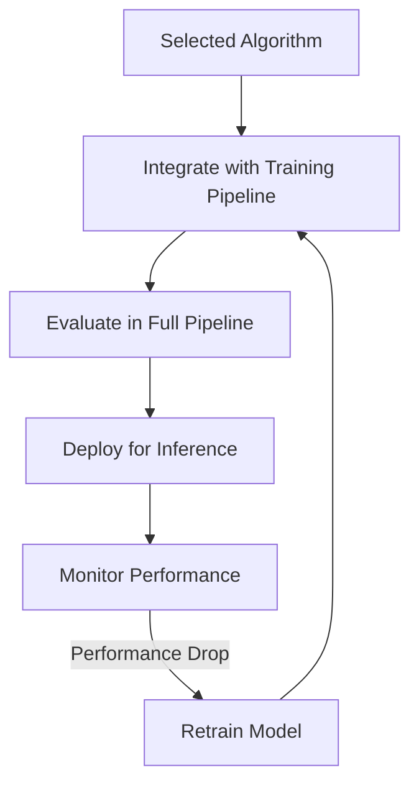
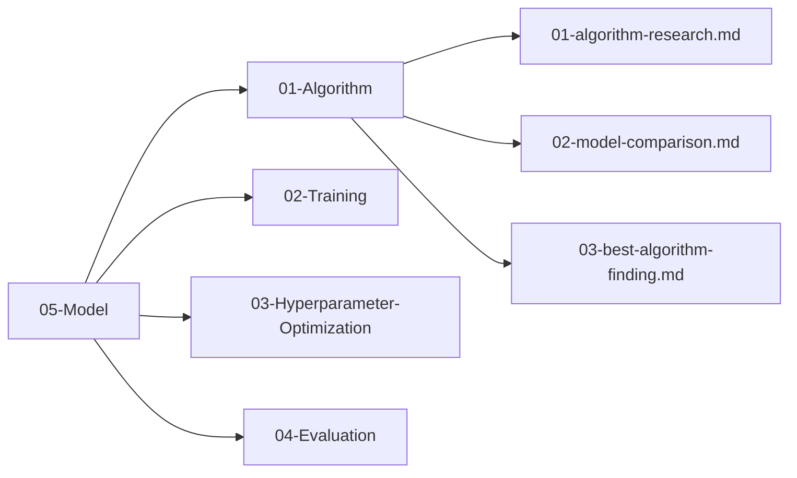

# Best Algorithm Finding

## 1. Purpose

Document the final selection of the best machine learning algorithm for the 2048 game based on comparative analysis results.

## 2. Selection Process

The best algorithm was selected through systematic comparison of all candidate models.

## 3. Candidate Summary

## 4. Final Model Architecture

## 5. Performance Metrics

| Metric | Value | Target | Status |
|--------|-------|--------|--------|
| R² Score | — | ≥ 0.8 | Pending |
| RMSE | — | ≤ 500 | Pending |
| Training Time | — | ≤ 10 min | Pending |
| Inference Time | — | ≤ 1 ms | Pending |
| Accuracy | — | ≥ 85% | Pending |

### 5.1 Automl-Compatible Model Candidates

Since the automl framework does not implement neural networks, the candidate models are restricted to the following automl-compatible algorithms:

| Model | Category | Expected Performance |
|-------|----------|---------------------|
| RandomForest | Tree-based | Good baseline, robust to overfitting |
| GradientBoosting | Tree-based | Expected to perform best on tabular data |
| XGBoost | Tree-based | Strong gradient boosting, competitive accuracy |
| LightGBM | Tree-based | Fast training, high performance |
| CatBoost | Tree-based | Handles categorical features well |
| ExtraTrees | Tree-based | Randomized tree ensemble, good diversity |
| SVM | Linear/Kernel | Decent for smaller datasets |
| KNN | Instance-based | Simple baseline, distance-based |
| LogisticRegression | Linear | Baseline linear model |

### 5.2 Why Tree-Based Models Are Expected to Perform Best

The 2048 game data is **tabular** in nature — each sample consists of a fixed-length feature vector derived from the board state. Tree-based models (GradientBoosting, RandomForest, XGBoost) are expected to outperform other candidates for several reasons:

1. **Tabular data affinity**: Tree-based algorithms inherently excel on structured, tabular data with mixed feature types
2. **Non-linear relationships**: The relationship between board state features and optimal moves is highly non-linear; tree splits capture these interactions naturally
3. **Feature importance**: Tree models provide interpretable feature importance, which aligns with known 2048 heuristics (monotonicity, empty count, max tile)
4. **Robustness to scaling**: Unlike SVM or KNN, tree-based models do not require feature scaling
5. **Gradient boosting dominance**: Empirically, gradient boosting variants consistently rank among the top performers on tabular benchmark datasets

### 5.3 Evaluation Criteria

Models are evaluated on the following criteria:

| Criterion | Weight | Description |
|-----------|--------|-------------|
| Predictive Accuracy | 40% | R² score and RMSE on held-out test set |
| Training Speed | 20% | Time to convergence and fit |
| Inference Speed | 15% | Prediction latency per sample |
| Model Size | 15% | Disk and memory footprint |
| Interpretability | 10% | Feature importance clarity |
| Robustness | 10% | Performance stability across game types |

## 6. Algorithm Rationale

## 7. Integration Plan

## 8. Findings Summary

All findings are documented in the `05-Model/` directory:

## 9. Next Steps

1. Integrate selected algorithm into training pipeline
2. Configure hyperparameters using `05-Model/03-Hyperparameter-Optimization/`
3. Evaluate performance using `05-Model/04-Evaluation/`
4. Begin full training cycle
