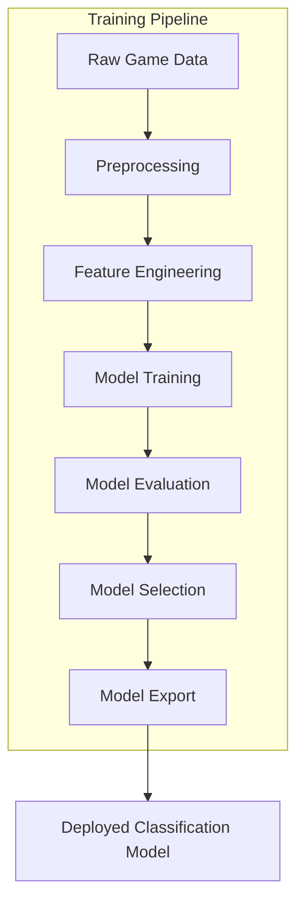
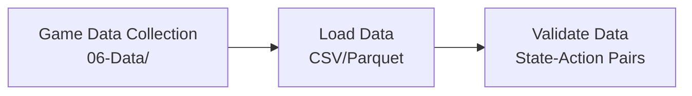
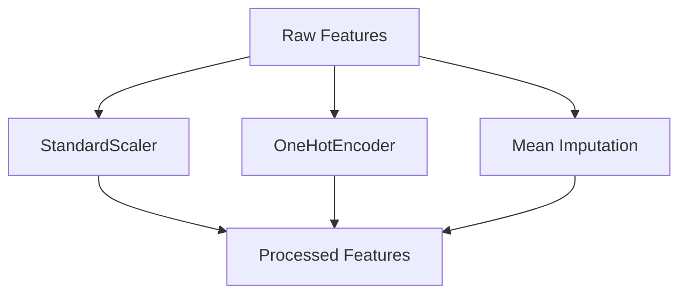
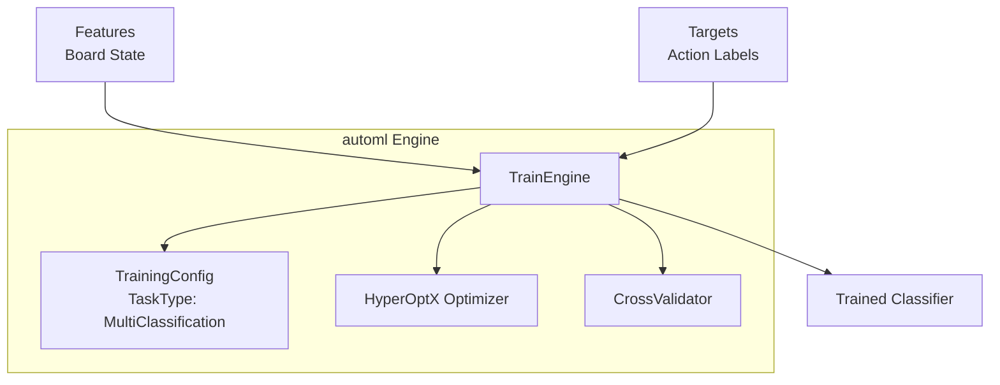
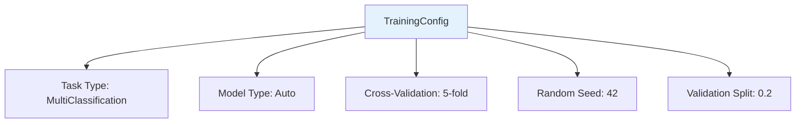
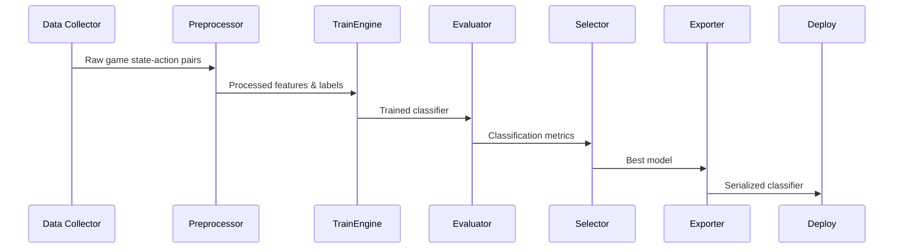
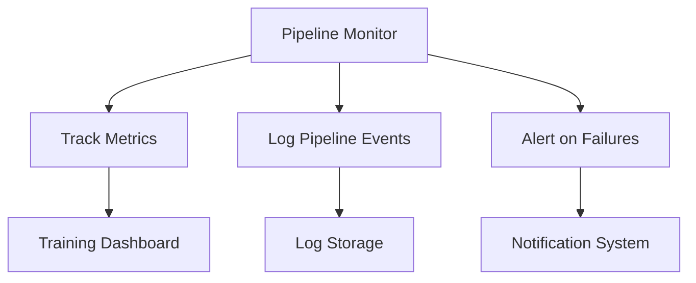
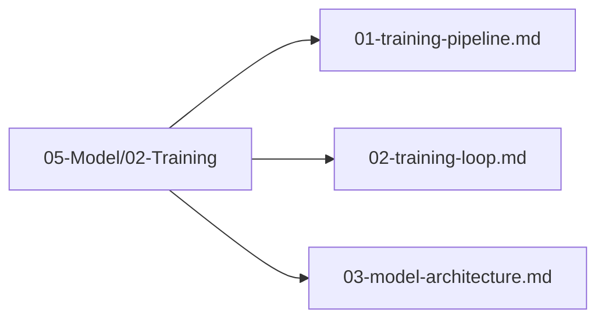

# Training Pipeline

## 1. Purpose

Define the complete training pipeline that takes collected game data and produces a trained supervised classification model capable of predicting optimal moves in the 2048 game.

## 2. Pipeline Overview

The training pipeline follows a structured flow from raw game data to a deployable classification model.

## 3. Pipeline Stages

### 3.1 Data Ingestion

### 3.2 Preprocessing

### 3.3 Training Execution

## 4. Pipeline Configuration

**Configuration Details:**
- **Task Type**: `MultiClassification` — 4 output classes (up, down, left, right)
- **Model Type**: `Auto` — automl selects best classifier from `ModelType` enum (DecisionTree, RandomForest, GradientBoosting, XGBoost, LightGBM, SVM, KNN, etc.)
- **Labels**: Integer-encoded actions where 0=up, 1=down, 2=left, 3=right

## 5. Theoretical-Limit-Oriented Training

The training pipeline is optimized for finding how close each model gets to the theoretical maximum:

1. Train each model with maximum budget (high n_estimators, early stopping disabled)
2. Run each trained model against the game environment until convergence
3. Track the maximum score achieved by each model
4. Compute proximity ratio: `max_score / theoretical_limit` (theoretical_limit = 32768)
5. Compare proximity ratios across models
6. The model closest to the theoretical limit wins

## 6. Pipeline Execution Flow

## 6. Pipeline Monitoring

## 7. Pipeline Files Location

All pipeline files are organized under `05-Model/02-Training/`:

## 8. Next Steps

1. Configure training parameters for multi-class classification
2. Execute training loop with supervised game data
3. Validate model architecture and classification accuracy
