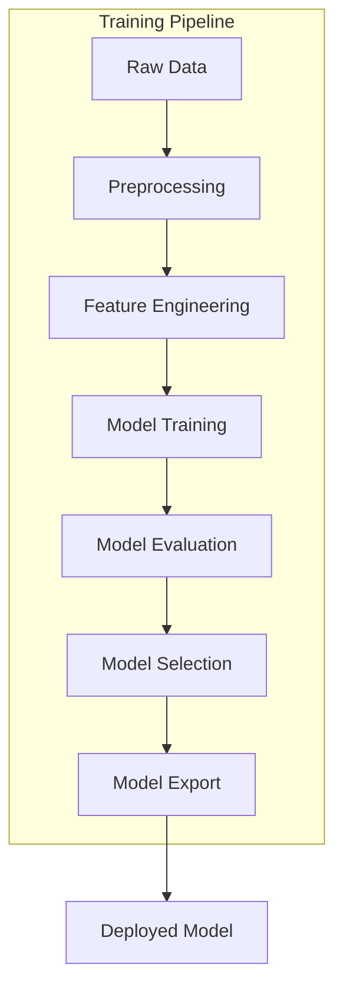
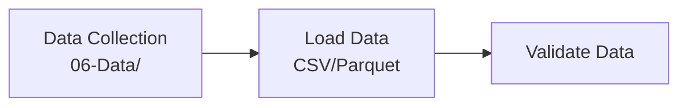
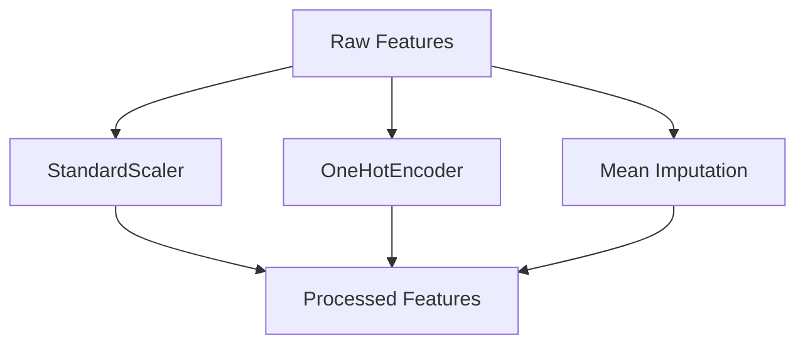
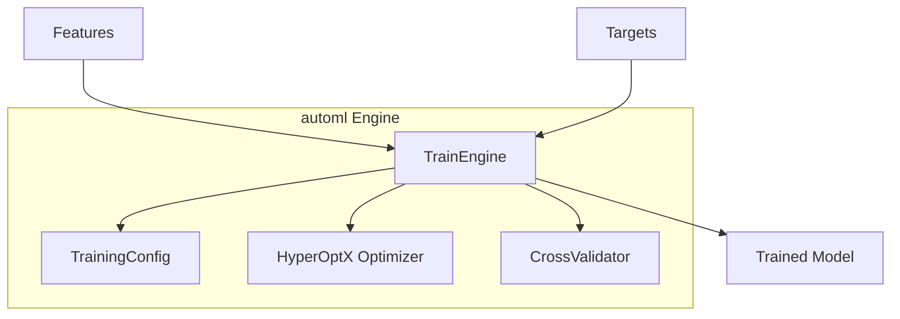
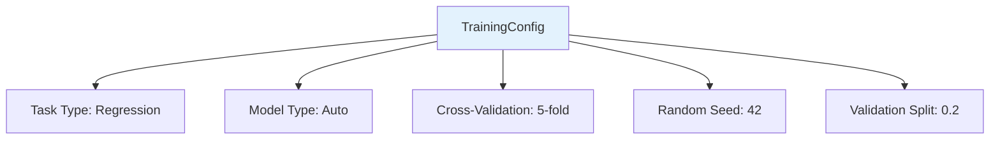
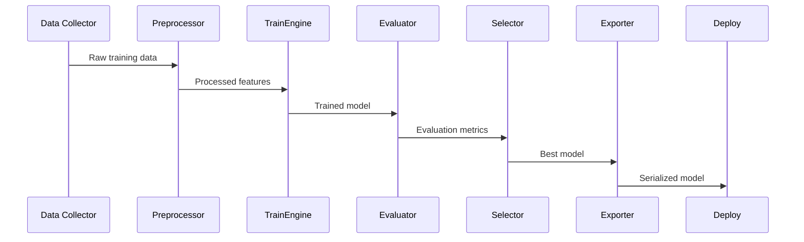
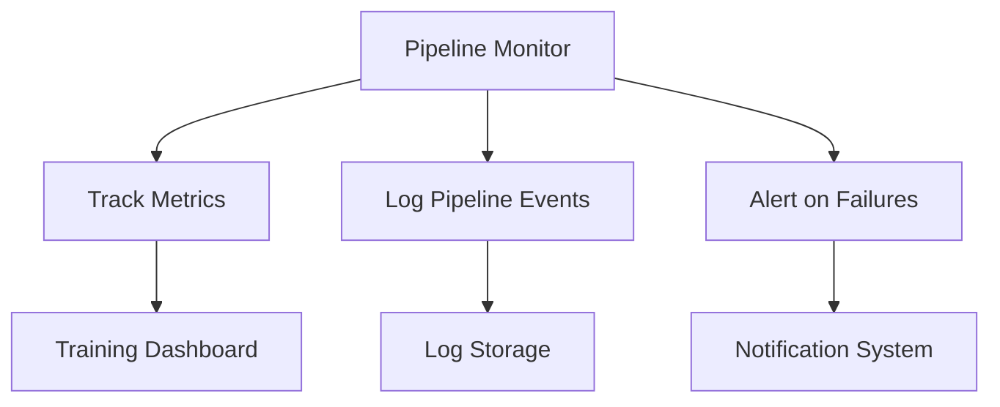
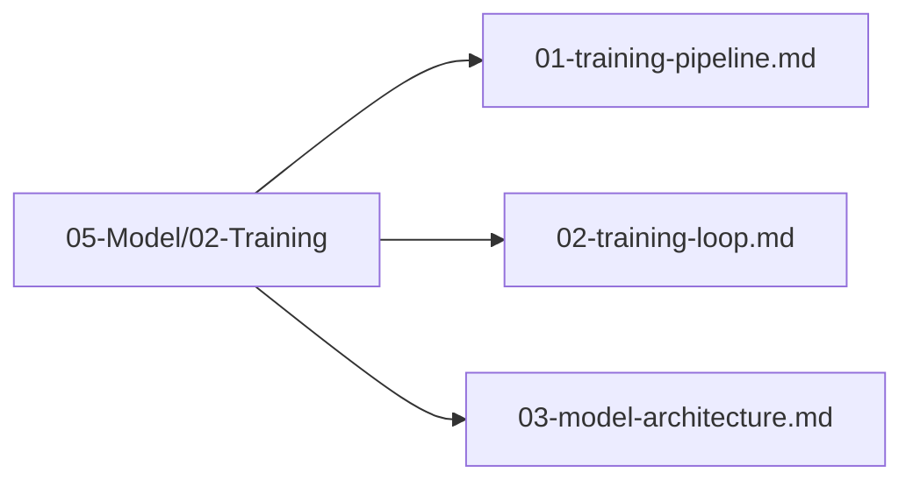

# Training Pipeline

## 1. Purpose

Define the complete training pipeline that takes collected data and produces a trained machine learning model capable of playing the 2048 game.

## 2. Pipeline Overview

The training pipeline follows a structured flow from raw data to a deployable model.

## 3. Pipeline Stages

### 3.1 Data Ingestion

### 3.2 Preprocessing

### 3.3 Training Execution

## 4. Pipeline Configuration

## 5. Pipeline Execution Flow

## 6. Pipeline Monitoring

## 7. Pipeline Files Location

All pipeline files are organized under `05-Model/02-Training/`:

## 8. Next Steps

1. Configure training parameters
2. Execute training loop
3. Validate model architecture
