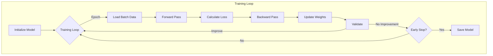
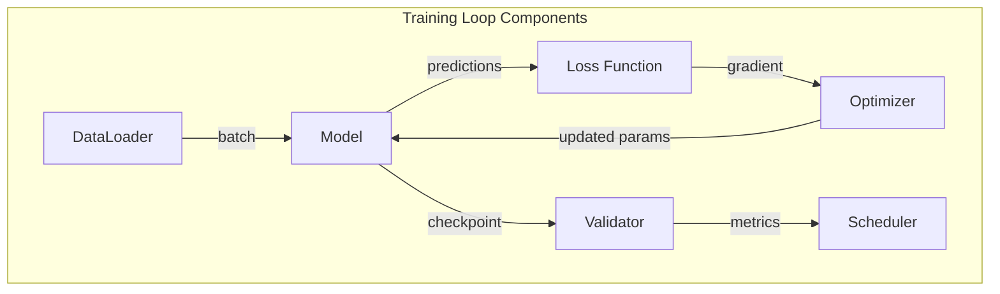
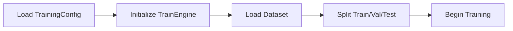
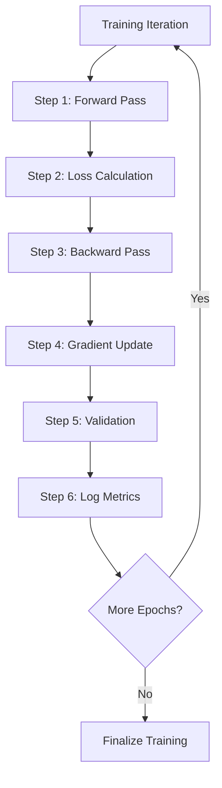
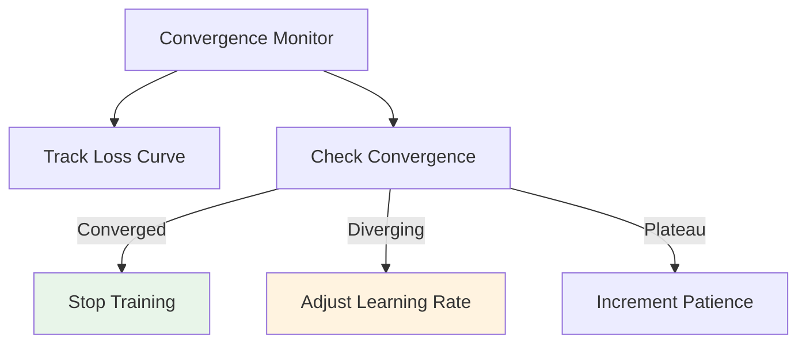
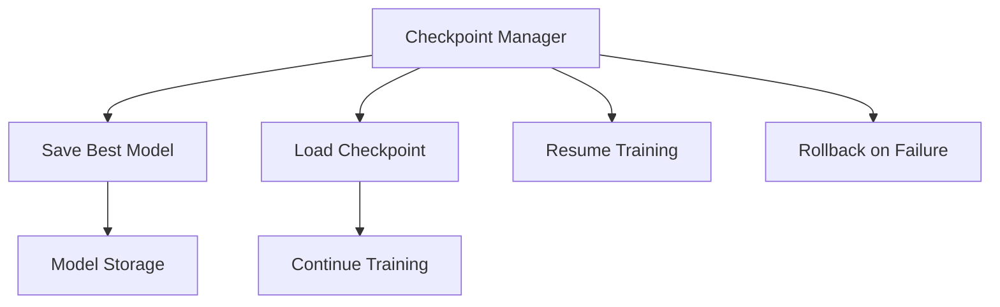
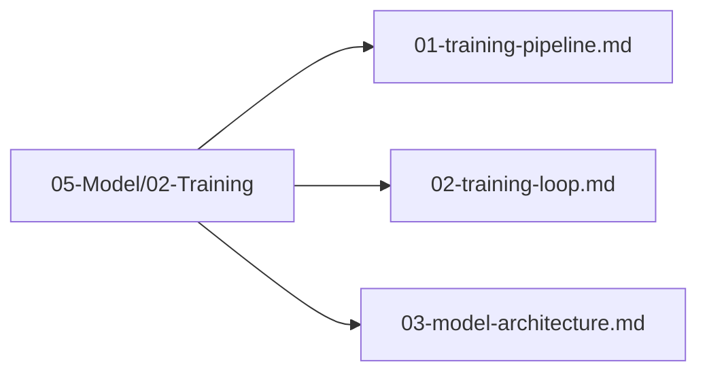

# Training Loop

## 1. Purpose

Define the iterative training loop that drives the machine learning model training process for the 2048 game.

## 2. Training Loop Overview

The training loop iteratively updates model weights using the automl framework's TrainEngine.



## 3. Loop Architecture



## 4. Training Stages

### 4.1 Initialization



### 4.2 Main Training Iteration



## 5. Training Loop Implementation

```rust
pub struct TrainingLoop {
    engine: TrainEngine,
    config: TrainingConfig,
    data: DataFrame,
}

impl TrainingLoop {
    pub fn run(&mut self) -> TrainingResult {
        let mut best_score = 0.0;
        let mut patience_counter = 0;
        
        for epoch in 0..self.config.n_epochs {
            // Forward pass
            let predictions = self.engine.predict(&self.data)?;
            let loss = self.calculate_loss(&predictions);
            
            // Backward pass
            self.engine.backward(&loss)?;
            self.engine.update_weights()?;
            
            // Validation
            let val_score = self.validate()?;
            
            if val_score > best_score {
                best_score = val_score;
                patience_counter = 0;
                self.save_checkpoint()?;
            } else {
                patience_counter += 1;
            }
            
            if patience_counter >= self.config.early_stopping_rounds {
                break;
            }
        }
        
        TrainingResult { best_score }
    }
}
```

## 6. Convergence Monitoring



## 7. Checkpoint Management



## 8. Training Files

All training loop files are in `05-Model/02-Training/`:



## 9. Next Steps

1. Define model architecture
2. Execute training loop
3. Monitor convergence
4. Save best model
