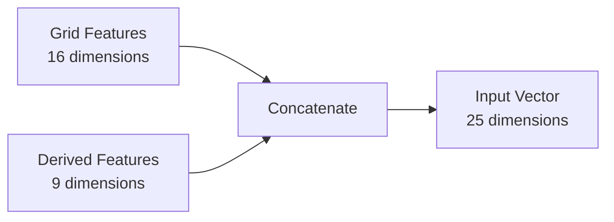
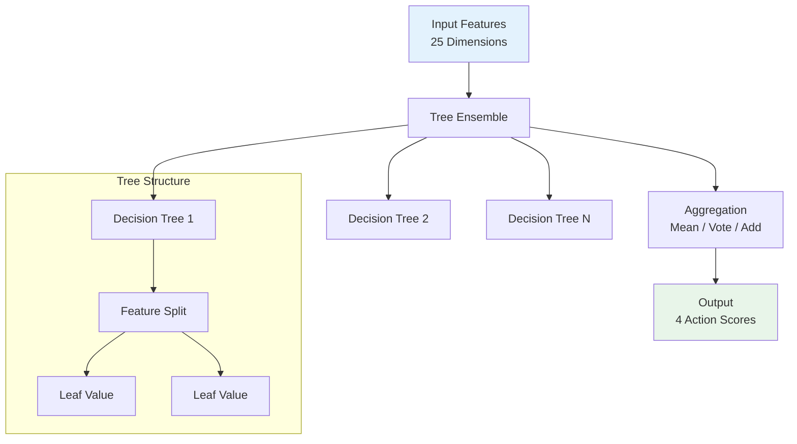
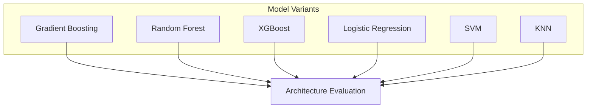
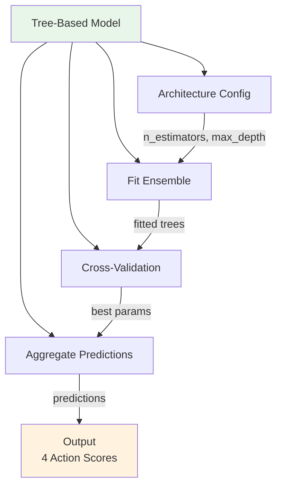
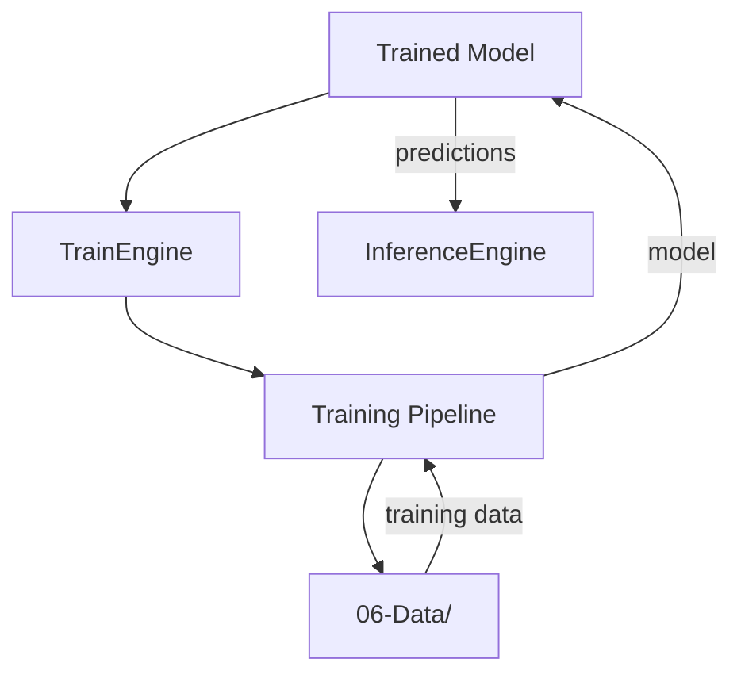
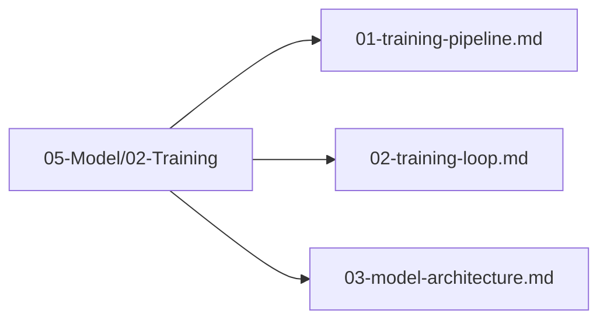

# Model Architecture

## 1. Purpose

Define the architecture of the machine learning model used to predict optimal moves in the 2048 game.

## 2. Architecture Overview

The model architecture is designed to consume 25-dimensional board state features and output 4 directional actions using tree-based ensemble methods.

### 2.1 Tree-Based Model Architecture

Tree-based models are the primary architecture for this project. Each model type has a distinct structure optimized for tabular data:

| Model Type | Structure | Key Parameters |
|------------|-----------|----------------|
| RandomForest | Ensemble of decision trees | n_estimators, max_depth, min_samples_split |
| GradientBoosting | Sequential additive trees | n_estimators, learning_rate, max_depth, subsample |
| XGBoost | Regularized gradient boosting | n_estimators, max_depth, learning_rate, reg_lambda |
| LightGBM | Leaf-wise growing trees | n_estimators, max_depth, num_leaves, learning_rate |
| CatBoost | Ordered boosting with categorical handling | n_estimators, depth, learning_rate |
| ExtraTrees | Randomized decision tree ensemble | n_estimators, max_depth, min_samples_split |

### 2.2 Feature Input Layer



### 2.3 Tree Ensemble Architecture



### 2.4 Model Variants



### 2.5 Tree-Based Model Architecture Details

```rust
pub struct TreeModelArchitecture {
    pub model_type: ModelType,           // GradientBoosting, RandomForest, XGBoost, etc.
    pub n_estimators: usize,             // Number of trees in the ensemble
    pub max_depth: usize,                // Maximum depth of each tree
    pub learning_rate: f64,              // Shrinkage parameter for boosting
    pub min_samples_split: usize,        // Minimum samples to split a node
    pub max_features: Option<usize>,     // Features considered per split
    pub subsample: Option<f64>,          // Row subsampling rate
    pub regularization: f64,             // L1/L2 regularization strength
}

pub struct ModelType {
    pub name: String,                    // e.g., "GradientBoosting", "RandomForest"
    pub is_ensemble: bool,               // True for ensemble methods
    pub is_boosting: bool,               // True for boosting-based methods
    pub supports_categorical: bool,      // True if native categorical support
}
```



## 6. Model Integration



## 7. Architecture Files Location

All model architecture files are in `05-Model/02-Training/`:



## 8. Next Steps

1. Select final model architecture
2. Configure hyperparameters in `05-Model/03-Hyperparameter-Optimization/`
3. Train and evaluate the model
