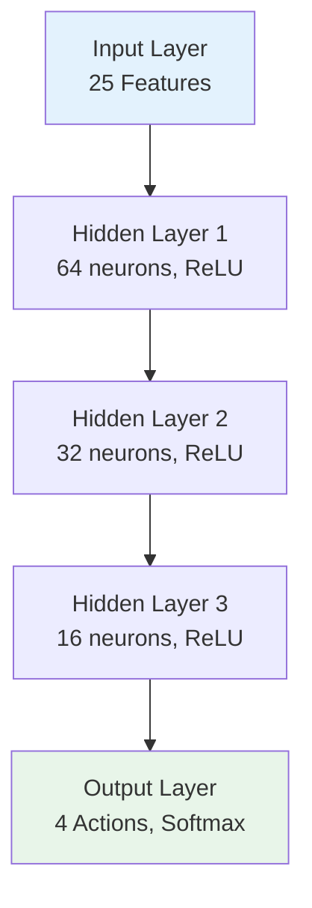
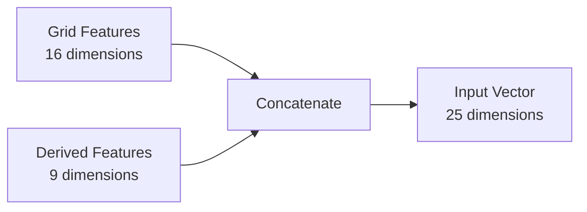
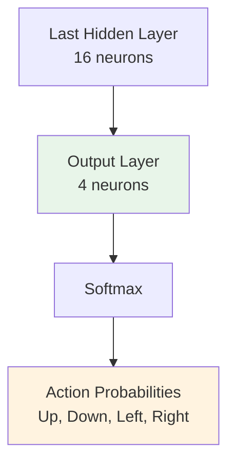
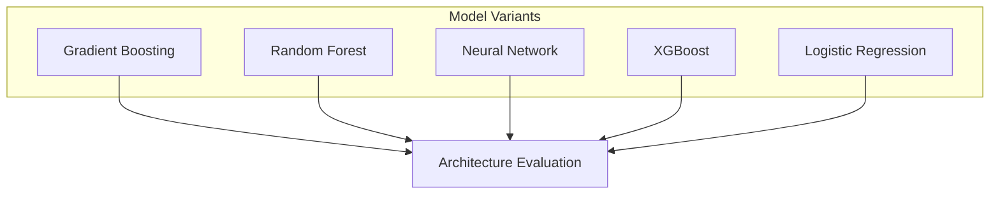
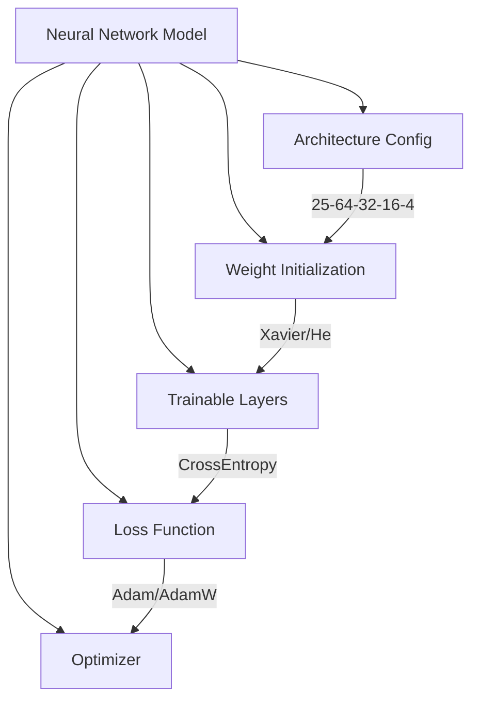
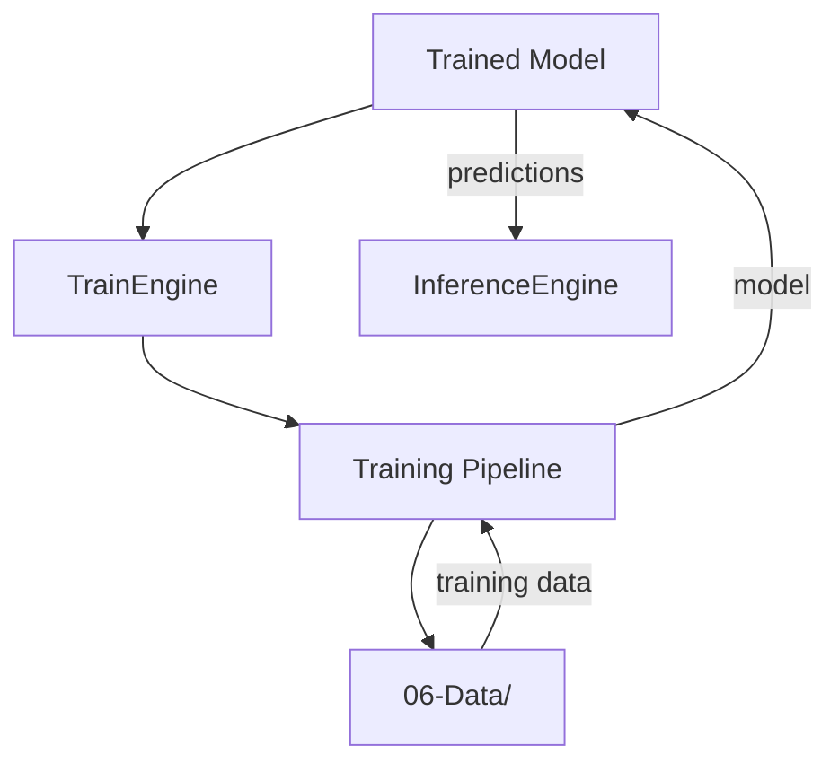
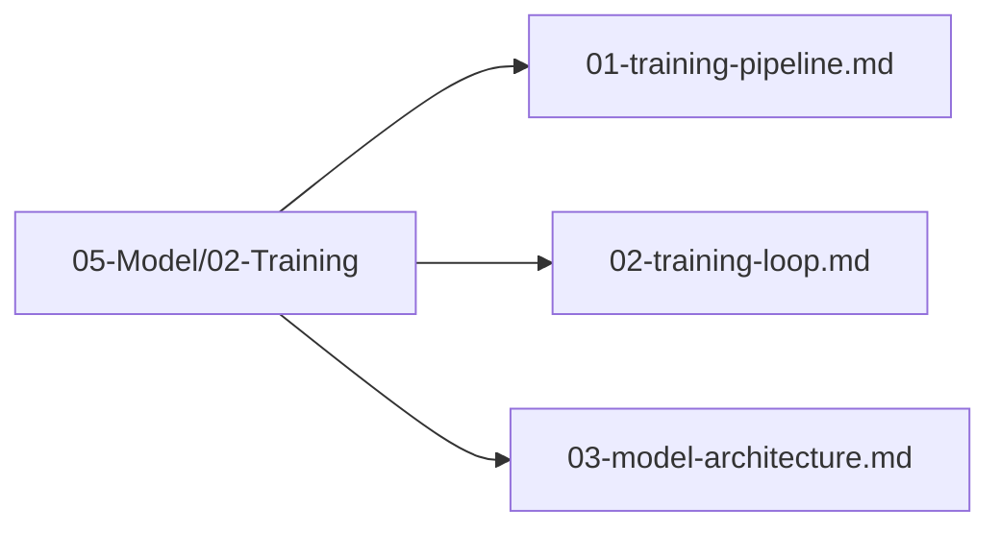

# Model Architecture

## 1. Purpose

Define the architecture of the machine learning model used to predict optimal moves in the 2048 game.

## 2. Architecture Overview

The model architecture is designed to consume 25-dimensional board state features and output 4 directional actions.



## 3. Model Architecture Components

### 3.1 Feature Input Layer



### 3.2 Hidden Layers

```mermaid
flowchart TD
    Layer1[Layer 1: Dense(64)]
    Layer1 --> Activation1[ReLU Activation]
    Activation1 --> Dropout1[Dropout 0.2]
    
    Layer2[Layer 2: Dense(32)]
    Layer2 --> Activation2[ReLU Activation]
    Activation2 --> Dropout2[Dropout 0.2]
    
    Layer3[Layer 3: Dense(16)]
    Layer3 --> Activation3[ReLU Activation]
    Activation3 --> Dropout3[Dropout 0.1]
    
    Layer1 --> Layer2
    Layer2 --> Layer3
```

### 3.3 Output Layer



## 4. Model Variants



## 5. Neural Network Architecture Details

```rust
pub struct ModelArchitecture {
    pub input_dim: usize,           // 25 features
    pub hidden_layers: Vec<usize>,  // [64, 32, 16]
    pub output_dim: usize,          // 4 actions
    pub dropout_rates: Vec<f64>,    // [0.2, 0.2, 0.1]
    pub activation: ActivationType, // ReLU
}
```



## 6. Model Integration



## 7. Architecture Files Location

All model architecture files are in `05-Model/02-Training/`:



## 8. Next Steps

1. Select final model architecture
2. Configure hyperparameters in `05-Model/03-Hyperparameter-Optimization/`
3. Train and evaluate the model
