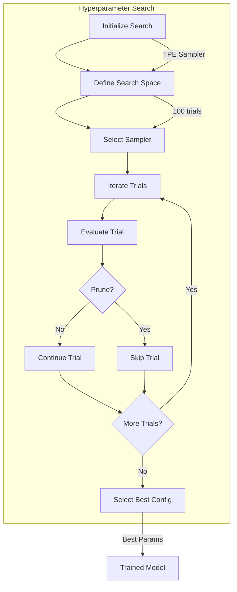
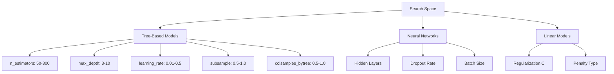
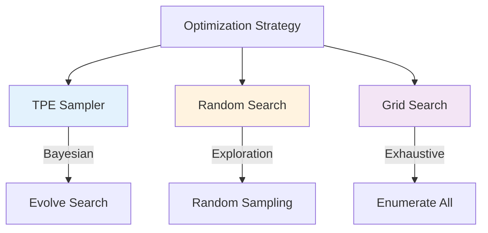
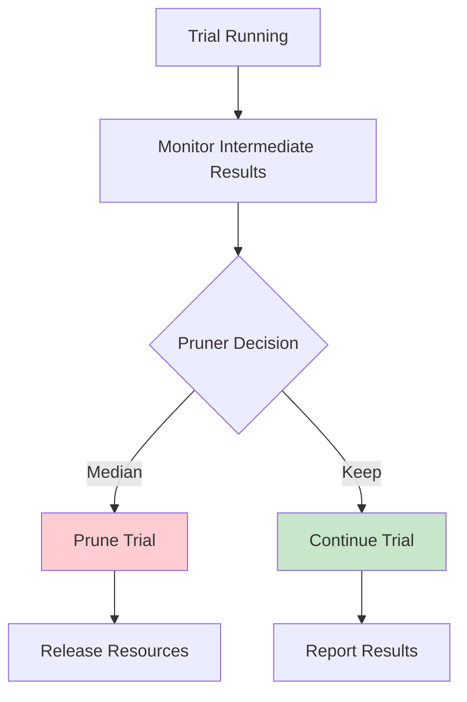
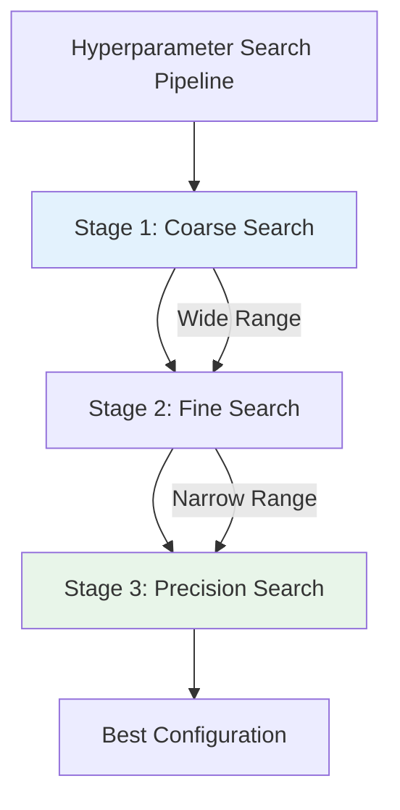
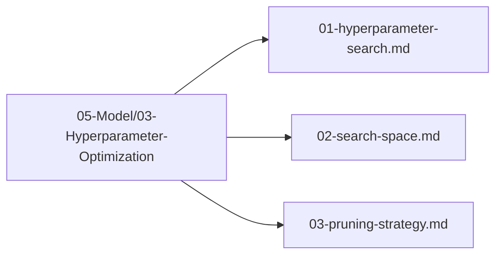

# Hyperparameter Search

## 1. Purpose

Define the hyperparameter search strategy for optimizing the 2048 game machine learning model using the automl framework's HyperOptX optimizer.

## 2. Search Overview

The hyperparameter search explores the parameter space to find optimal configurations for the selected model.



## 3. Search Space Definition



## 4. Optimization Strategy



## 5. Pruning Strategy



## 6. Search Configuration

```rust
use automl::{OptimizationConfig, SearchSpace, Parameter, ParameterType};

let opt_config = OptimizationConfig::default()
    .with_direction(OptimizeDirection::Maximize)
    .with_n_trials(100)
    .with_n_jobs(None)
    .with_pruner(MedianPruner::new());

let mut search_space = SearchSpace::new();
search_space.add(Parameter::new("n_estimators", ParameterType::Int(50, 300)));
search_space.add(Parameter::new("max_depth", ParameterType::Int(3, 10)));
search_space.add(Parameter::new("learning_rate", ParameterType::Float(0.01, 0.5)));
search_space.add(Parameter::new("subsample", ParameterType::Float(0.5, 1.0)));
search_space.add(Parameter::new("colsample_bytree", ParameterType::Float(0.5, 1.0)));
```

## 7. Search Pipeline



## 8. Search Files Location

All hyperparameter search files are in `05-Model/03-Hyperparameter-Optimization/`:



## 9. Next Steps

1. Define search space in `05-Model/03-Hyperparameter-Optimization/02-search-space.md`
2. Configure pruning strategy
3. Execute search and select best parameters
