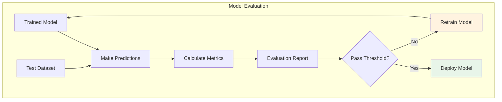
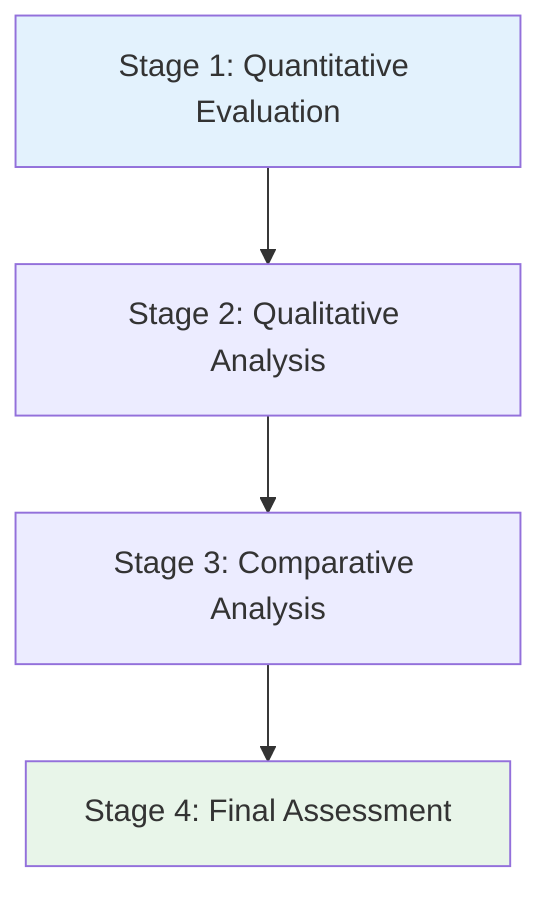
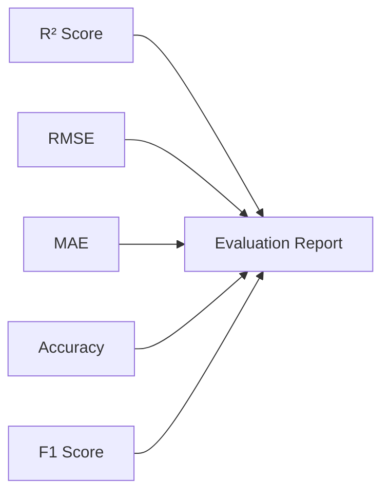
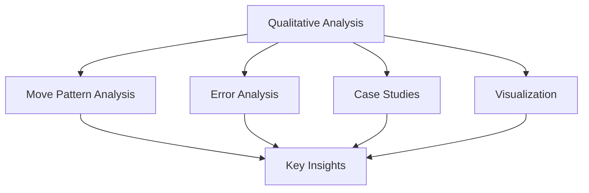
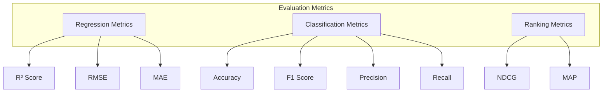
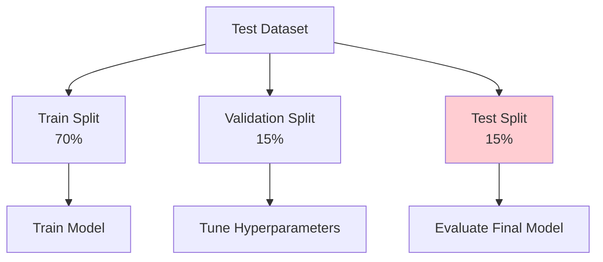
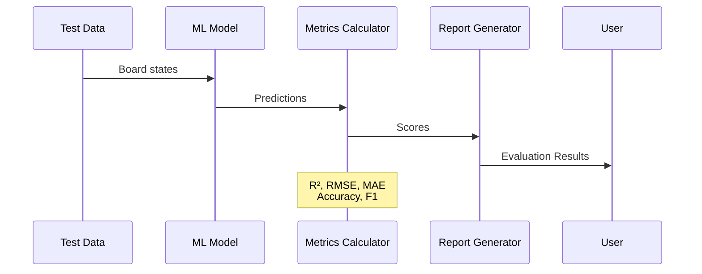
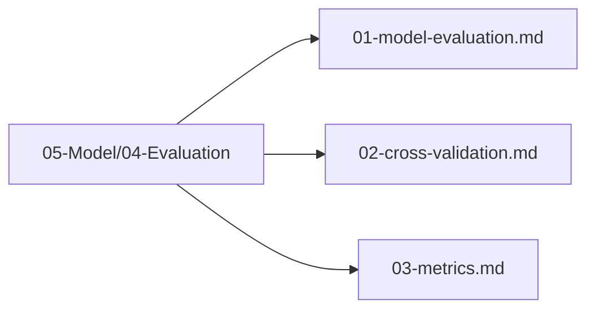

# Model Evaluation

## 1. Purpose

Define the evaluation methodology for assessing the performance of the trained 2048 game machine learning model.

## 2. Evaluation Overview

The model evaluation process measures how well the trained model performs on unseen board states.

## 3. Evaluation Stages

### 3.1 Quantitative Evaluation

### 3.2 Qualitative Analysis

## 4. Evaluation Metrics

## 5. Test Dataset Structure

## 6. Evaluation Pipeline

## 7. Evaluation Files Location

All evaluation files are in `05-Model/04-Evaluation/`:

## 8. Next Steps

1. Perform cross-validation
2. Calculate detailed metrics
3. Compare with baseline models
