# Cross-Validation

## 1. Purpose

Define the cross-validation strategy for robust evaluation of the 2048 game machine learning model.

## 2. Cross-Validation Overview

Cross-validation ensures the model generalizes well by training and evaluating on different data splits.

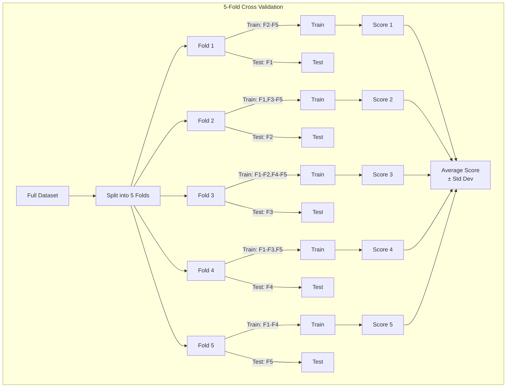

## 3. Cross-Validation Strategies

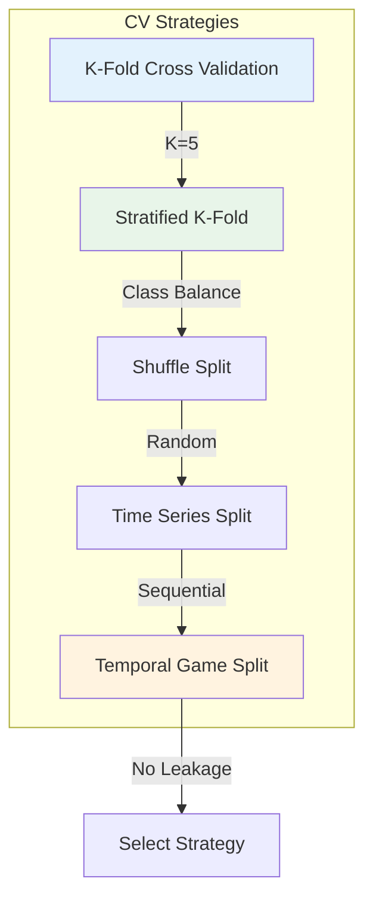

### 3.1 Stratified K-Fold

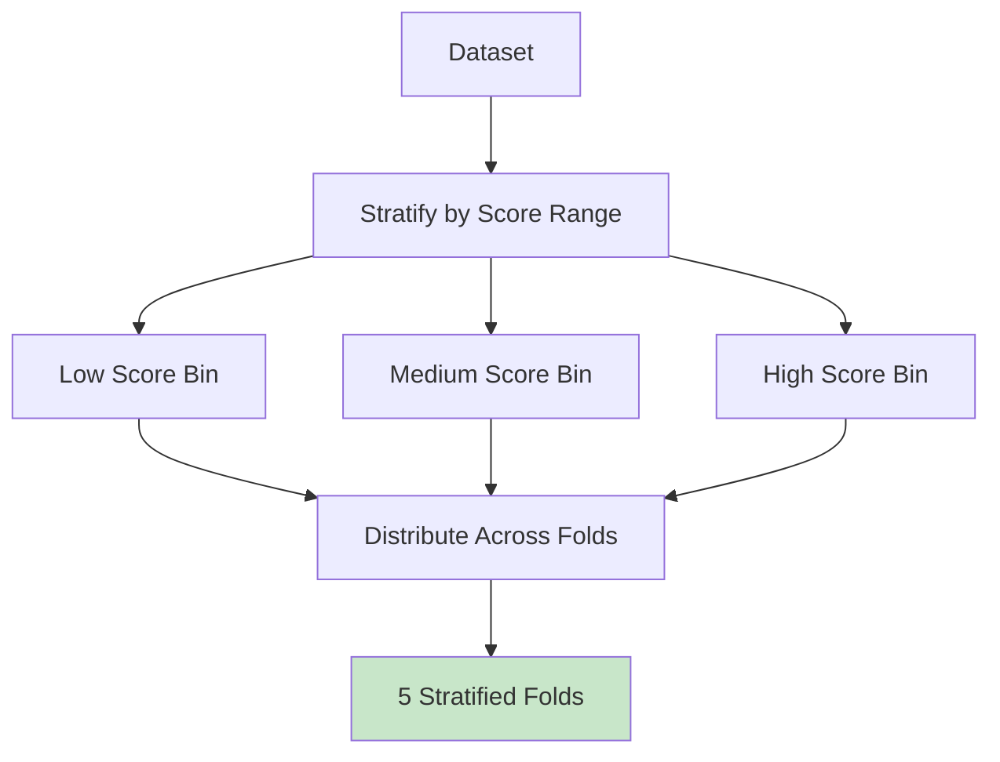

### 3.2 Shuffle Split

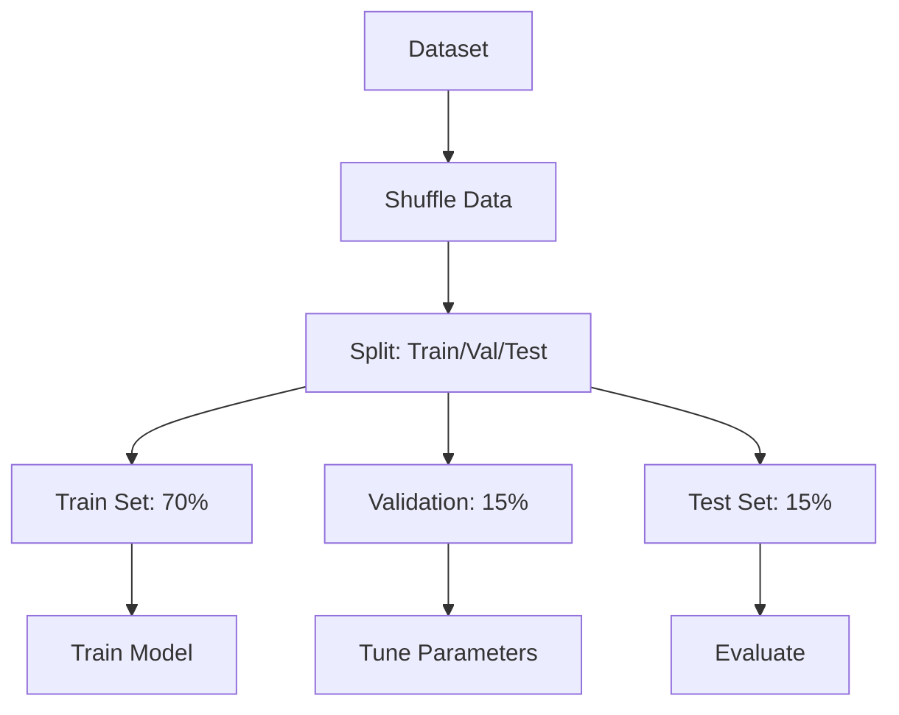

### 3.3 Temporal Data Problem: Why Random CV Leaks

Game data has an inherent temporal structure that violates the i.i.d. assumption of standard K-Fold cross-validation. Each game produces a sequence of board states where later states depend on earlier states. Random CV shuffles all states together, causing the following leakage problems:

1. **Future state leakage**: A model trained on states from game epoch 50 can "predict" states from game epoch 10 (because they share similar board patterns), but this does not reflect real generalization to truly unseen game sequences
2. **Sequence contamination**: Adjacent moves within a single game are highly correlated — placing a train state from move 80 and a test state from move 82 in different folds means the model has seen essentially the same game trajectory
3. **Score correlation**: States from high-scoring games tend to cluster together (good opening sequences lead to good mid-game states), so random splitting can put correlated high-score states in both train and test sets

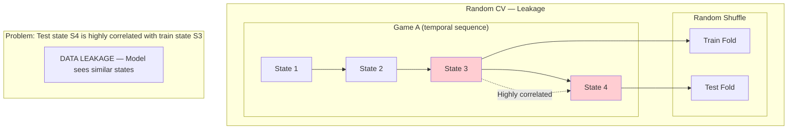

### 3.4 Temporal Game-Aware Cross-Validation Strategy

To prevent data leakage, we use a **temporal game sequence split** strategy that respects the sequential nature of game data:

**Core Principle**: Entire games (or game sequences) are kept together within a single fold. Train and test sets contain completely separate game sessions.

**Split Strategy**:

1. **Game-level splitting**: Group all board states by their originating game ID
2. **Temporal ordering**: Sort games by their start timestamp or game counter
3. **Forward-chaining splits**: Train on earlier games, test on later games
4. **No overlap**: A game's states appear in exactly one fold (either all train or all test)

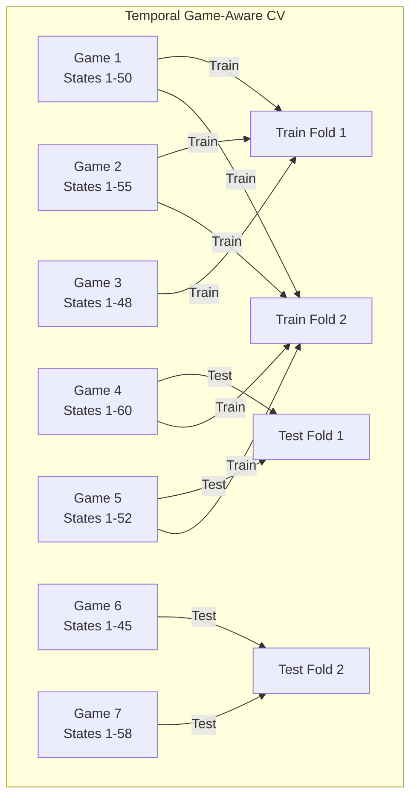

**Implementation**:

```rust
use automl::{CrossValidator, CVStrategy};

let cv = CrossValidator::new()
    .with_k_folds(5)
    .with_strategy(CVStrategy::Temporal)
    .with_group_column("game_id")  // Group by game, not individual states
    .with_shuffle(false)            // Preserve temporal order
    .with_random_state(42);

let results = cv.cross_val_score(&engine, &x, &y, Some(&groups))?;
```

**Fold definitions for 5-fold temporal CV**:

```
Total games: 100 (chronologically ordered)

Fold 1: Train = Games 1-80,  Test = Games 81-84
Fold 2: Train = Games 1-84,  Test = Games 85-88
Fold 3: Train = Games 1-88,  Test = Games 89-92
Fold 4: Train = Games 1-92,  Test = Games 93-96
Fold 5: Train = Games 1-96,  Test = Games 97-100
```

This ensures that every test set contains only games that occurred *after* all training games, preventing temporal leakage.

**Key Properties**:
- No game appears in both train and test sets
- Test games always chronologically follow training games
- Each fold uses an expanding window (training set grows over time)
- Game states within a test game are never seen during training

### 3.5 Stratified Temporal CV (Recommended)

For best results, combine stratification with temporal ordering:

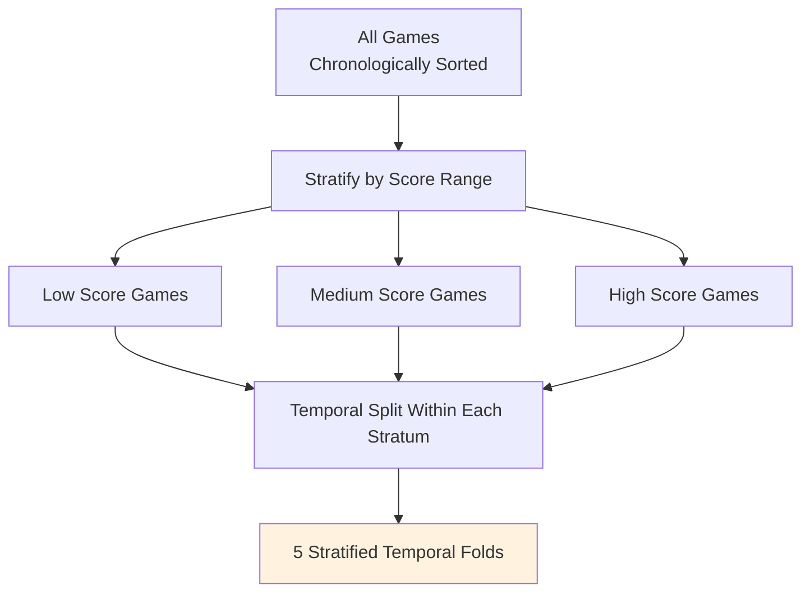

Each stratum (score range) is temporally split independently, ensuring both class balance and temporal consistency.

## 4. Cross-Validation Configuration

```rust
use automl::{CrossValidator, CVStrategy};

// Recommended: Temporal game-aware CV
let cv = CrossValidator::new()
    .with_k_folds(5)
    .with_strategy(CVStrategy::Temporal)
    .with_group_column("game_id")
    .with_shuffle(false)
    .with_random_state(42);

let results = cv.cross_val_score(&engine, &x, &y, Some(&groups))?;

// Alternative: Stratified K-Fold (if temporal ordering is not available)
let cv_stratified = CrossValidator::new()
    .with_k_folds(5)
    .with_strategy(CVStrategy::Stratified)
    .with_shuffle(true)
    .with_random_state(42);
```

**Configuration Notes**:
- Always specify `group_column` when game data has temporal structure
- Set `shuffle = false` for temporal CV to preserve ordering
- Use `Stratified` with score bins when game outcomes are imbalanced
- Never shuffle game IDs — this would cause temporal leakage

## 5. Cross-Validation Process

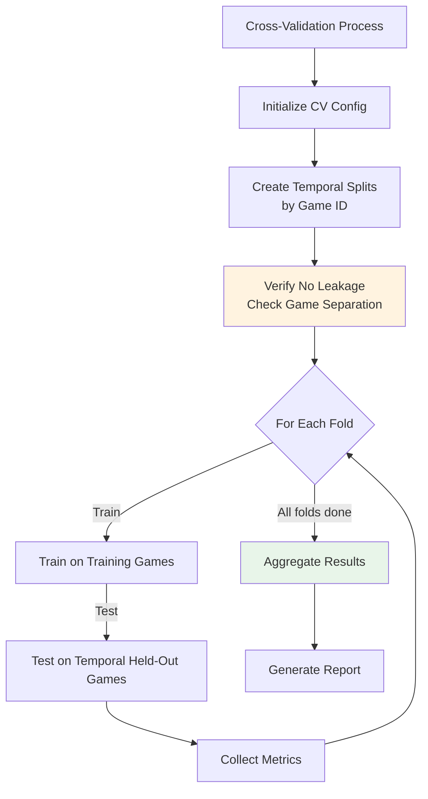

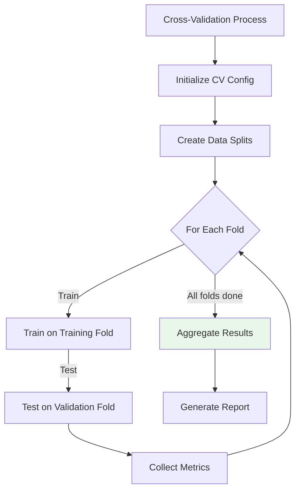

## 6. Results Aggregation

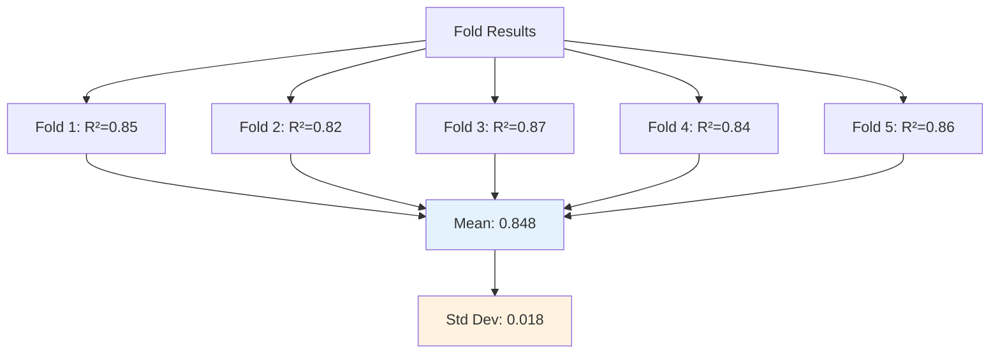

## 7. Cross-Validation Files

All cross-validation files are in `05-Model/04-Evaluation/`:

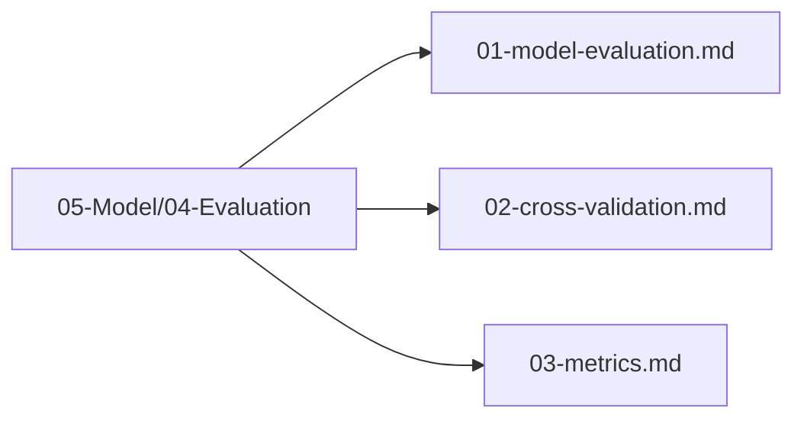

## 8. Next Steps

1. Define evaluation metrics
2. Execute cross-validation with temporal splits
3. Analyze results
4. Verify no data leakage between folds
