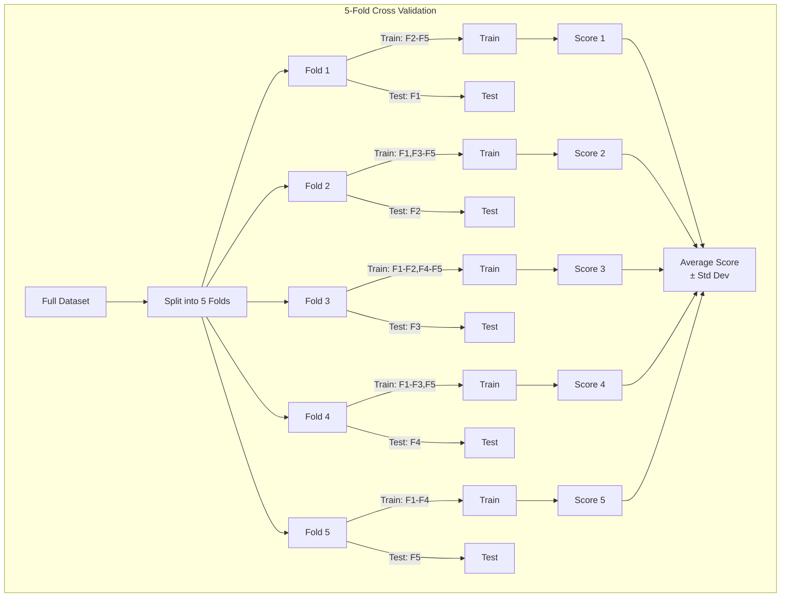
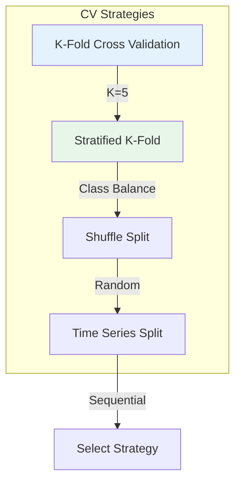
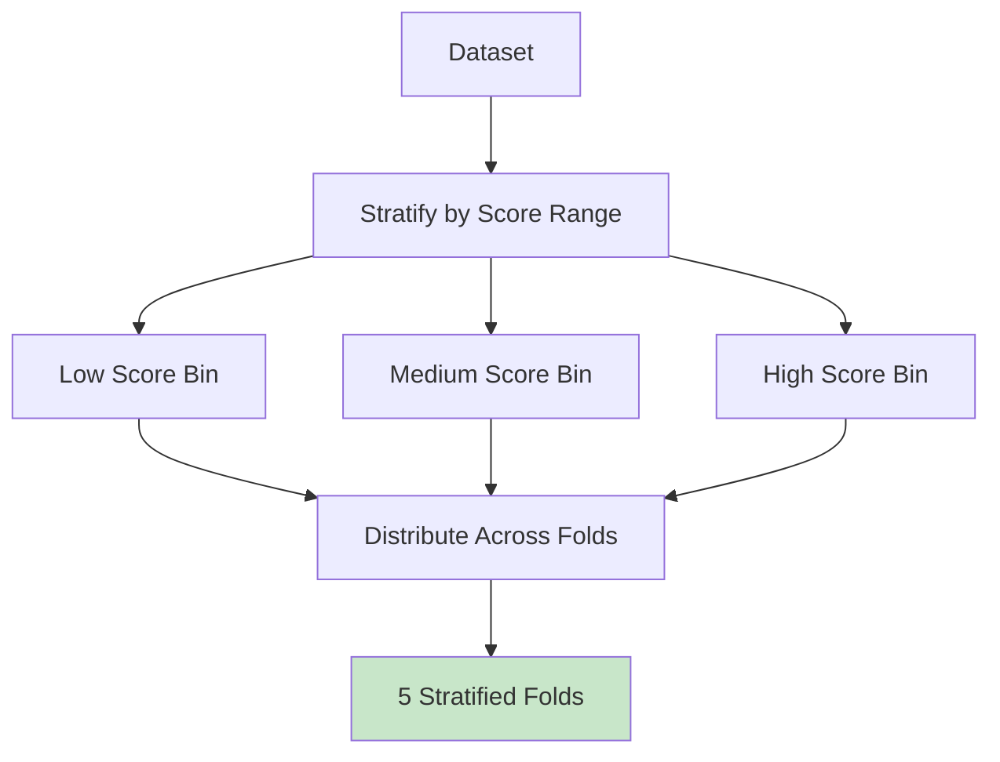
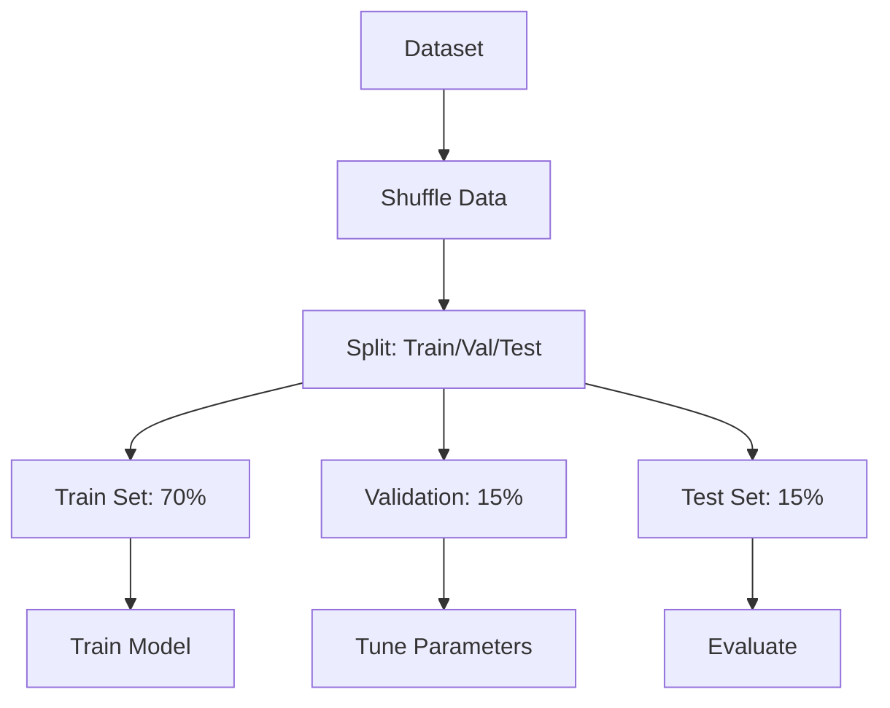
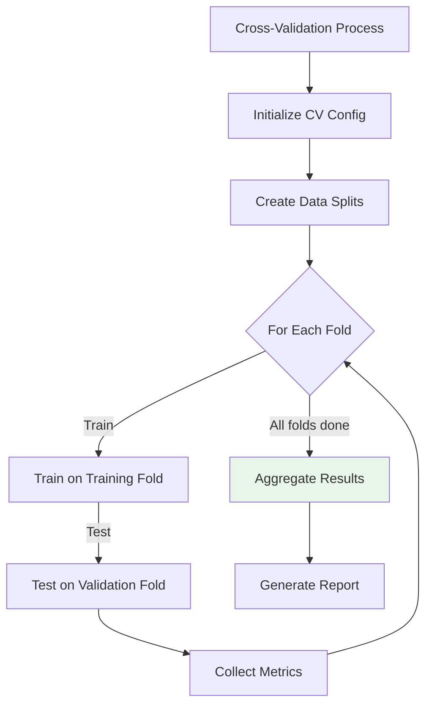
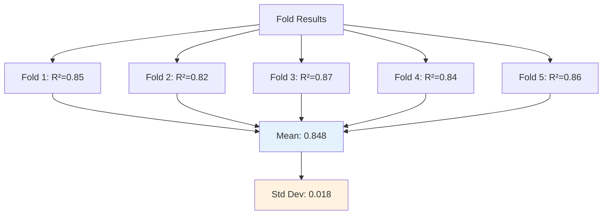
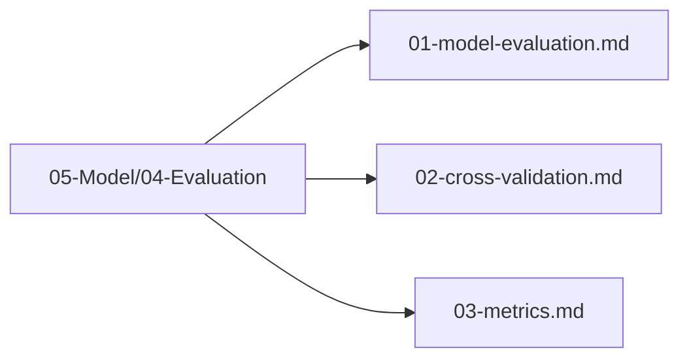

# Cross-Validation

## 1. Purpose

Define the cross-validation strategy for robust evaluation of the 2048 game machine learning model.

## 2. Cross-Validation Overview

Cross-validation ensures the model generalizes well by training and evaluating on different data splits.



## 3. Cross-Validation Strategies



### 3.1 Stratified K-Fold



### 3.2 Shuffle Split



## 4. Cross-Validation Configuration

```rust
use automl::{CrossValidator, CVStrategy};

let cv = CrossValidator::new()
    .with_k_folds(5)
    .with_strategy(CVStrategy::Stratified)
    .with_shuffle(true)
    .with_random_state(42);

let results = cv.cross_val_score(&engine, &x, &y)?;
```

## 5. Cross-Validation Process



## 6. Results Aggregation



## 7. Cross-Validation Files

All cross-validation files are in `05-Model/04-Evaluation/`:



## 8. Next Steps

1. Define evaluation metrics
2. Execute cross-validation
3. Analyze results
