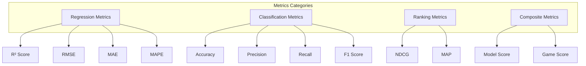
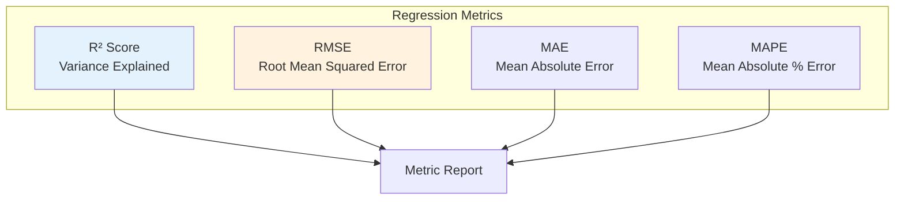
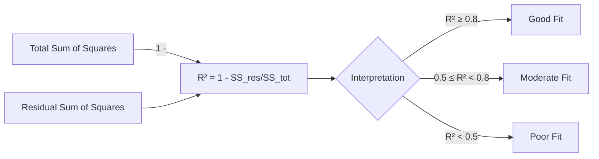
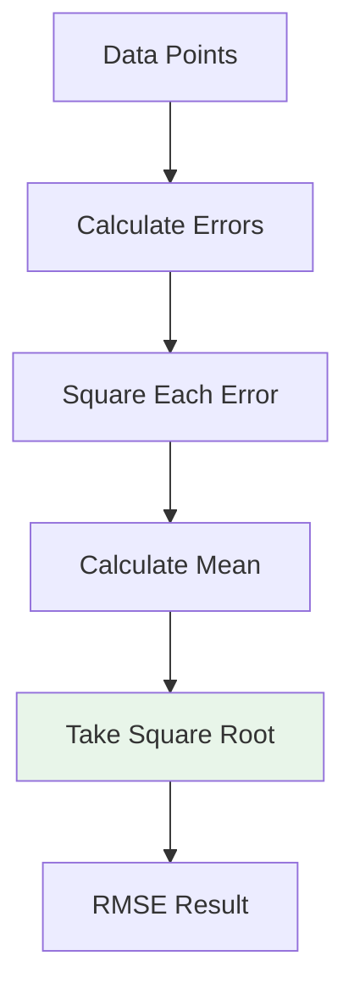
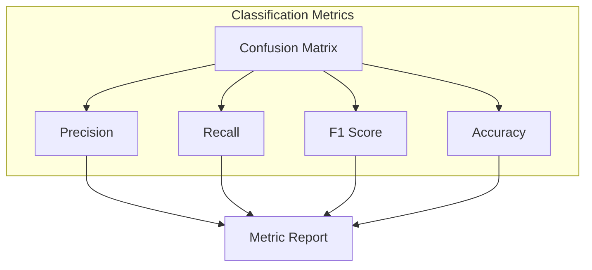
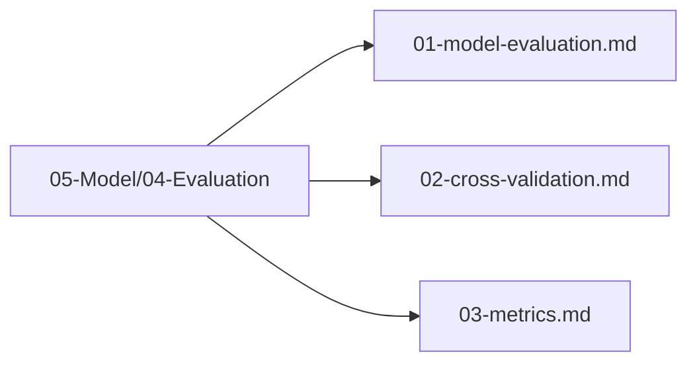

# Metrics

## 1. Purpose

Define the evaluation metrics used to assess the 2048 game machine learning model performance.

## 2. Metrics Overview

The metrics are categorized into regression metrics (for score prediction) and classification metrics (for move prediction).



## 3. Regression Metrics



### 3.1 R² Score



### 3.2 RMSE



## 4. Classification Metrics



### 4.1 Confusion Matrix

```mermaid
flowchart TD
    CM[Confusion Matrix<br/>4x4 Matrix<br/>Actions: Up, Down, Left, Right]
    CM --> TP[True Positives]
    CM --> FP[False Positives]
    CM --> FN[False Negatives]
    CM --> TN[True Negatives]
    
    CM --> AccCalc[Accuracy = (TP+TN)/Total]
    CM --> PrecCalc[Precision = TP/(TP+FP)]
    CM --> RecCalc[Recall = TP/(TP+FN)]
    CM --> F1Calc[F1 = 2*Prec*Rec/(Prec+Rec)]
```

### 4.2 F1 Score

```mermaid
flowchart LR
    Prec[Precision] --> F1[F1 Score]
    Rec[Recall] --> F1
    F1 --> |2 * P * R / (P + R)| Report[Report]
    
    style F1 fill:#e8f5e9
```

## 5. Composite Metrics

```mermaid
flowchart TD
    subgraph "Composite Metrics"
        ModelPerf[Model Performance Score]
        GameScore[Game Score Metric]
    end
    
    ModelPerf --> R2W[Weight: R² (40%)]
    ModelPerf --> AccW[Weight: Accuracy (30%)]
    ModelPerf --> SpeedW[Weight: Speed (30%)]
    
    GameScore --> Score[Final Game Score]
    GameScore --> MaxTile[Max Tile Reached]
    GameScore --> Moves[Total Moves]
    
    style ModelPerf fill:#e3f2fd
    style GameScore fill:#fff3e0
```

## 6. Metric Targets

| Metric | Target | Weight | Category |
|--------|--------|--------|----------|
| R² Score | ≥ 0.8 | 40% | Regression |
| Accuracy | ≥ 85% | 30% | Classification |
| RMSE | ≤ 500 | 20% | Regression |
| Inference Speed | ≤ 1ms | 10% | Performance |

## 7. Metric Calculation Pipeline

```mermaid
sequenceDiagram
    participant Pred as Predictions
    participant Actual as Actual Values
    participant Calc as Metric Calculator
    participant Store as Metric Store
    
    Pred->>Calc: Predicted values
    Actual->>Calc: Ground truth values
    Calc->>Calc: Compute all metrics
    Calc->>Store: Store metrics
    Store --> Report[Generate Report]
    
    Note over Calc: R², RMSE, MAE<br/>Accuracy, Precision, Recall, F1
```

## 8. Metrics Files Location

All metrics files are in `05-Model/04-Evaluation/`:



## 9. Next Steps

1. Run cross-validation experiments
2. Collect metric results
3. Compare against targets
