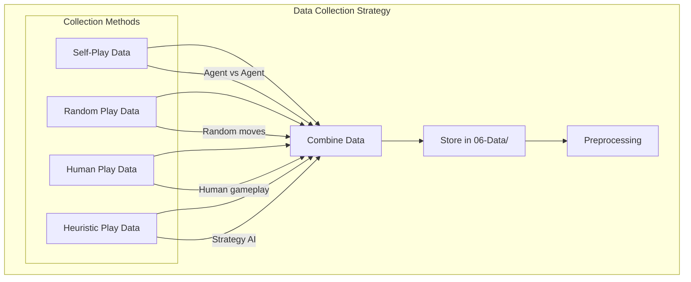
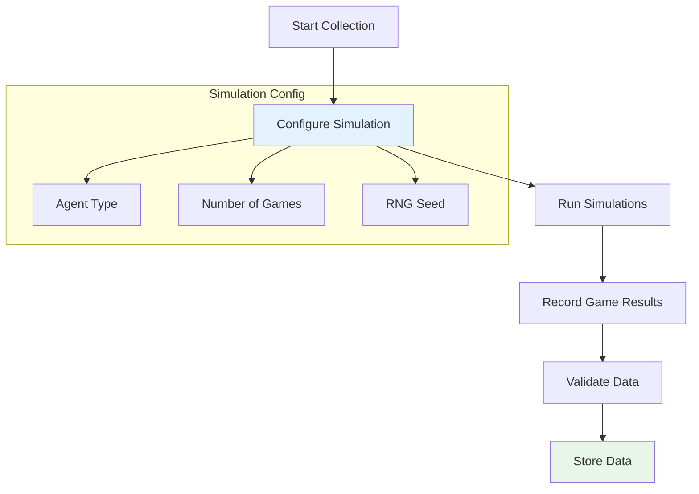
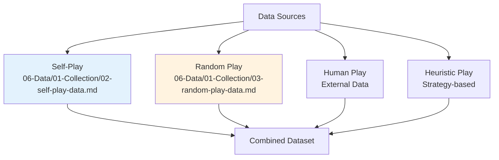
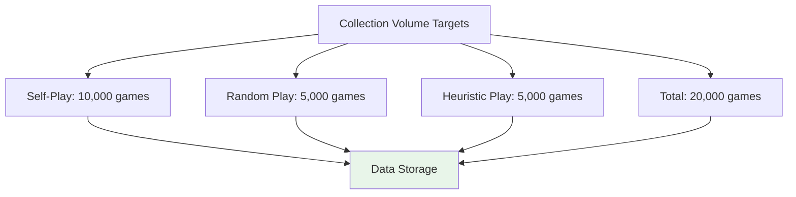
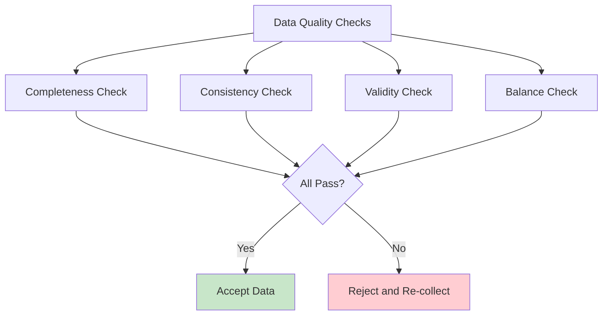
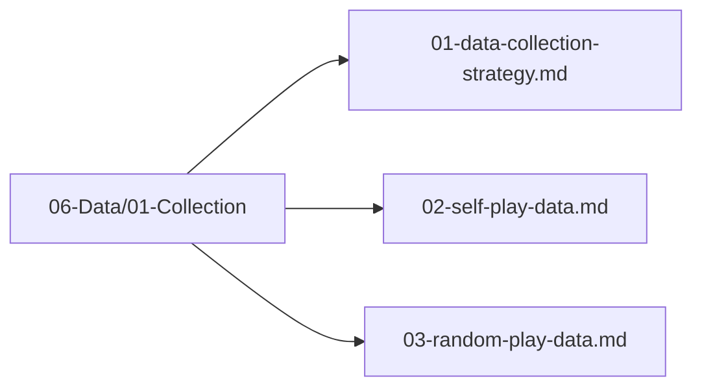

# Data Collection Strategy

## 1. Purpose

Define the strategy for collecting training data for the 2048 game machine learning model.

## 2. Data Collection Overview

Data is collected through multiple game simulation strategies to ensure diverse and comprehensive training data.

## 3. Collection Pipeline

## 4. Data Sources

## 5. Collection Volume

## 6. Data Quality Checks

## 7. Data Collection Files Location

## 8. Next Steps

1. Collect self-play data
2. Collect random play data
3. Validate and store collected data
