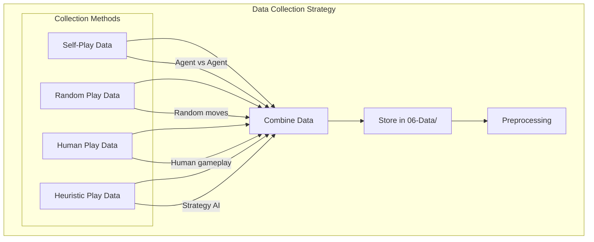
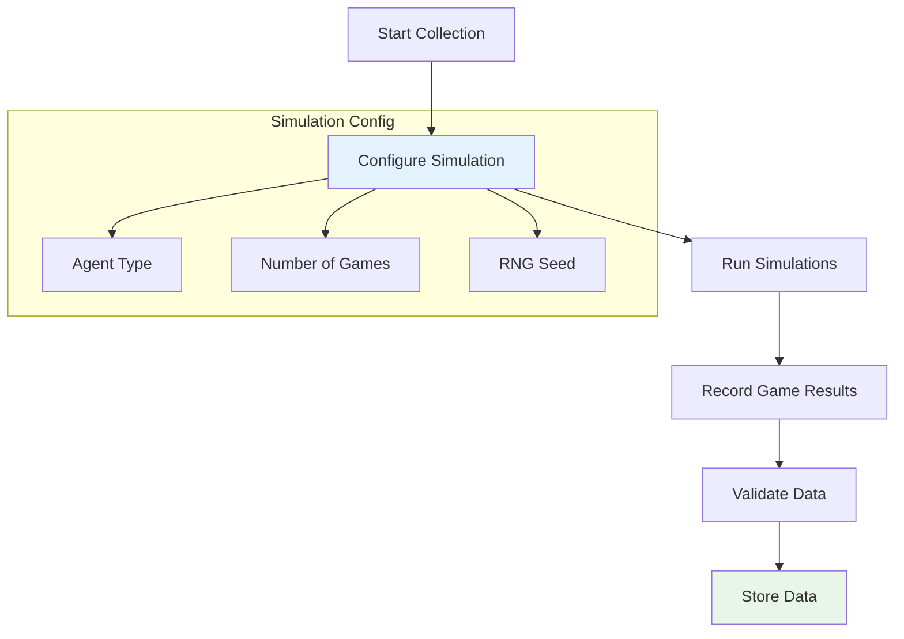
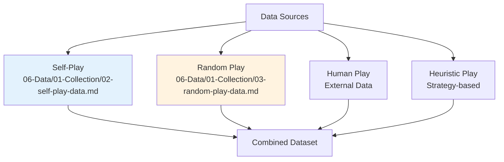
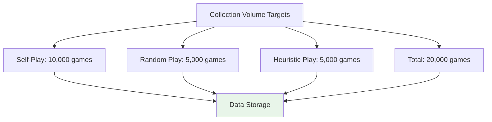
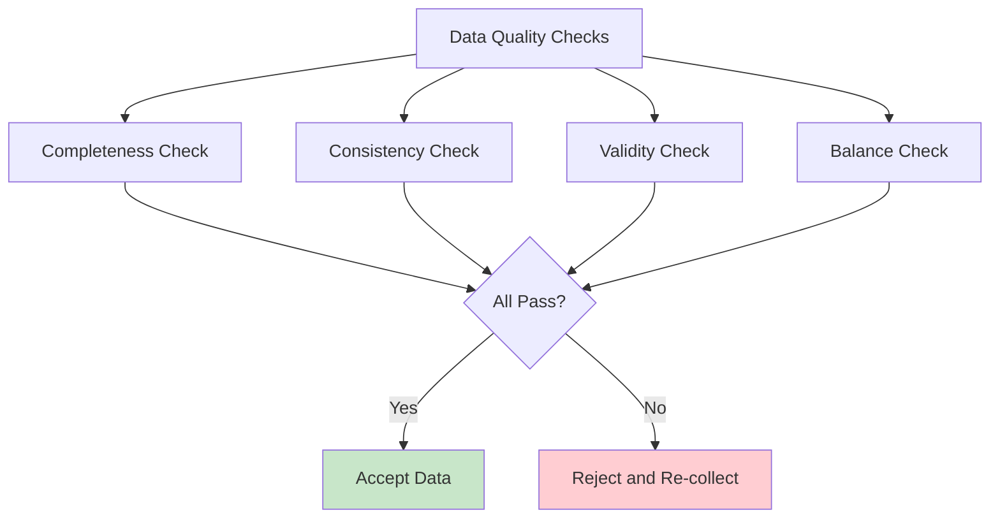
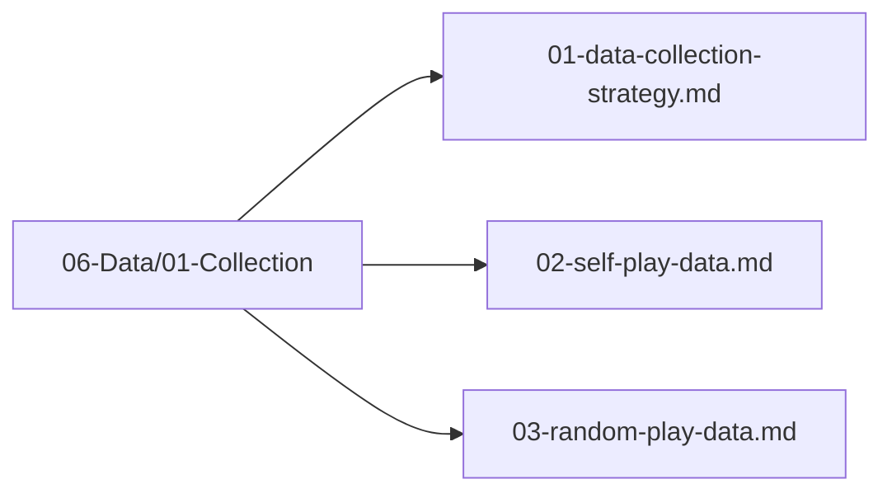

# Data Collection Strategy

## 1. Purpose

Define the strategy for collecting training data for the 2048 game machine learning model.

## 2. Data Collection Overview

Data is collected through multiple game simulation strategies to ensure diverse and comprehensive training data.



## 3. Collection Pipeline



## 4. Data Sources



## 5. Collection Volume



## 6. Data Quality Checks



## 7. Data Pipeline Definition

This section defines exactly how a game play is converted to CSV rows for training.

### 7.1 Sample Generation

A game with **N moves** produces **N training samples**. Each sample is a tuple of:

```
(state_features[25], action: u8, reward: f64)
```

| Component | Type | Size | Description |
|-----------|------|------|-------------|
| `state_features` | array | 25 | Board state feature vector at turn t |
| `action` | u8 | 1 | Direction taken at turn t (0=Up, 1=Down, 2=Left, 3=Right) |
| `reward` | f64 | 1 | Score change or final score encoding |

### 7.2 State-to-Feature Mapping

The board state at turn t is encoded into a 25-dimensional feature vector:

```
Feature Vector = [
    grid[0][0], grid[0][1], ..., grid[3][3],  // 16 dimensions: tile values on the 4x4 grid
    empty_count,                              // 1 dimension: number of empty cells
    max_tile,                                 // 1 dimension: highest tile value on board
    monotonicity,                             // 1 dimension: monotonicity score (0-1)
    smoothness,                               // 1 dimension: smoothness score (0-1)
    merged_count,                             // 1 dimension: number of merges this turn
    move_count                                // 1 dimension: total moves played so far
]
```

Each grid cell value is normalized by dividing by the maximum tile value seen in the game (or 2048). Derived features (monotonicity, smoothness) are computed from the grid layout using standard 2048 heuristic formulas.

### 7.3 Action as Target Label

The action taken at turn t becomes the **target label** for that sample:
- `0` = move up
- `1` = move down
- `2` = move left
- `3` = move right

This is the direction that the agent actually executed. The model learns to predict which direction maximizes the expected reward given the current board state.

### 7.4 Reward Encoding

The reward is encoded as follows:
- **Immediate reward**: `score_after_move - score_before_move` (the score change from the action)
- **Terminal reward**: For the final move of a game, the reward is the **final score** of the game
- **Invalid move penalty**: If the move results in no change (invalid/empty move), reward = `-10.0`
- **Game over bonus**: If the game ends after this move, add a bonus of `+50.0` to the final reward

### 7.5 Concrete Example

A game with **100 moves** produces **100 CSV rows**:

```csv
state_features_0,state_features_1,...,state_features_24,action,reward
0.125,0.0,0.0,0.125,...,0.5,2,45.0
0.25,0.0,0.0,0.25,...,0.6,0,32.0
0.125,0.0,0.125,0.125,...,0.7,3,18.0
...
0.0625,0.0625,...,0.25,1,1024.0
```

Example row breakdown:
- `state_features[0..24]`: The 25-dimensional feature vector encoding the board state at turn t
- `action: 2`: The agent moved left at turn t
- `reward: 45.0`: The score increased by 45 points from this move

### 7.6 Train/Validation/Test Split for Sequential Data

Because game data is sequential (each game is a correlated trajectory), standard random splitting would cause data leakage. The split is done **by game**:

| Split | Percentage | Method |
|-------|-----------|--------|
| **Train** | 70% | First 70% of games (chronologically) |
| **Validation** | 15% | Next 15% of games |
| **Test** | 15% | Final 15% of games |

Rules:
- **Entire games** go to one split — never split a single game across splits
- Games are shuffled **before** assignment to splits to avoid temporal bias
- Each split contains games from all collection methods (self-play, random, heuristic)
- No game appears in more than one split
- The split ensures the model is evaluated on game trajectories it has never seen during training

### 7.7 CSV File Format

All training data is stored as CSV files with the following schema:

```
columns: f0,f1,f2,...,f24,action:u8,reward:f64
encoding: UTF-8
delimiter: comma
header: yes
```

Files are organized by collection method:
- `06-Data/01-Collection/self_play.csv`
- `06-Data/01-Collection/random_play.csv`
- `06-Data/01-Collection/heuristic_play.csv`

## 8. Data Collection Files Location



## 8. Next Steps

1. Collect self-play data
2. Collect random play data
3. Validate and store collected data
