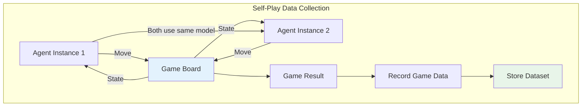
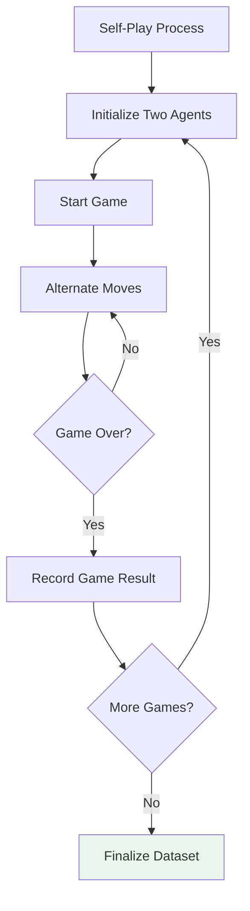
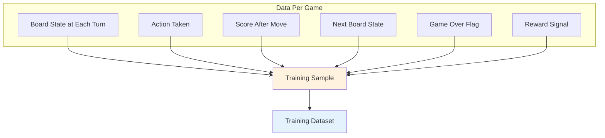
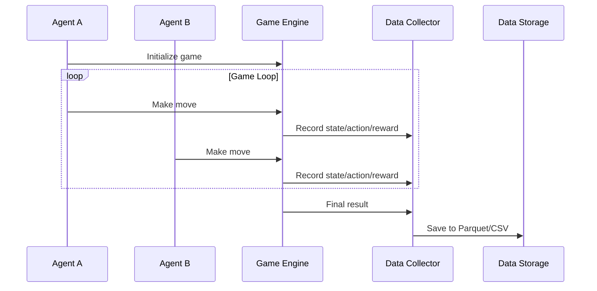
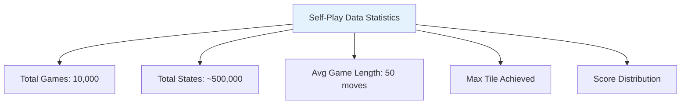
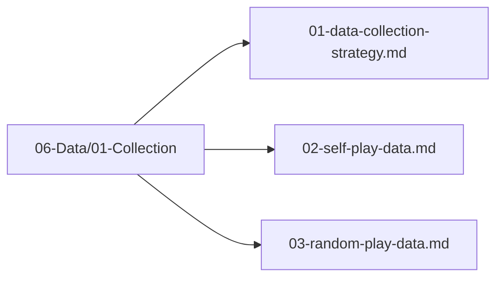

# Self-Play Data

## 1. Purpose

Collect training data from self-play games where the AI agent plays against itself, generating high-quality game sequences.

## 2. Self-Play Overview

Self-play is the primary method for generating training data, as it produces games where the agent learns from its own experience.



## 3. Self-Play Process



## 4. Data Generation



## 5. Self-Play Configuration

```rust
pub struct SelfPlayConfig {
    pub n_games: usize,              // Number of self-play games
    pub agent1: AgentType,           // First agent type
    pub agent2: AgentType,           // Second agent type
    pub save_interval: usize,        // Save every N games
    pub output_path: String,         // Output path: 06-Data/01-Collection/
    pub seed: u64,                   // Random seed
}
```

## 6. Self-Play Data Flow



## 7. Data Statistics



## 8. Self-Play Data Files Location



## 9. Next Steps

1. Configure self-play simulation
2. Run self-play games
3. Collect and store game data
