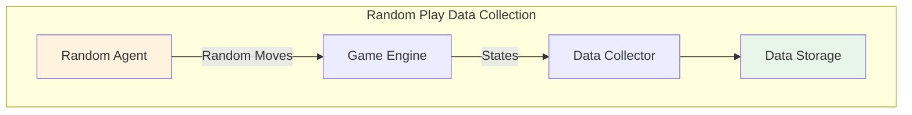
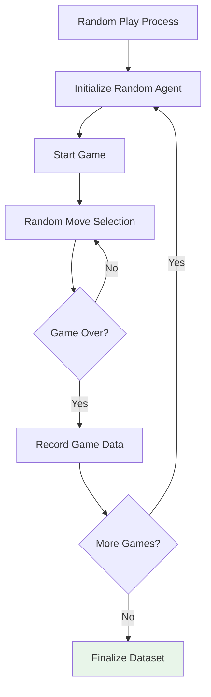
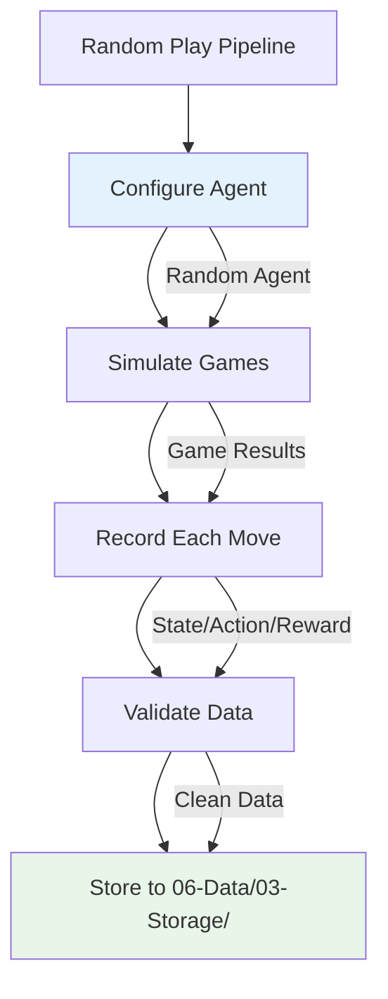
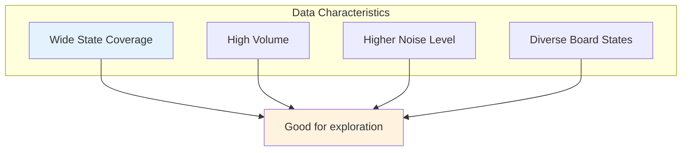
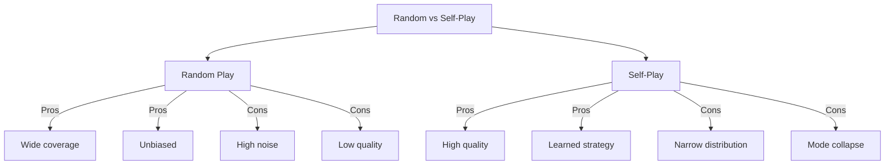
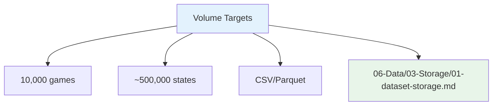
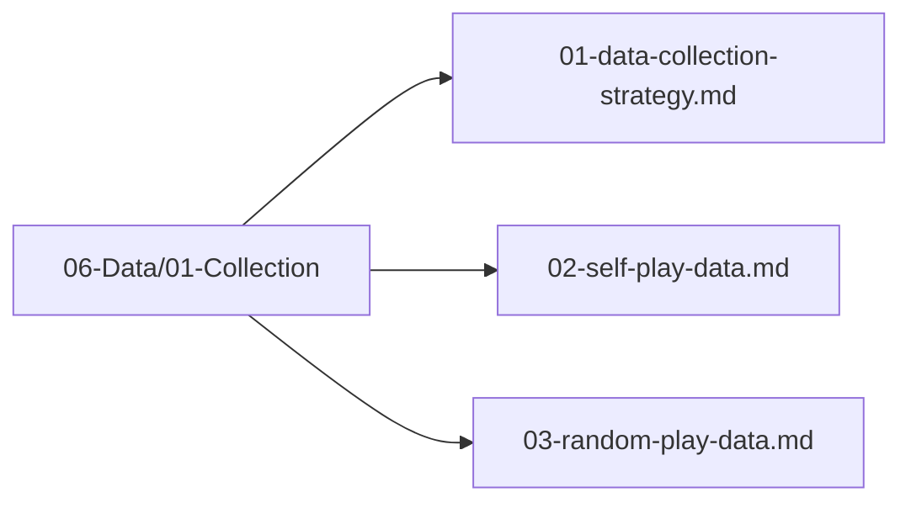

# Random Play Data

## 1. Purpose

Collect training data from random play games to provide baseline data and ensure diverse coverage of the board state space.

## 2. Random Play Overview

Random play data provides a broad sampling of the state-action space, which is essential for training models that can handle diverse board configurations.



## 3. Random Play Process



## 4. Random Agent Implementation

```rust
pub struct RandomAgent {
    rng: ChaCha8Rng,
}

impl Agent for RandomAgent {
    fn select_move(&self, board: &Board) -> Direction {
        let valid = board.get_valid_moves();
        valid[self.rng.gen_range(0..valid.len())]
    }
}
```

## 5. Data Collection Pipeline



## 6. Random Play Data Characteristics



## 7. Random Play vs Self-Play



## 8. Data Collection Volume



## 9. Random Play Data Files Location



## 10. Next Steps

1. Run random play simulations
2. Validate collected data
3. Store in data storage
