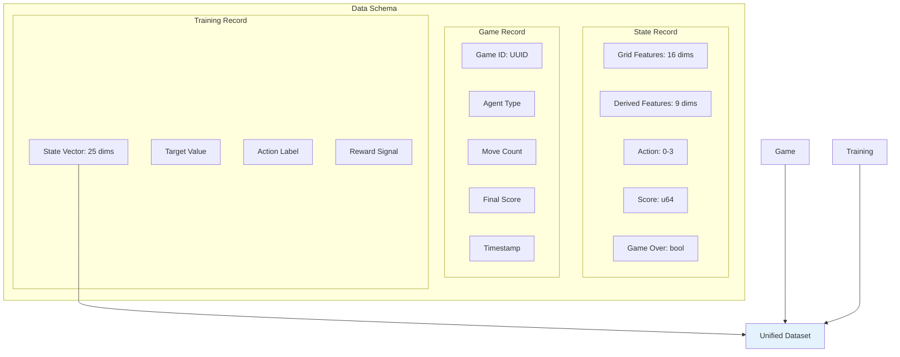
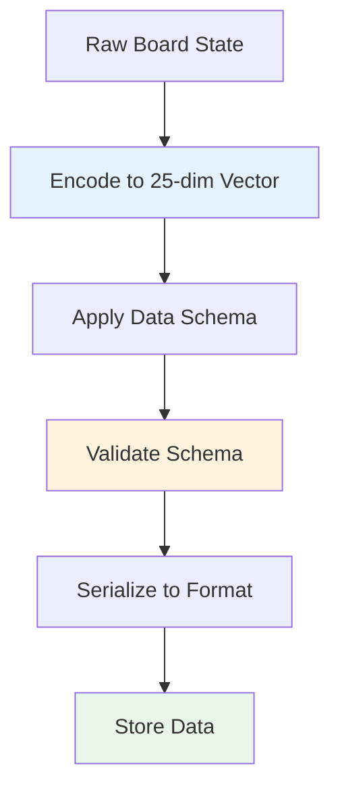
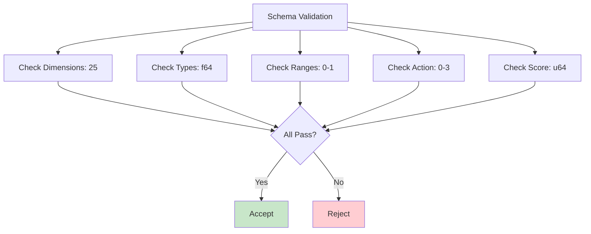
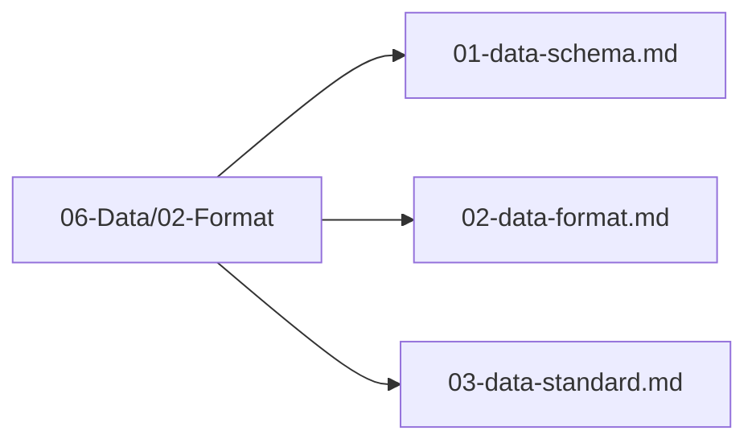

# Data Schema

## 1. Purpose

Define the data schema for all training and evaluation data used in the 2048 game machine learning pipeline.

## 2. Data Schema Overview

The data schema defines the structure of all data records, ensuring consistency across the pipeline.



## 3. State Feature Schema

```mermaid
flowchart TB
    subgraph "25-Dimensional State Vector"
        Grid[Grid Features<br/>Dimensions 0-15]
        Empty[Empty Count<br/>Dimension 16]
        MaxTile[Max Tile Log<br/>Dimension 17]
        Mono[Monotonicity<br/>Dimension 18]
        Smooth[Smoothness<br/>Dimension 19]
        Corner[Corner Value<br/>Dimension 20]
        Moves[Available Moves<br/>Dimension 21]
        Merges[Merges Available<br/>Dimension 22]
        ScoreNorm[Score Normalized<br/>Dimension 23]
        MoveNorm[Move Count Norm<br/>Dimension 24]
    end
    
    Grid --> StateVec[State Vector<br/>[f64; 25]]
    Empty --> StateVec
    MaxTile --> StateVec
    Mono --> StateVec
    Smooth --> StateVec
    Corner --> StateVec
    Moves --> StateVec
    Merges --> StateVec
    ScoreNorm --> StateVec
    MoveNorm --> StateVec
    
    style StateVec fill:#e8f5e9
```

## 4. Schema Definition

```rust
pub struct StateRecord {
    pub grid: [f64; 16],
    pub empty_count: f64,
    pub max_tile_log: f64,
    pub monotonicity: f64,
    pub smoothness: f64,
    pub corner_value: f64,
    pub available_moves: f64,
    pub merges_available: f64,
    pub score_normalized: f64,
    pub move_count_norm: f64,
    pub action: u8,
    pub score: u64,
    pub done: bool,
}
```

## 5. Data Format Flow



## 6. Schema Validation



## 7. Schema Files Location

All data schema files are in `06-Data/02-Format/`:



## 8. Next Steps

1. Implement schema validation
2. Apply schema to all data pipelines
