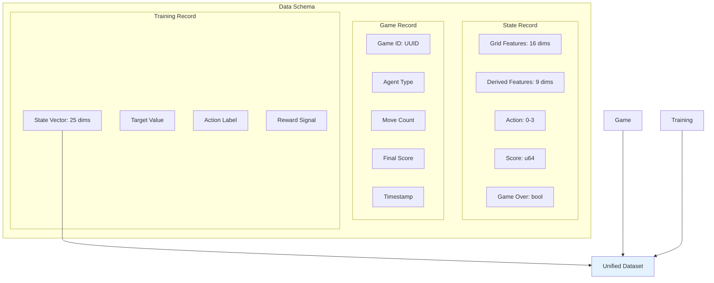
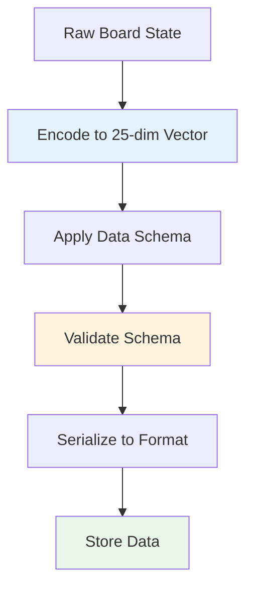
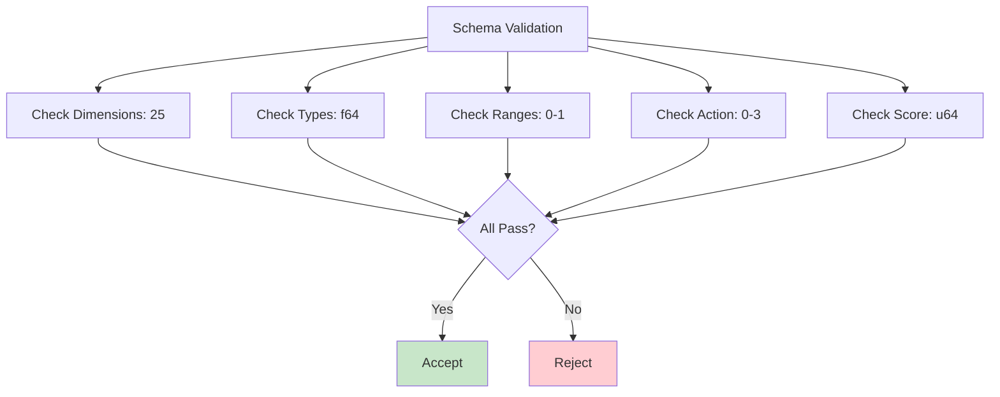
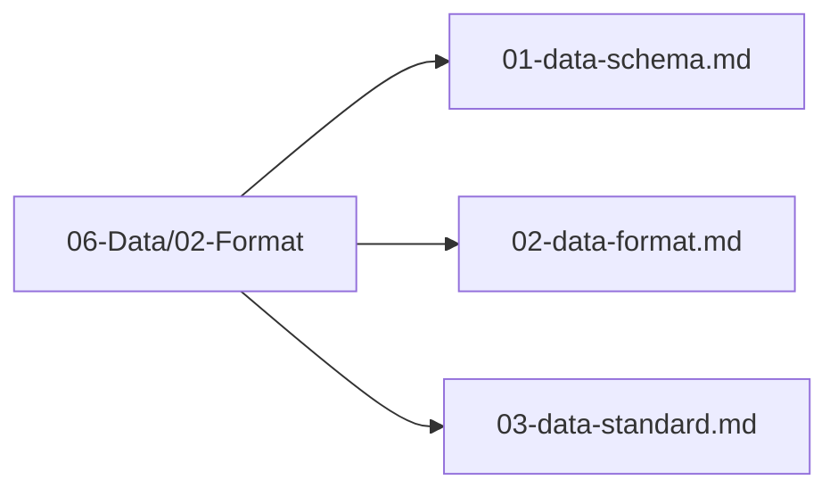

# Data Schema

## 1. Purpose

Define the data schema for all training and evaluation data used in the 2048 game machine learning pipeline.

## 2. Data Schema Overview

The data schema defines the structure of all data records, ensuring consistency across the pipeline.



## 3. State Feature Schema

```mermaid
flowchart TB
    subgraph "25-Dimensional State Vector"
        Grid[Grid Features<br/>Dimensions 0-15]
        Empty[Empty Count<br/>Dimension 16]
        MaxTile[Max Tile Log<br/>Dimension 17]
        Mono[Monotonicity<br/>Dimension 18]
        Smooth[Smoothness<br/>Dimension 19]
        Corner[Corner Value<br/>Dimension 20]
        Moves[Available Moves<br/>Dimension 21]
        Merges[Merges Available<br/>Dimension 22]
        ScoreNorm[Score Normalized<br/>Dimension 23]
        MoveNorm[Move Count Norm<br/>Dimension 24]
    end
    
    Grid --> StateVec[State Vector<br/>[f64; 25]]
    Empty --> StateVec
    MaxTile --> StateVec
    Mono --> StateVec
    Smooth --> StateVec
    Corner --> StateVec
    Moves --> StateVec
    Merges --> StateVec
    ScoreNorm --> StateVec
    MoveNorm --> StateVec
    
    style StateVec fill:#e8f5e9
```

## 4. Schema Definition

```rust
pub struct StateRecord {
    pub grid: [f64; 16],
    pub empty_count: f64,
    pub max_tile_log: f64,
    pub monotonicity: f64,
    pub smoothness: f64,
    pub corner_value: f64,
    pub available_moves: f64,
    pub merges_available: f64,
    pub score_normalized: f64,
    pub move_count_norm: f64,
    pub action: u8,
    pub score: u64,
    pub done: bool,
}
```

## 5. Data Format Flow



## 6. Schema Validation



## 7. Schema Files Location

All data schema files are in `06-Data/02-Format/`:



## 8. CSV Schema for AutoML

The automl framework consumes data in CSV format. The following defines the exact schema expected.

### 8.1 Column Definitions

| Column Name | Data Type | Description |
|-------------|-----------|-------------|
| `grid_0` | `f64` | Tile value at grid position (0,0) |
| `grid_1` | `f64` | Tile value at grid position (0,1) |
| `grid_2` | `f64` | Tile value at grid position (0,2) |
| `grid_3` | `f64` | Tile value at grid position (0,3) |
| `grid_4` | `f64` | Tile value at grid position (1,0) |
| `grid_5` | `f64` | Tile value at grid position (1,1) |
| `grid_6` | `f64` | Tile value at grid position (1,2) |
| `grid_7` | `f64` | Tile value at grid position (1,3) |
| `grid_8` | `f64` | Tile value at grid position (2,0) |
| `grid_9` | `f64` | Tile value at grid position (2,1) |
| `grid_10` | `f64` | Tile value at grid position (2,2) |
| `grid_11` | `f64` | Tile value at grid position (2,3) |
| `grid_12` | `f64` | Tile value at grid position (3,0) |
| `grid_13` | `f64` | Tile value at grid position (3,1) |
| `grid_14` | `f64` | Tile value at grid position (3,2) |
| `grid_15` | `f64` | Tile value at grid position (3,3) |
| `empty_count` | `f64` | Number of empty tiles on the board |
| `max_tile_log` | `f64` | Log2 of the maximum tile value |
| `monotonicity` | `f64` | Monotonicity score of the board |
| `smoothness` | `f64` | Smoothness score of the board |
| `corner_value` | `f64` | Value of the corner tile (highest priority corner) |
| `available_moves` | `f64` | Number of valid moves available |
| `merges_available` | `f64` | Number of possible merges |
| `score_normalized` | `f64` | Normalized score (0.0 to 1.0) |
| `move_count_norm` | `f64` | Normalized move count (0.0 to 1.0) |
| `action` | `u8` | Target label: 0=Up, 1=Down, 2=Left, 3=Right |

### 8.2 Data Formats

Supported formats for training data:
- **CSV** (`.csv`) — Primary format for automl ingestion
- **Parquet** (`.parquet`) — Optional, for large-scale datasets

### 8.3 Example Row

```csv
grid_0,grid_1,grid_2,grid_3,grid_4,grid_5,grid_6,grid_7,grid_8,grid_9,grid_10,grid_11,grid_12,grid_13,grid_14,grid_15,empty_count,max_tile_log,monotonicity,smoothness,corner_value,available_moves,merges_available,score_normalized,move_count_norm,action
2.0,0.0,0.0,0.0,0.0,4.0,0.0,0.0,0.0,0.0,0.0,0.0,0.0,0.0,0.0,0.0,8,6.0,0.85,0.72,4.0,3.0,2.0,0.15,0.45,0
```

### 8.4 Game State to CSV Row Mapping

Each CSV row represents a single **state-action pair** extracted from a game trajectory:

1. A game is played from start to finish (or until a terminal state).
2. At each step, the current board state is captured as the 25-dimensional feature vector.
3. The action taken at that step is recorded as the target label (`action` column).
4. The resulting row is added to the training dataset.
5. Multiple games are concatenated into a single CSV file.
6. Each row is independent — there is no sequence dependency between rows in the CSV.

```
Game 1:
  State(step 0) + Action(up)     → Row 1
  State(step 1) + Action(right)  → Row 2
  State(step 2) + Action(down)   → Row 3
  ...
Game 2:
  State(step 0) + Action(left)   → Row N
  ...
```

### 8.5 Data Type Summary

- All `grid_*` features: `f64` (tile values as f64, 0.0 for empty cells)
- All derived features: `f64` (continuous scores, normalized where applicable)
- `action` target: `u8` (integer class label: 0, 1, 2, or 3)
- CSV delimiter: `,` (comma)
- Header row: present (column names as defined above)
- Missing values: none expected; all features are deterministically computed from board state

## 9. Next Steps

1. Implement schema validation
2. Apply schema to all data pipelines
3. Generate training CSV from game replay data
