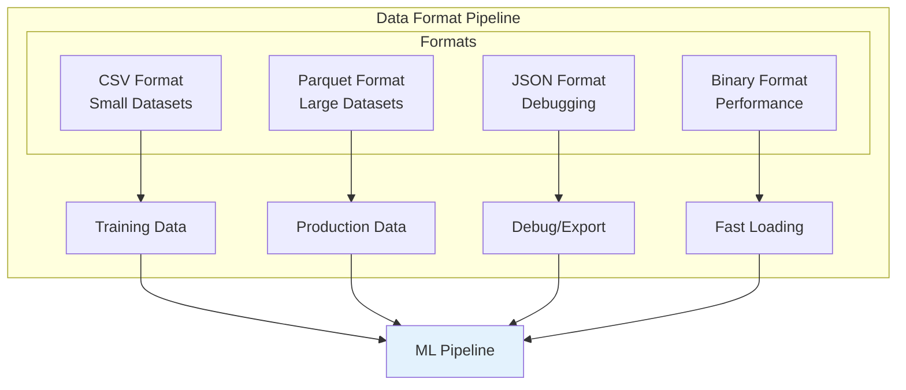
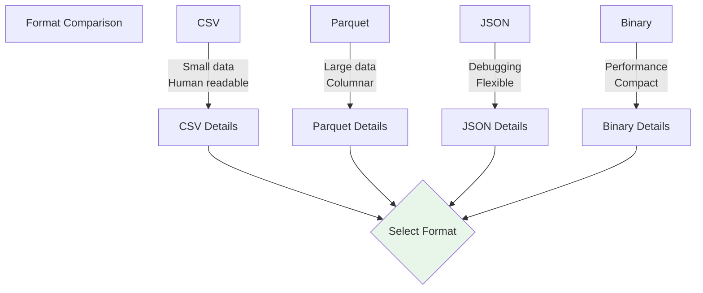
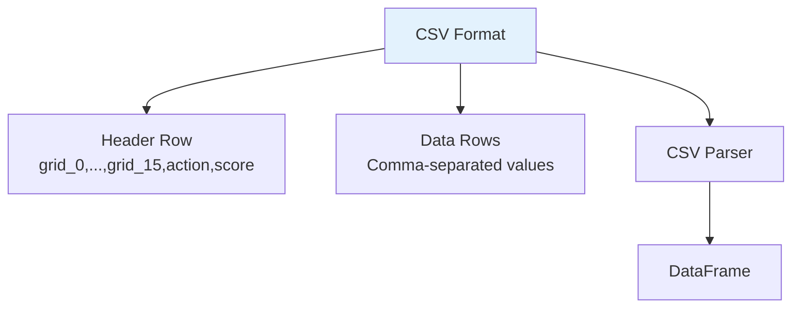
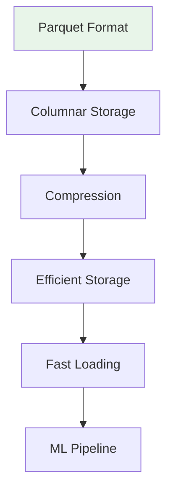
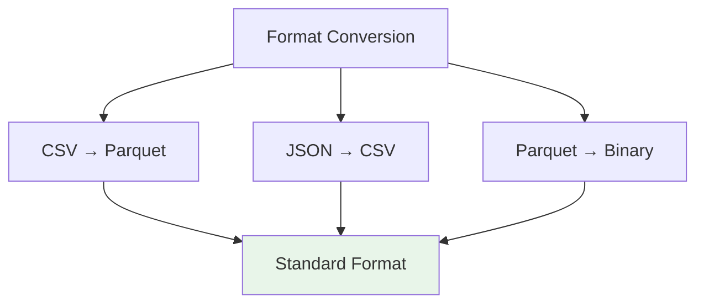
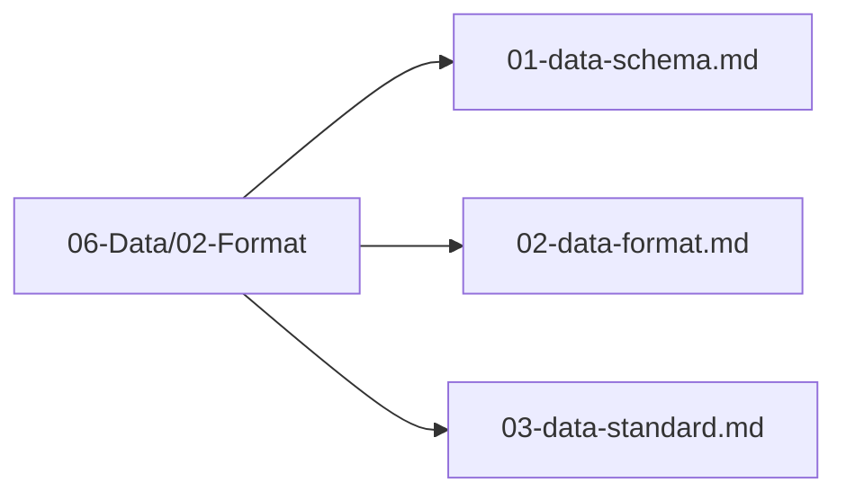

# Data Format

## 1. Purpose

Define the data formats used for storing and exchanging 2048 game training data.

## 2. Data Format Overview

Multiple data formats are supported for different stages of the ML pipeline.



## 3. Format Comparison



## 4. CSV Format



### CSV Structure

```
grid_0,grid_1,...,grid_15,empty_count,max_tile_log,monotonicity,smoothness,corner_value,available_moves,merges_available,score_normalized,move_count_norm,action,score
2,4,8,16,32,64,128,256,512,1024,2048,0,0,0,0,8,4.5,0.8,0.9,0.5,2,0.0004,0.3,1,2048
```

## 5. Parquet Format



### Parquet Schema

```rust
use polars::prelude::*;

fn create_dataframe(states: &[BoardStateML], actions: &[u8], scores: &[u64]) -> DataFrame {
    // Create polars DataFrame from collected data
    // Stored in 06-Data/03-Storage/
}
```

## 6. JSON Format

```mermaid
flowchart TD
    JSON[JSON Format]
    JSON --> State[State Object]
    JSON --> Action[Action Value]
    JSON --> Score[Score Value]
    JSON --> Metadata[Metadata]
    
    State --> Grid[Grid: [u8; 16]]
    State --> Features[Derived Features]
    
    style JSON fill:#fff3e0
```

### JSON Structure

```json
{
    "state": {
        "grid": [2, 4, 8, 16, 32, 64, 128, 256, 512, 1024, 2048, 0, 0, 0, 0, 0],
        "score": 4092,
        "empty_count": 5,
        "max_tile_log": 11.0,
        "monotonicity": 0.8
    },
    "action": 1,
    "score": 2048,
    "game_over": false
}
```

## 7. Format Conversion Pipeline



## 8. Format Files Location

All data format files are in `06-Data/02-Format/`:



## 9. Next Steps

1. Select appropriate format for each pipeline stage
2. Implement format converters
