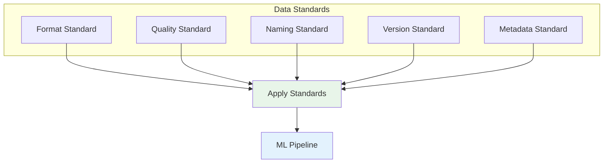
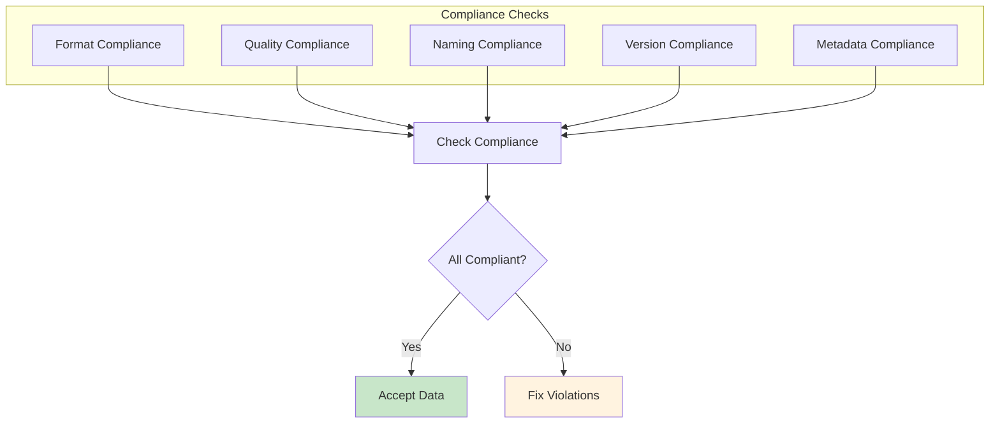
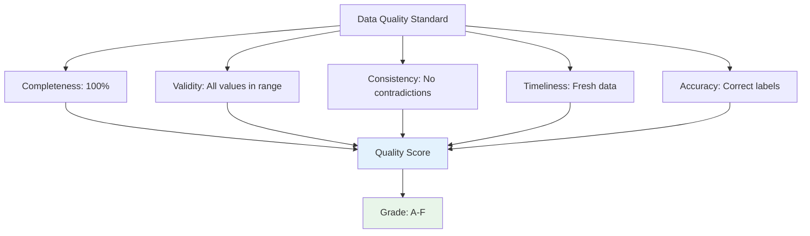
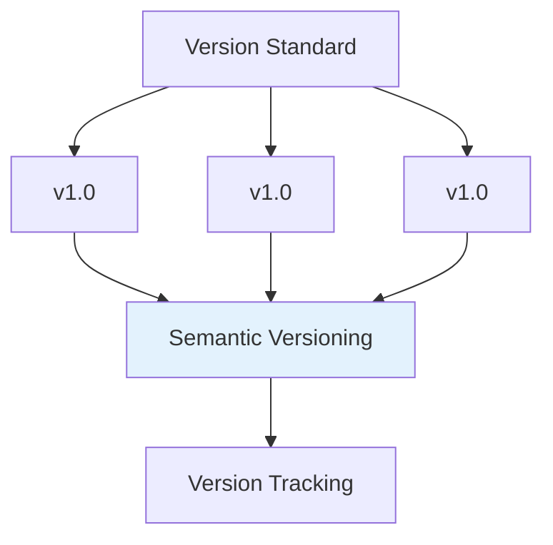
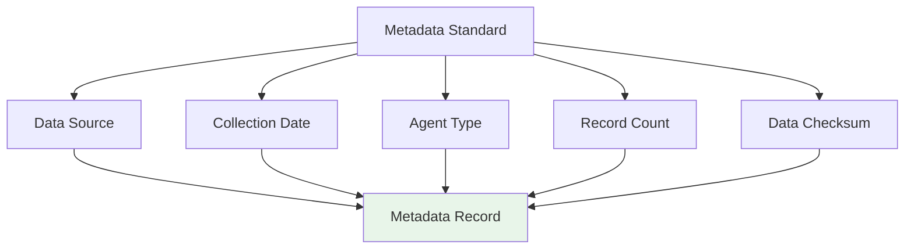
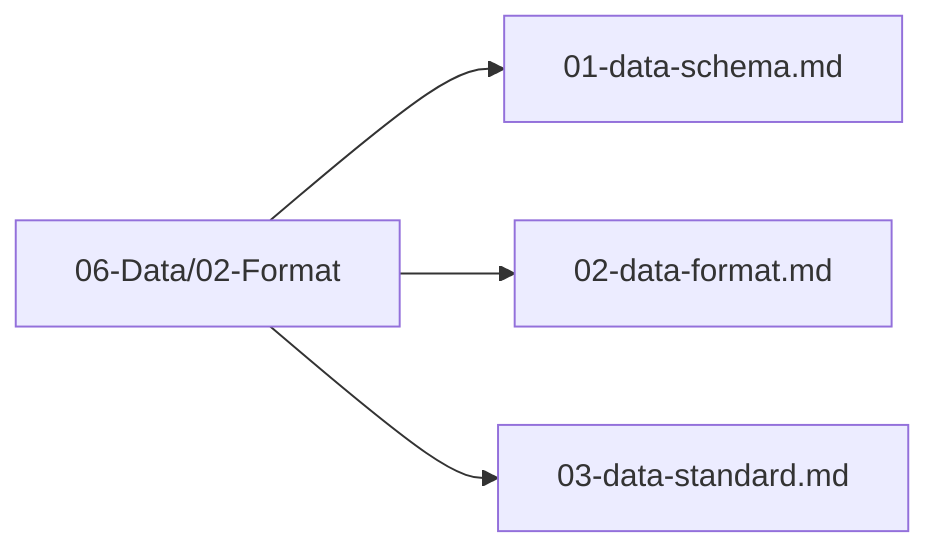

# Data Standard

## 1. Purpose

Define the data standards that ensure consistency, quality, and interoperability across the 2048 game ML pipeline.

## 2. Data Standard Overview

Data standards ensure all data conforms to a consistent format, enabling seamless integration across pipeline stages.



## 3. Standard Compliance



## 4. Feature Standard

```mermaid
flowchart TD
    Feature[Feature Standard]
    Feature --> Dim[Dimension: 25]
    Feature --> Type[Type: f64]
    Feature --> Range[Range: [0, 1]]
    Feature --> Order[Order: Fixed]
    
    Dim --> Spec[Feature Specification]
    Type --> Spec
    Range --> Spec
    Order --> Spec
    
    style Spec fill:#e3f2fd
```

### 4.1 Feature Ordering

```mermaid
flowchart LR
    F0[grid_0] --> F1[grid_1]
    F1 --> F2[grid_2]
    F2 --> F3[grid_3]
    F3 --> F4[...grid_15]
    F4 --> F5[empty_count]
    F5 --> F6[max_tile_log]
    F6 --> F7[monotonicity]
    F7 --> F8[smoothness]
    F8 --> F9[corner_value]
    F9 --> F10[available_moves]
    F10 --> F11[merges_available]
    F11 --> F12[score_normalized]
    F12 --> F13[move_count_norm]
    
    style F0 fill:#e8f5e9
    style F13 fill:#fff3e0
```



## 5. Data Quality Standard



## 6. Versioning Standard



## 7. Metadata Standard



## 8. Standard Files Location

All data standard files are in `06-Data/02-Format/`:



## 9. Next Steps

1. Implement standard validation
2. Apply standards to all data pipelines
