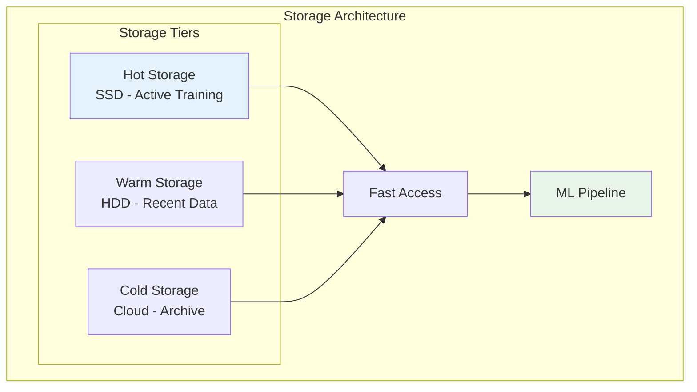
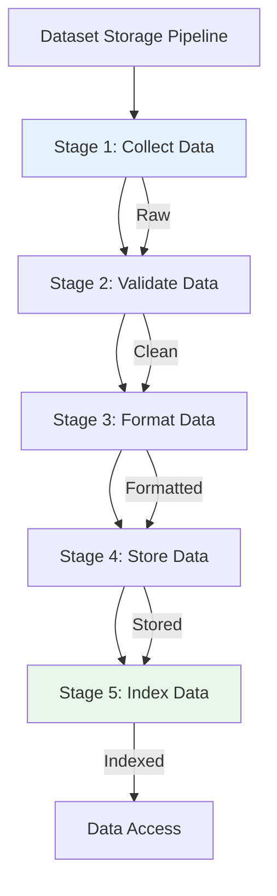
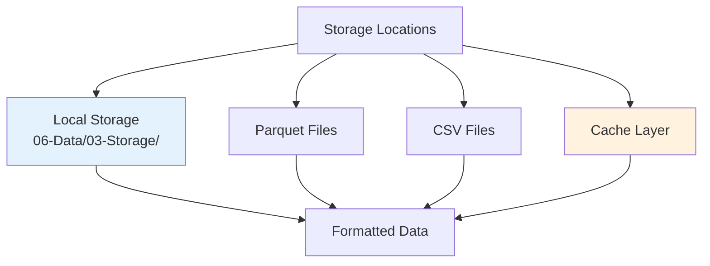
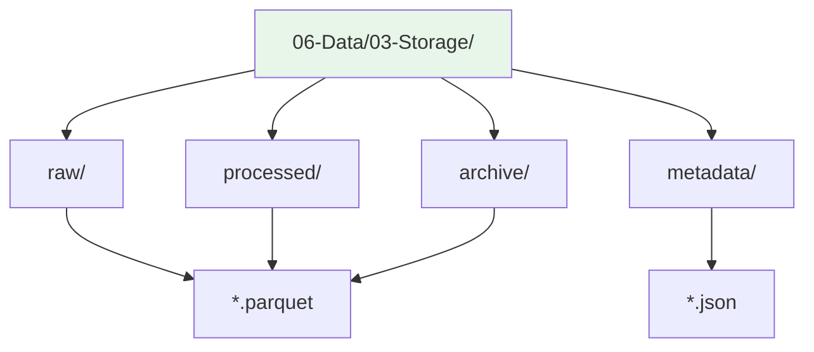
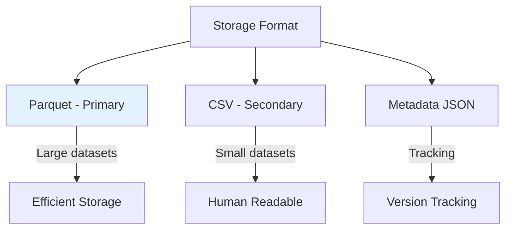
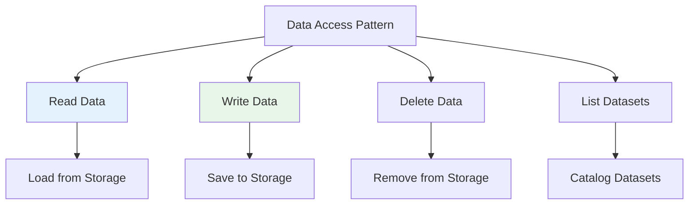
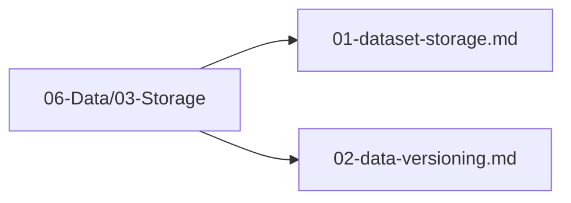

# Dataset Storage

## 1. Purpose

Define the storage strategy for 2048 game training datasets, ensuring efficient and reliable data persistence.

## 2. Storage Overview

Datasets are stored using a tiered storage approach optimized for both performance and cost.



## 3. Storage Pipeline



## 4. Storage Locations



### 4.1 Local Storage Structure



## 5. Data Storage Format



## 6. Storage Configuration

```rust
pub struct DatasetStorageConfig {
    pub storage_path: String,      // 06-Data/03-Storage/
    pub format: StorageFormat,     // Parquet or CSV
    pub compression: CompressionType, // Snappy, Zstd
    pub partition_by: Vec<String>, // Partition strategy
    pub cache_size: usize,         // Cache size in MB
}
```

## 7. Data Access Pattern



## 8. Storage Files Location

All dataset storage files are in `06-Data/03-Storage/`:



## 9. Next Steps

1. Set up storage infrastructure
2. Implement data access layer
