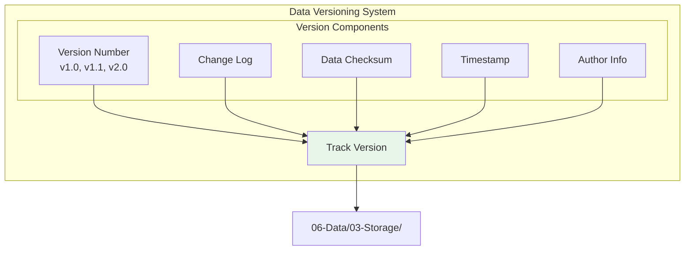
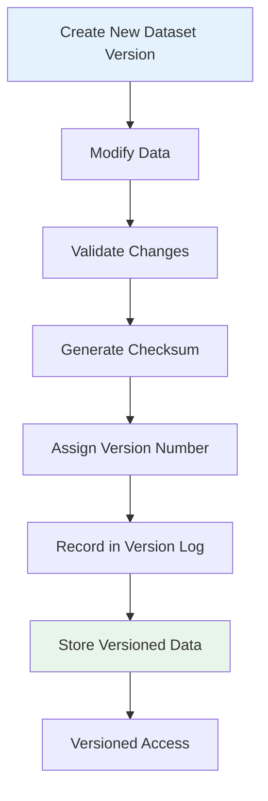
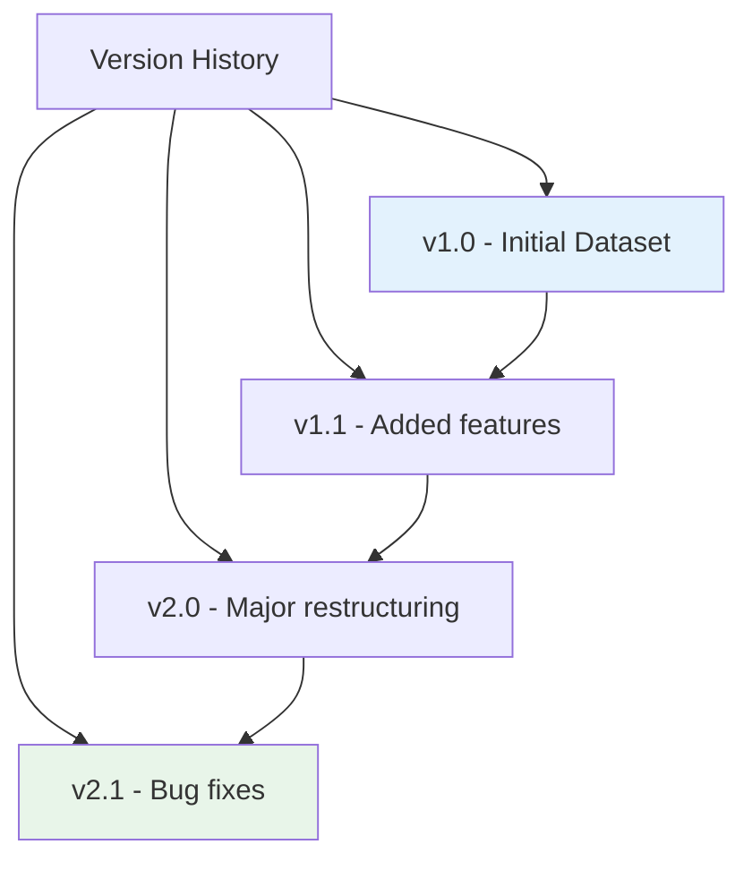
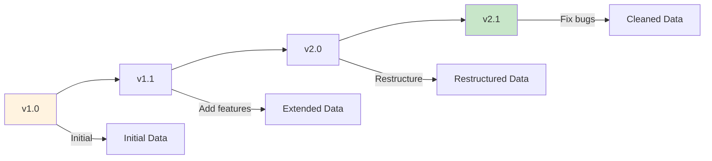
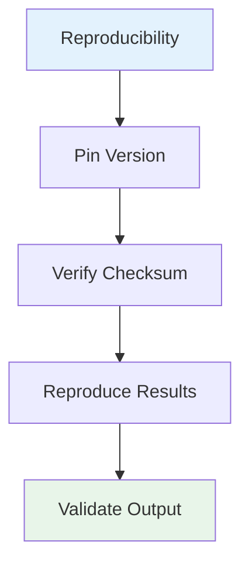
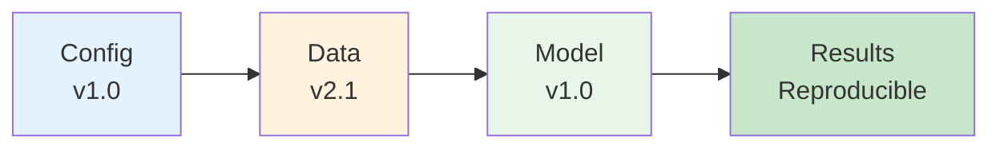
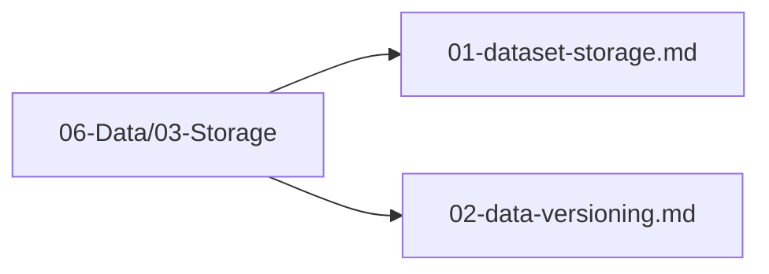

# Data Versioning

## 1. Purpose

Define the data versioning strategy to track changes to datasets over time and ensure reproducibility.

## 2. Versioning Overview

Data versioning ensures that every dataset change is tracked, enabling reproducibility and rollback capabilities.



## 3. Versioning Workflow



## 4. Version History



### 4.1 Version Tracking Diagram



## 5. Version Control Configuration

```rust
pub struct DataVersionConfig {
    pub dataset_name: String,
    pub current_version: String,      // "v1.0"
    pub history: Vec<VersionEntry>,
    pub storage_path: String,         // 06-Data/03-Storage/
}

pub struct VersionEntry {
    pub version: String,
    pub timestamp: DateTime<Utc>,
    pub author: String,
    pub changes: String,
    pub checksum: String,
}
```

## 6. Reproducibility



### 6.1 Reproducibility Chain



## 7. Data Versioning Files Location

All data versioning files are in `06-Data/03-Storage/`:



## 8. Next Steps

1. Implement version control for all datasets
2. Set up automated version tracking
