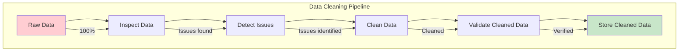
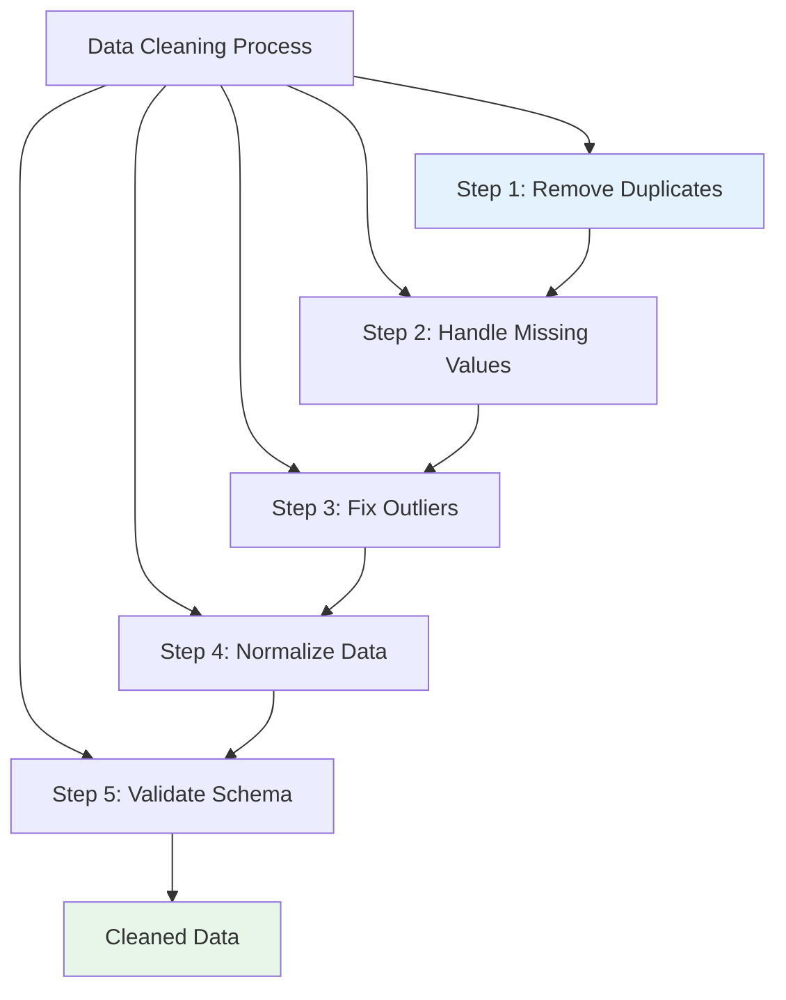
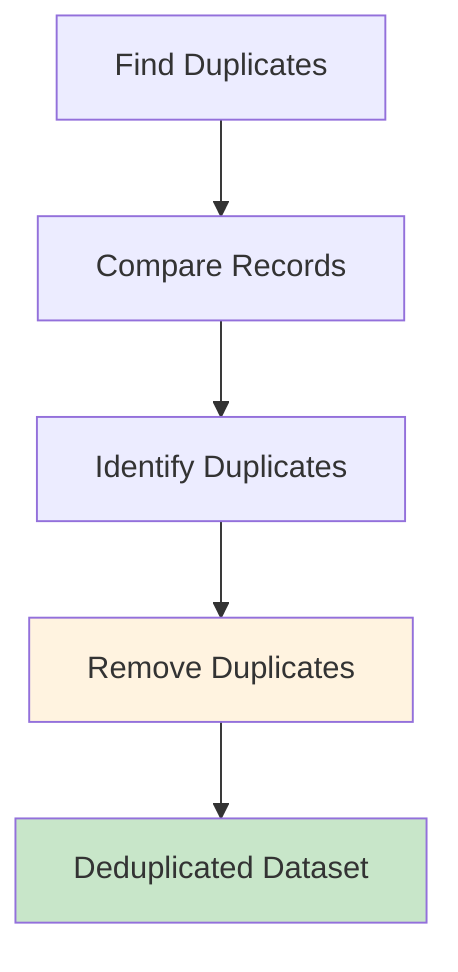
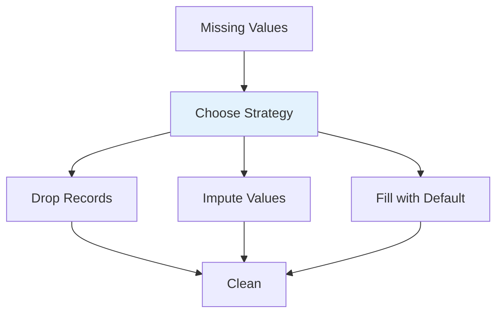
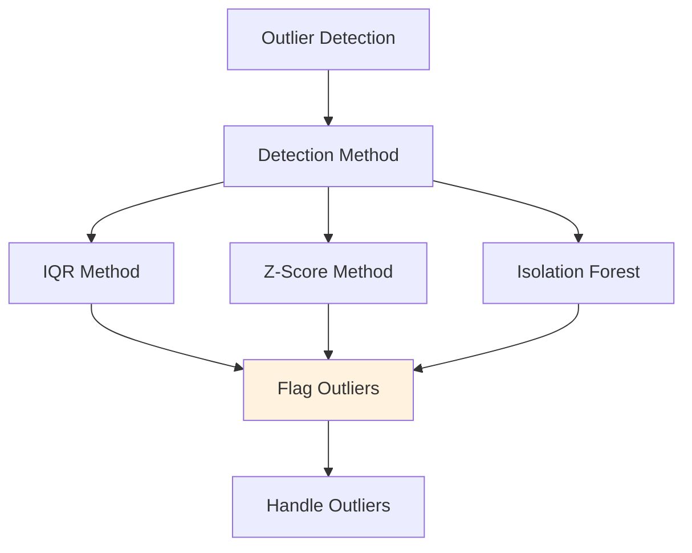
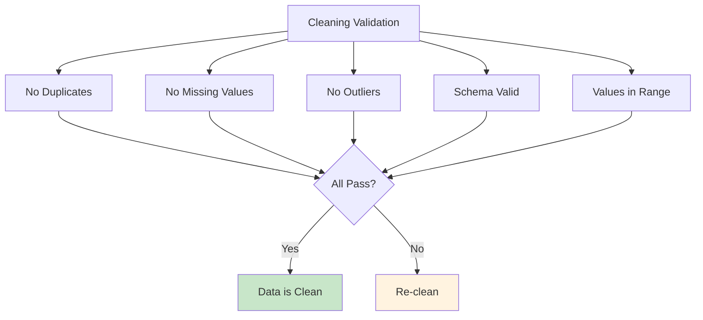
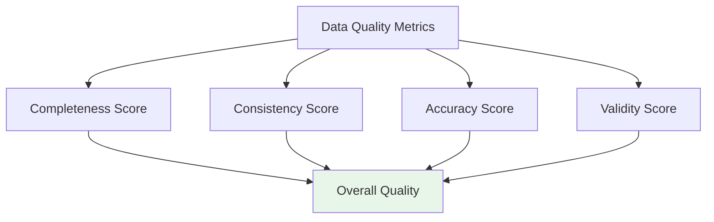
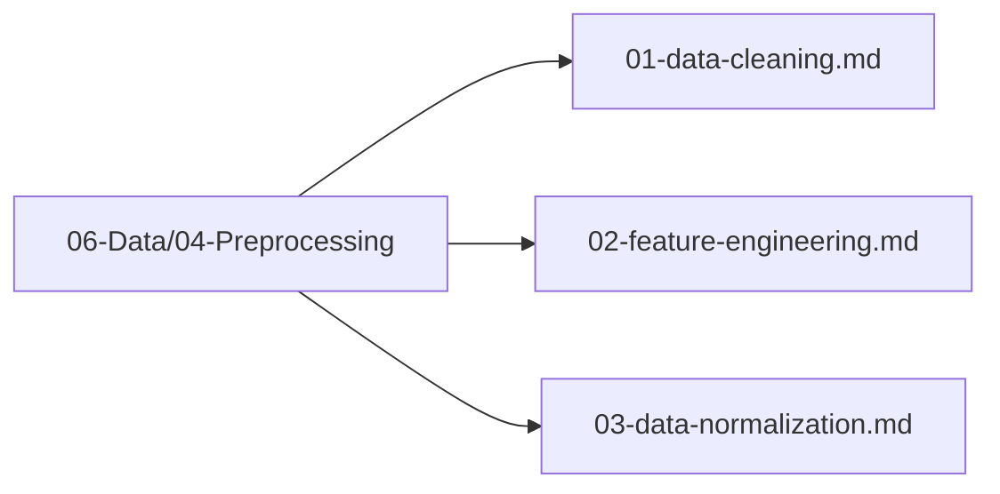

# Data Cleaning

## 1. Purpose

Define the data cleaning process to ensure high-quality training data for the 2048 game ML model.

## 2. Data Cleaning Overview

Data cleaning removes errors, inconsistencies, and invalid data points from the raw dataset.



## 3. Cleaning Process



### 3.1 Duplicate Removal



### 3.2 Missing Value Handling



### 3.3 Outlier Detection



## 4. Cleaning Configuration

```rust
pub struct DataCleaningConfig {
    pub remove_duplicates: bool,
    pub impute_strategy: ImputationStrategy,
    pub outlier_method: OutlierMethod,
    pub outlier_threshold: f64,
    pub validate_schema: bool,
}
```

## 5. Cleaning Validation



## 6. Data Quality Metrics



## 7. Cleaning Files Location

All data cleaning files are in `06-Data/04-Preprocessing/`:



## 8. Next Steps

1. Execute data cleaning pipeline
2. Validate cleaned data
3. Proceed to feature engineering
