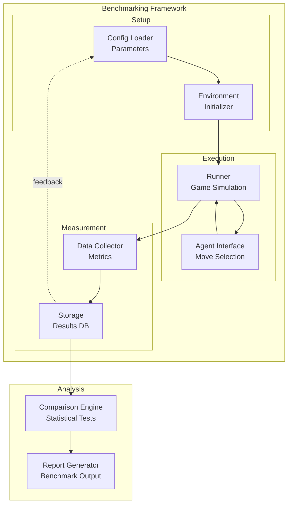
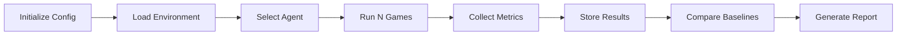
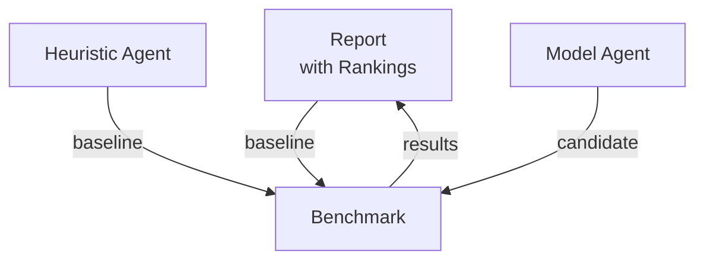

# Benchmarking Framework

## 1. Purpose

Define the benchmarking framework for evaluating the 2048 ML system's performance against baselines and targets.

## 2. Framework Overview



## 3. Benchmark Categories

| Category | Description | Baseline |
|----------|-------------|----------|
| Score | Maximum, mean, median scores | Random agent score |
| Speed | Games per second | Real-time threshold |
| Convergence | Training speed | Fixed epoch count |
| Robustness | Performance variance | Std dev threshold |

## 4. Benchmarking Pipeline



## 5. Configuration

```rust
pub struct BenchmarkConfig {
    pub n_games: usize,              // Default: 10000
    pub baseline_agent: AgentType,   // Random, Heuristic
    pub target_agent: AgentType,     // Model agent
    pub metrics: Vec<MetricType>,
    pub output_path: String,
    pub seed: u64,
}
```

## 6. Baseline Comparisons

All benchmarks compare against these baselines:



## 7. Success Criteria

- Model agent outperforms random agent by ≥ 2x mean score
- Model agent outperforms heuristic agent by ≥ 1.5x mean score
- Benchmark results are statistically significant (p < 0.05)
- All runs are reproducible with seed-based initialization

## 8. Reporting

Each benchmark run produces:
- Summary statistics table
- Score distribution charts
- Comparative analysis against baselines
- Recommendations for model improvements
