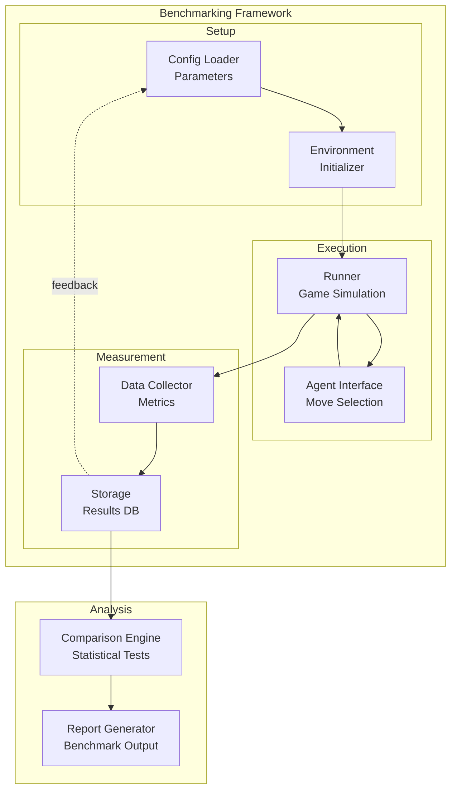
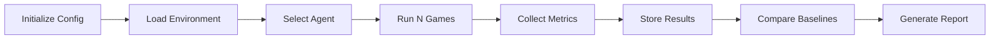
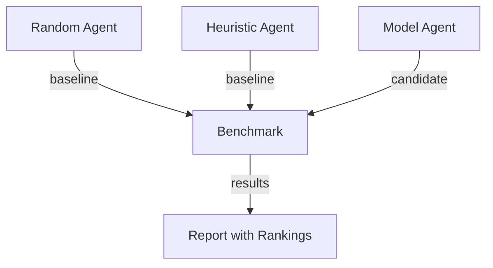
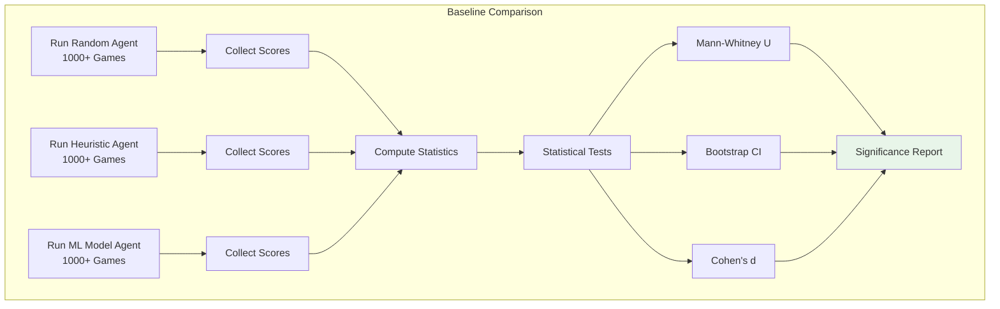

# Benchmarking Framework

## 1. Purpose

Define the benchmarking framework for evaluating the 2048 ML system's performance against baselines and targets.

## 2. Framework Overview



## 3. Benchmark Categories

| Category | Description | Baseline |
|----------|-------------|----------|
| Score | Maximum, mean, median scores | Random agent score |
| Speed | Games per second | Real-time threshold |
| Convergence | Training speed | Fixed epoch count |
| Robustness | Performance variance | Std dev threshold |

## 4. Benchmarking Pipeline



## 5. Configuration

```rust
pub struct BenchmarkConfig {
    pub n_games: usize,              // Default: 10000
    pub baseline_agent: AgentType,   // Random, Heuristic
    pub target_agent: AgentType,     // Model agent
    pub metrics: Vec<MetricType>,
    pub output_path: String,
    pub seed: u64,
}
```

## 6. Baseline Comparisons

All benchmarks compare against these baselines:



### 6.1 Baseline Definitions

#### Random Agent Baseline

The random agent selects moves uniformly at random from available actions. It serves as the absolute minimum performance floor.

| Metric | Expected Value |
|--------|---------------|
| Mean Score | ~128 |
| Median Score | ~96 |
| Max Tile | Typically 64-128 |
| Games Completed | ~30-50 moves average |

**Rationale**: A random agent has no strategy and will quickly reach a dead state. The expected score of ~128 comes from the limited number of merges possible before the board fills.

#### Heuristic Agent Baseline

The heuristic agent uses domain-specific rules to select moves: prioritize maintaining monotonicity, keeping the highest tile in a corner, and maximizing empty tiles. This represents the best non-ML approach.

| Metric | Expected Value |
|--------|---------------|
| Mean Score | ~512 |
| Median Score | ~384 |
| Max Tile | Typically 512-1024 |
| Games Completed | ~80-120 moves average |

**Rationale**: The heuristic agent uses established 2048 strategies (monotonicity, corner placement, empty tile preservation) and consistently achieves scores significantly above random play.

#### Summary Table

| Baseline | Mean Score | Median Score | Max Tile | Notes |
|----------|-----------|-------------|----------|-------|
| Random Agent | ~128 | ~96 | 64-128 | Uniform random moves |
| Heuristic Agent | ~512 | ~384 | 512-1024 | Rule-based strategy |
| ML Model Agent | TBD | TBD | TBD | To be benchmarked |

### 6.2 Comparison Methodology

ML models are compared against baselines using the following protocol:

1. **Same game environment**: All agents run in the identical 2048 environment with the same random seed sequence
2. **Same number of games**: Each agent plays N games (see 6.3 for sample size requirements)
3. **Score collection**: Record the final score for each game
4. **Statistical comparison**: Compare the ML model's score distribution against each baseline using the tests defined in 6.4
5. **Effect size**: Report Cohen's d alongside p-values to quantify the magnitude of improvement

### 6.3 Sample Size Requirements

To achieve statistical significance, the following sample sizes are required:

- **Minimum games per agent**: 1,000 games
- **Recommended games per agent**: 5,000 games
- **For 99% confidence (α=0.01)**: 10,000 games

Sample size justification:
- Game scores follow a heavy-tailed distribution (many low scores, few very high scores)
- Larger samples reduce the impact of outliers on mean estimates
- The central limit theorem ensures the sampling distribution of the mean approaches normality for n ≥ 1,000
- For detecting a 2x improvement over random (128 → 256), approximately 500 games per group are needed at 80% power with α=0.05

### 6.4 Statistical Test Requirements

All comparisons must satisfy the following statistical requirements:

| Test | Purpose | Significance Level |
|------|---------|-------------------|
| Mann-Whitney U test | Compare score distributions (non-parametric) | α = 0.05 |
| Wilcoxon signed-rank test | Paired comparisons (same seed sequence) | α = 0.05 |
| Bootstrap confidence intervals | Estimate mean score uncertainty | 95% CI |
| Cohen's d | Effect size measurement | d > 0.8 = large |
| Permutation test | Validate significance of observed differences | 10,000 permutations |

**Requirements**:
- Primary test: Mann-Whitney U test (scores are non-normally distributed)
- Secondary test: Bootstrap 95% CI on the difference in means (must not include zero)
- Effect size: Cohen's d must be reported; d ≥ 0.5 is considered meaningful
- Multiple comparison correction: Bonferroni correction when comparing against multiple baselines
- Reproducibility: All tests must use fixed random seeds

### 6.5 Baseline Comparison Pipeline



### 6.6 Success Criteria

- Model agent outperforms random agent by ≥ 2x mean score (statistically significant)
- Model agent outperforms heuristic agent by ≥ 1.5x mean score (statistically significant)
- Benchmark results pass Mann-Whitney U test at p < 0.05
- Bootstrap 95% CI for mean difference does not include zero
- Cohen's d ≥ 0.5 (medium effect size)
- All runs are reproducible with seed-based initialization
- Sample sizes meet minimum requirements (≥1,000 games per agent)
