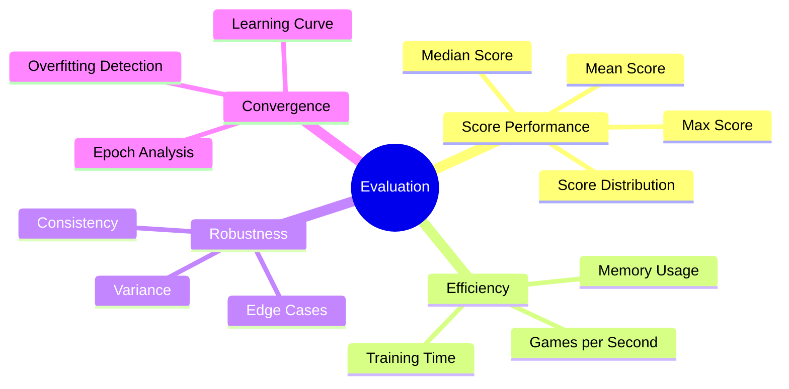
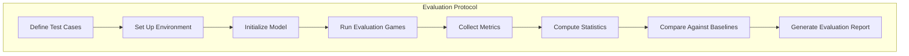
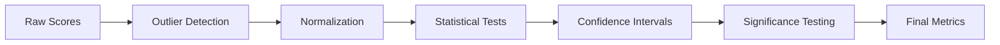
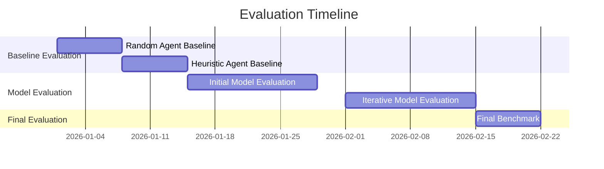

# Evaluation Methodology

## 1. Purpose

Establish the systematic methodology for evaluating the 2048 ML model's performance across multiple dimensions.

## 2. Evaluation Dimensions



## 3. Evaluation Protocol



## 4. Test Suite Structure

| Test Type | Description | Games Required |
|-----------|-------------|----------------|
| Baseline Test | Random agent comparison | 1000 |
| Standard Test | Heuristic agent comparison | 1000 |
| Stress Test | High-difficulty scenarios | 500 |
| Convergence Test | Training progression | 100 per epoch |

## 5. Metric Collection

```rust
pub struct EvaluationResult {
    pub test_name: String,
    pub agent_type: AgentType,
    pub n_games: usize,
    pub scores: Vec<u64>,
    pub metrics: ScoreMetrics,
    pub timestamp: DateTime<Utc>,
}

pub struct ScoreMetrics {
    pub mean: f64,
    pub median: u64,
    pub std_dev: f64,
    pub min: u64,
    pub max: u64,
    pub percentiles: [u64; 10],
    pub games_above_2048: usize,
    pub games_above_4096: usize,
}
```

## 6. Statistical Validation



## 7. Evaluation Schedule



## 8. Quality Gates

1. Minimum 1000 games per evaluation run
2. Results must be reproducible (same seed → same scores)
3. Statistical significance required for any claim of improvement
4. All evaluation artifacts must be archived

## 9. Reporting Format

Each evaluation produces:
- Quantitative metrics summary
- Visual performance charts
- Comparative analysis tables
- Qualitative observations
- Recommendations for next iteration
