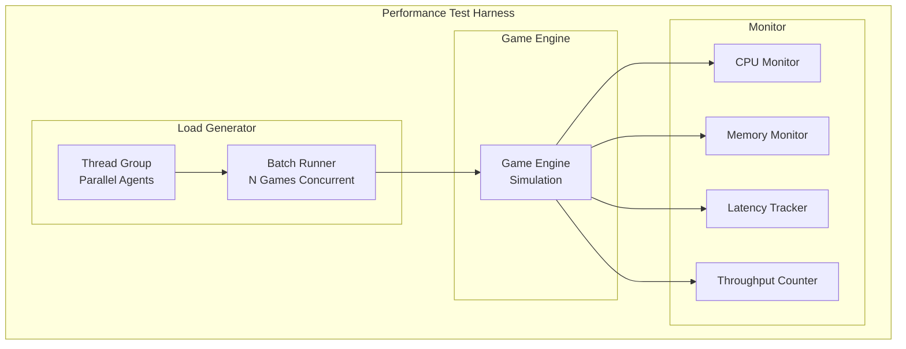
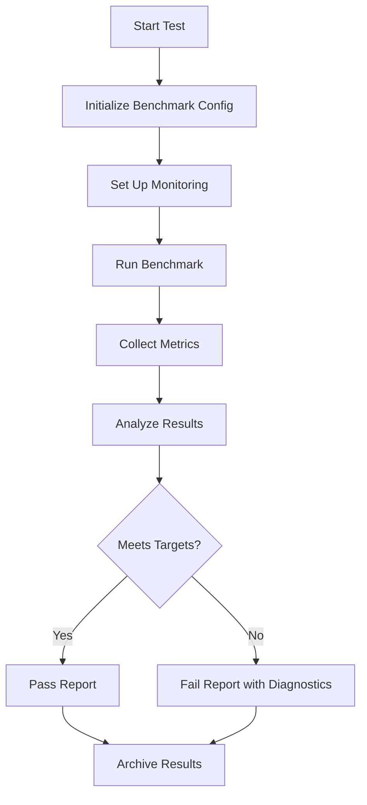
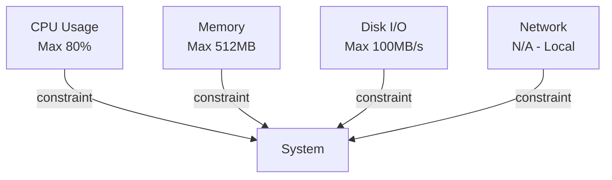
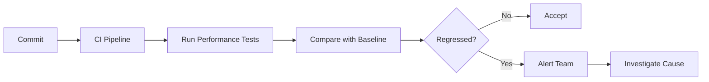

# Performance Testing

## 1. Purpose

Define performance testing procedures to measure speed, throughput, and resource usage of the 2048 ML system.

## 2. Performance Testing Architecture



## 3. Performance Metrics

| Metric | Target | Measurement Method |
|--------|--------|-------------------|
| Games/Second | ≥ 1000 | Count games completed per second |
| Avg Latency | ≤ 10ms | Time per move decision |
| Memory Usage | ≤ 512MB | Peak RSS during simulation |
| Training Time | ≤ 1 hour | End-to-end training for 1 epoch |

## 4. Test Scenarios


## 5. Benchmark Types

### 5.1 Throughput Test

```rust
pub struct ThroughputTest {
    pub n_games: usize,
    pub agent: AgentType,
    pub duration_seconds: u64,
}

impl ThroughputTest {
    pub fn run(&self) -> ThroughputResult {
        let start = Instant::now();
        let games_completed = self.run_games_until_timeout();
        let elapsed = start.elapsed();
        ThroughputResult {
            games_per_second: games_completed as f64 / elapsed.as_secs_f64(),
            total_games: games_completed,
            duration: elapsed,
        }
    }
}
```

### 5.2 Latency Test

```rust
pub struct LatencyTest {
    pub n_iterations: usize,
    pub model: InferenceEngine,
}

impl LatencyTest {
    pub fn measure(&self) -> LatencyMetrics {
        let mut latencies = Vec::new();
        for _ in 0..self.n_iterations {
            let start = Instant::now();
            self.model.predict(&test_features);
            latencies.push(start.elapsed());
        }
        LatencyMetrics {
            mean_latency: latencies.mean(),
            p99_latency: latencies.percentile(99),
            max_latency: latencies.max(),
        }
    }
}
```

## 6. Performance Benchmarking Pipeline



## 7. Resource Constraints



## 8. Performance Regression Detection

```rust
pub struct PerformanceRegression {
    pub metric_name: String,
    pub baseline_value: f64,
    pub current_value: f64,
    pub regression_percent: f64,
    pub is_significant: bool,
    pub recommendation: String,
}
```

## 9. Continuous Performance Monitoring

Performance metrics are tracked across every commit:



## 10. Reporting

Each performance test generates:
- Throughput and latency distributions
- Resource utilization charts
- Comparison against previous benchmarks
- Regression alerts if performance drops
