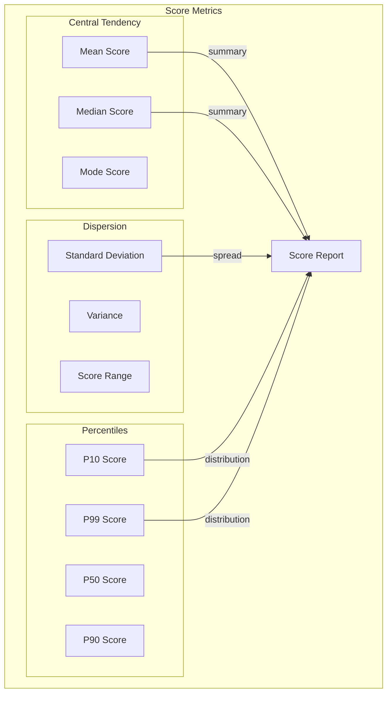
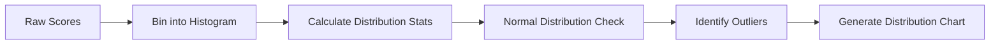
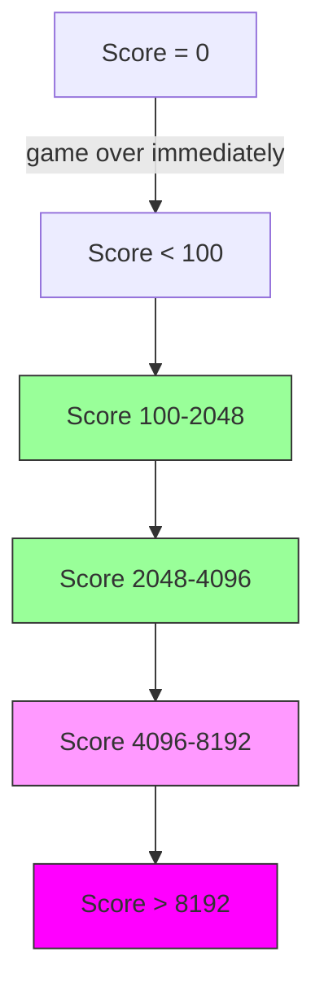
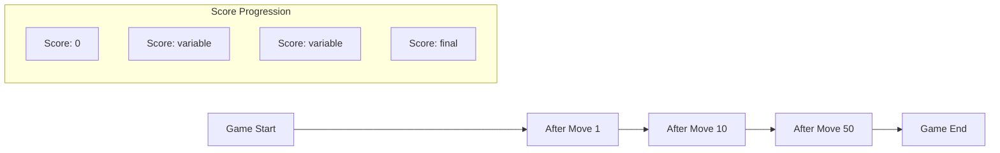
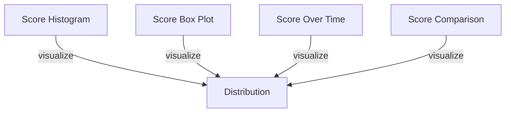

# Score Metrics

## 1. Purpose

Define the score metrics used to evaluate and compare 2048 ML model performance.

## 2. Score Metrics Framework



## 3. Primary Score Metrics

| Metric | Formula | Purpose |
|--------|---------|---------|
| Mean Score | Σ score / N | Average performance |
| Median Score | Middle value | Robust central tendency |
| Std Dev | √(Σ(x-μ)²/N) | Performance consistency |
| Max Score | max(scores) | Best capability |
| Min Score | min(scores) | Worst case |

## 4. Score Distribution Analysis



## 5. Key Score Thresholds



## 6. Score Metrics Calculation

```rust
pub struct ScoreMetrics {
    pub mean: f64,
    pub median: u64,
    pub std_dev: f64,
    pub min: u64,
    pub max: u64,
    pub percentile_10: u64,
    pub percentile_25: u64,
    pub percentile_50: u64,
    pub percentile_75: u64,
    pub percentile_90: u64,
    pub percentile_95: u64,
    pub percentile_99: u64,
    pub games_above_2048: usize,
    pub games_above_4096: usize,
    pub games_above_8192: usize,
    pub total_games: usize,
}

impl ScoreMetrics {
    pub fn calculate(scores: &[u64]) -> ScoreMetrics {
        let n = scores.len();
        let sum: u64 = scores.iter().sum();
        let mean = sum as f64 / n as f64;
        let sorted = {
            let mut s = scores.to_vec();
            s.sort();
            s
        };
        let median = sorted[n / 2];
        let variance = scores.iter().map(|s| (*s as f64 - mean).powi(2)).sum::<f64>() / n as f64;
        let std_dev = variance.sqrt();
        
        ScoreMetrics {
            mean,
            median,
            std_dev,
            min: sorted[0],
            max: sorted[n - 1],
            percentile_10: sorted[n / 10],
            percentile_25: sorted[n / 4],
            percentile_50: sorted[n / 2],
            percentile_75: sorted[3 * n / 4],
            percentile_90: sorted[9 * n / 10],
            percentile_95: sorted[19 * n / 20],
            percentile_99: sorted[99 * n / 100],
            games_above_2048: scores.iter().filter(|s| **s >= 2048).count(),
            games_above_4096: scores.iter().filter(|s| **s >= 4096).count(),
            games_above_8192: scores.iter().filter(|s| **s >= 8192).count(),
            total_games: n,
        }
    }
}
```

## 7. Score Progress Tracking



## 8. Score Normalization for Comparison

```rust
fn normalize_score(score: u64) -> f64 {
    (score as f64 + 1.0).log10()
}

fn denormalize_score(normalized: f64) -> u64 {
    (10f64.powf(normalized) - 1.0) as u64
}
```

## 9. Metric Visualization



## 10. Reporting

Each score metrics report includes:
- Summary statistics table
- Score distribution analysis
- Threshold achievement rates
- Historical comparison
