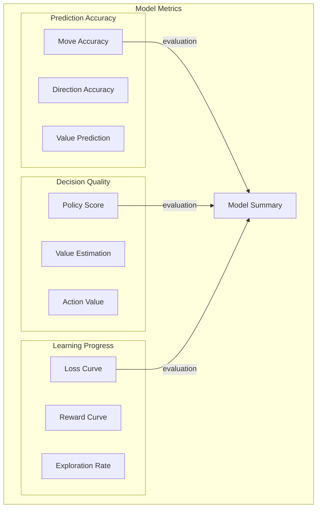
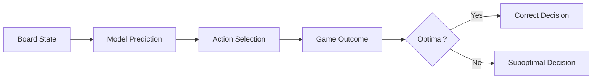
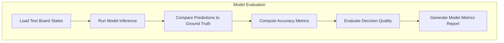
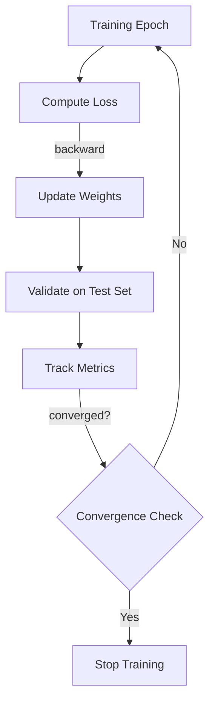
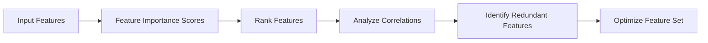
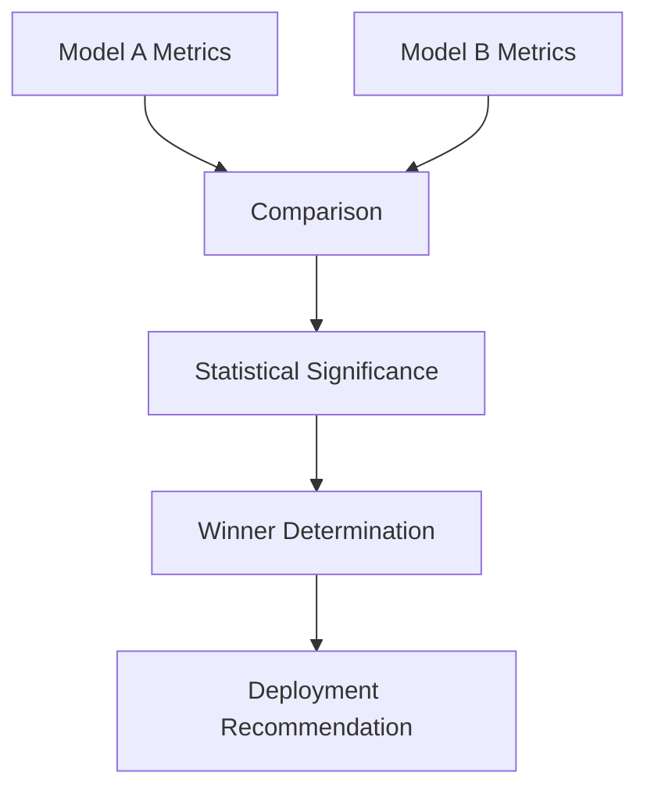

# Model Metrics

## 1. Purpose

Define metrics specifically for evaluating the ML model's predictive and decision-making capabilities in the 2048 game.

## 2. Model Metrics Framework



## 3. Prediction Metrics

| Metric | Description | Purpose |
|--------|-------------|----------|
| Move Accuracy | % of correct move predictions | Indicator of theoretical-limit proximity |
| Direction Accuracy | % of correct direction | Indicator of theoretical-limit proximity |
| Value Accuracy | MAE of tile value prediction | Board state understanding |
| Policy Entropy | Measure of exploration | Balanced exploration vs exploitation |

> **Note on targets**: Models are evaluated by proximity to the theoretical maximum score, not by fixed thresholds. The theoretical limit is bounded by game mechanics (max tile 32768, max board occupancy 16). `proximity_ratio = ceiling_score / theoretical_limit`.

> **Note on targets**: These targets are deliberately set as progressive milestones. A score of 45% move accuracy corresponds to significantly better than random (25% for 4 actions). Achieving >60% would be a stretch goal. The targets should be iteratively revised based on initial baseline results.

## 4. Decision Quality Metrics



## 5. Model Evaluation Pipeline



## 6. Training Metrics

```rust
pub struct TrainingMetrics {
    pub epoch: usize,
    pub loss: f64,
    pub accuracy: f64,
    pub learning_rate: f64,
    pub epoch_time_ms: u64,
    pub validation_loss: f64,
    pub validation_accuracy: f64,
    pub overfitting_gap: f64,
}

pub struct ModelMetrics {
    pub move_accuracy: f64,
    pub direction_accuracy: f64,
    pub value_mae: f64,
    pub policy_entropy: f64,
    pub q_value_correlation: f64,
    pub td_error_mean: f64,
    pub reward_prediction_mae: f64,
}
```

## 7. Loss and Convergence Tracking



## 8. Feature Importance Metrics



| Feature | Importance Score | Category |
|---------|-----------------|----------|
| Grid values | TBD | Raw board |
| Empty count | TBD | Board state |
| Max tile | TBD | Board state |
| Monotonicity | TBD | Derived |
| Smoothness | TBD | Derived |
| Move count | TBD | Game state |

> Feature importance values are TBD until model training completes.

## 9. Model Comparison Metrics



## 10. Quality Gates

1. Proximity ratio > 0.3 for baseline model acceptance
2. Proximity ratio > 0.5 for deployment consideration
3. Loss must converge within reasonable training time
4. Validation performance must not degrade significantly (no severe overfitting)
5. All model metrics including proximity_ratio must be logged and reproducible
6. Theoretical limit must be documented and cited
