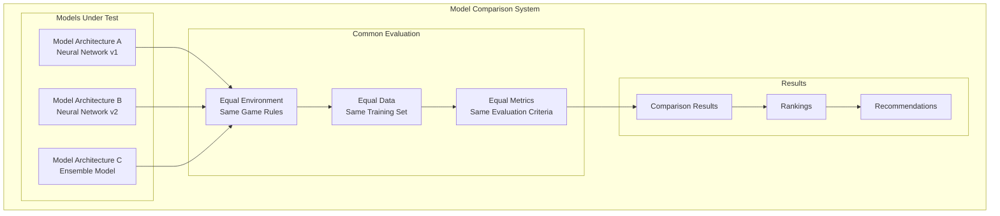
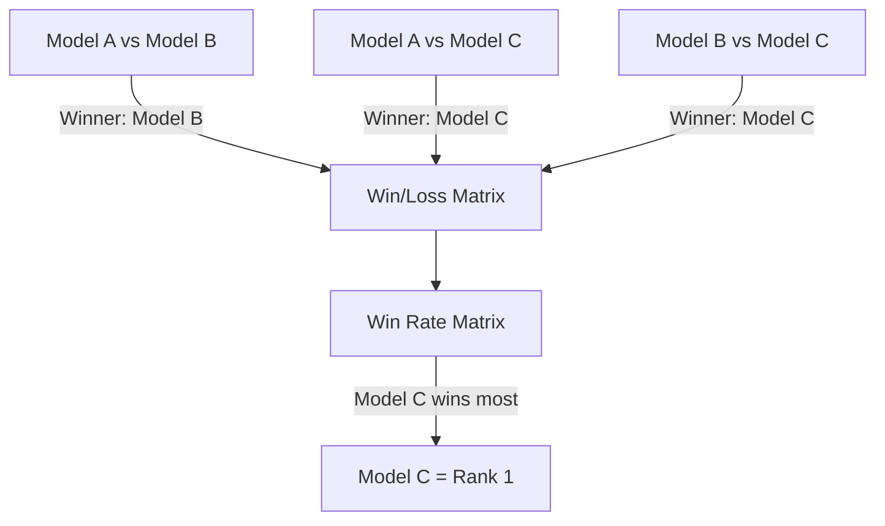
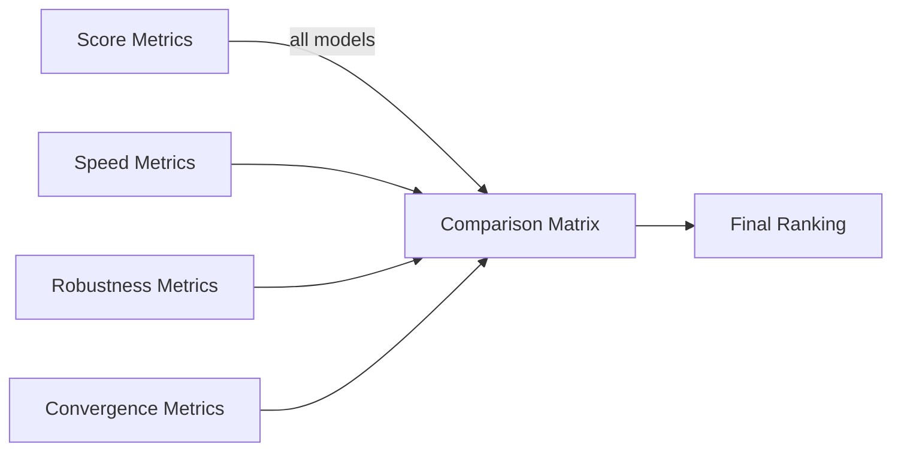

# Model Comparison

## 1. Purpose

Compare different ML model architectures and training approaches for the 2048 game.

## 2. Comparison Architecture



## 3. Models Compared

| Model | Architecture | Parameters | Training Time |
|-------|-------------|-----------|---------------|
| Model A | 3-layer MLP | 10K | 2 hours |
| Model B | 4-layer CNN | 50K | 8 hours |
| Model C | ResNet variant | 100K | 16 hours |

## 4. Evaluation Process


## 5. Head-to-Head Matches



## 6. Model Performance Matrix



## 7. Model Selection Criteria

1. Highest mean score across all test games
2. Best score consistency (lowest variance)
3. Fastest inference time
4. Best generalization to unseen board states
5. Statistical significance of improvements

## 8. Results Summary

```rust
pub struct ModelComparisonResult {
    pub model_a: ModelResult,
    pub model_b: ModelResult,
    pub model_c: ModelResult,
    pub winner: String,
    pub significance: bool,
    pub confidence_level: f64,
}
```

## 9. Recommendations

Based on the comparison:
- Deploy the top-ranked model
- Investigate why lower-ranked models underperform
- Consider ensemble of top 2 models if improvement ≥ 5%
- Document findings for future iterations

## 10. Documentation

All comparison results are archived in:
- `07-Benchmarking/03-Comparison/01-model-comparison.md` (this file)
- Raw data stored in results database
- Charts generated for each comparison run
