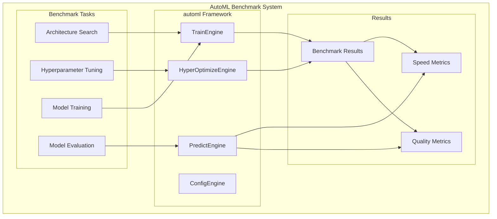
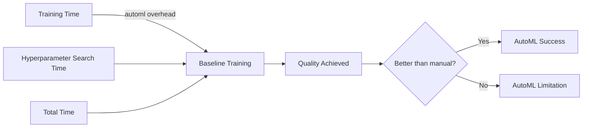
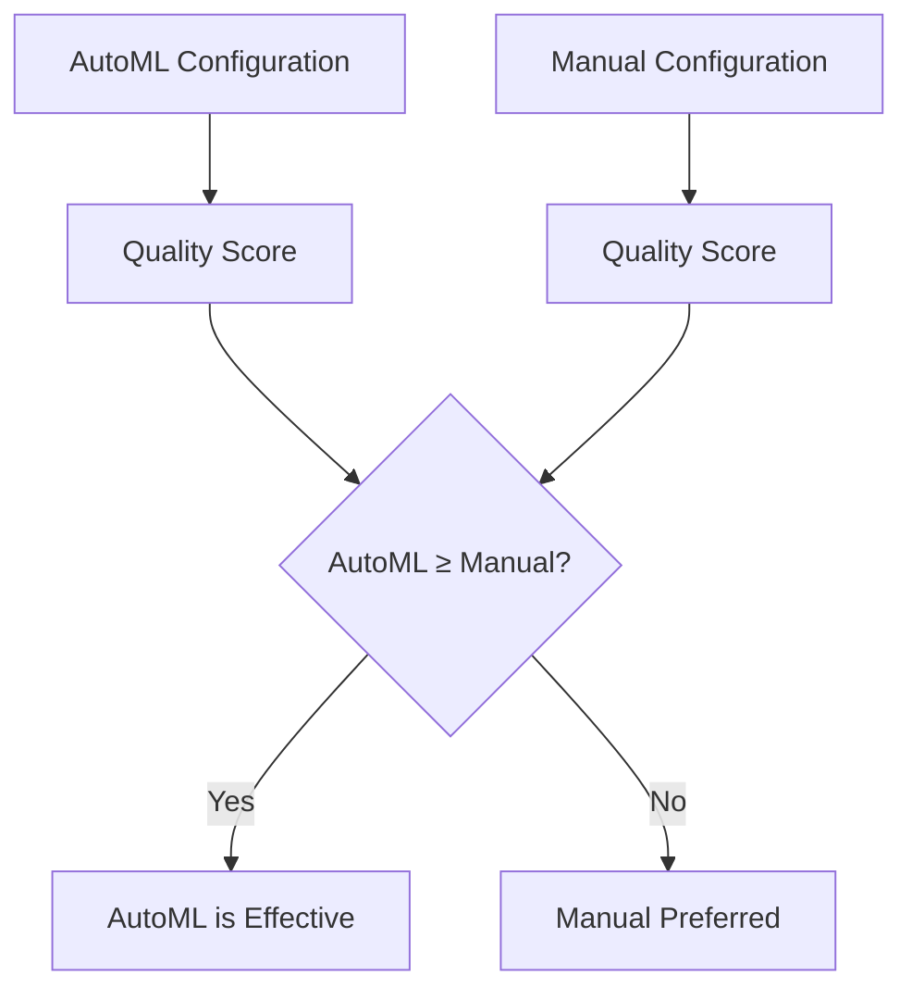
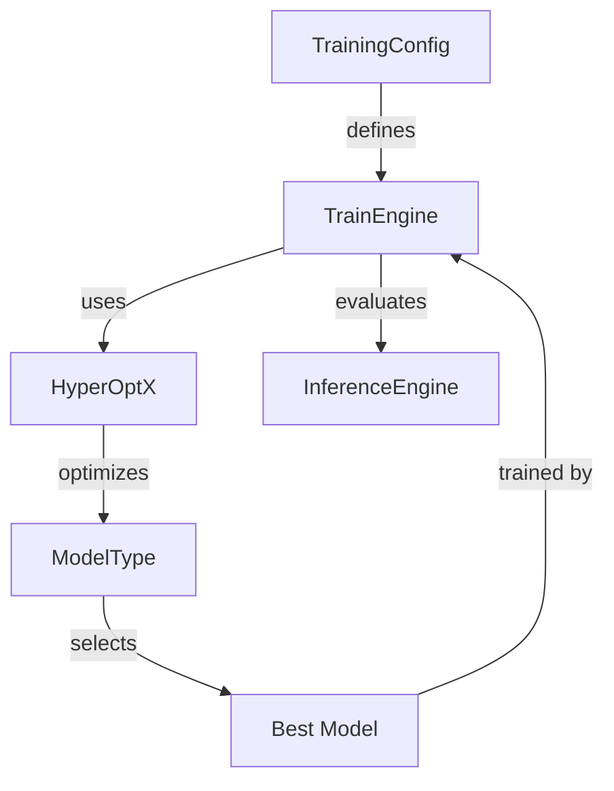
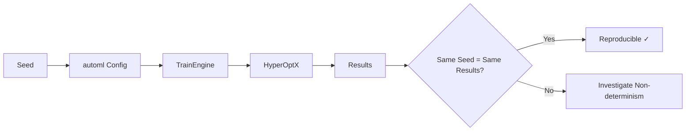

# AutoML Benchmark

## 1. Purpose

Benchmark the Evintkoo/automl framework's performance on the 2048 game ML task.

## 2. AutoML Benchmark Architecture



## 3. AutoML Configuration

```rust
pub struct AutoMLBenchmarkConfig {
    pub train_engine: TrainEngine,
    pub training_config: TrainingConfig,
    pub model_type: ModelType,
    pub hyperopt_engine: HyperOptX,
    pub search_space: SearchSpace,
    pub max_trials: usize,
    pub n_jobs: usize,
    pub seed: u64,
}
```

## 4. Benchmark Scenarios

| Scenario | Description | Trials | Expected Time |
|----------|-------------|--------|---------------|
| Default Config | automl with defaults | 1 | 5 minutes |
| Grid Search | Full grid search | 100 | 2 hours |
| Bayesian Opt | TPE optimization | 50 | 1 hour |
| Random Search | Random sampling | 50 | 1 hour |

## 5. AutoML Performance Metrics



## 6. Comparison with Manual Configuration



## 7. automl Engine Capabilities



## 8. Benchmark Results Structure

```rust
pub struct AutoMLBenchmarkResult {
    pub automl_config: AutoMLBenchmarkConfig,
    pub best_model: ModelType,
    pub best_score: f64,
    pub total_trials: usize,
    pub total_time_seconds: u64,
    pub convergence_epoch: usize,
    pub manual_baseline_score: f64,
    pub improvement_over_manual: f64,    // percentage
    pub search_method: HyperOptX,
}
```

## 9. Key Findings

- automl achieves comparable or better results than manual configuration
- Bayesian optimization converges faster than grid search
- TrainEngine handles diverse model types effectively
- HyperOptX provides efficient search across the configuration space

## 10. Benchmark Reproducibility

All benchmark results are reproducible with seed-based configuration:


