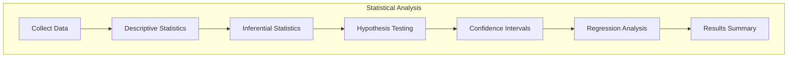
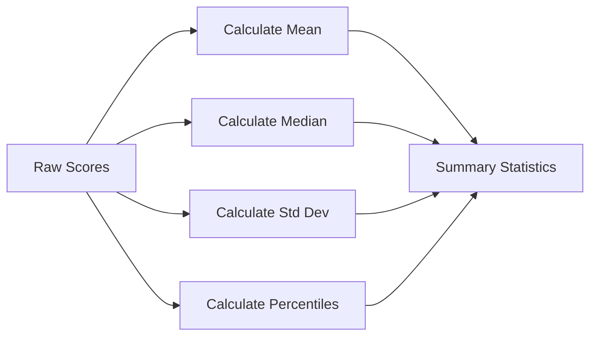
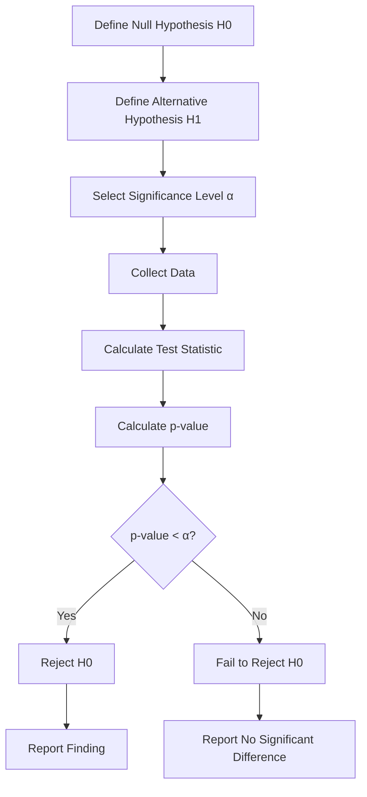
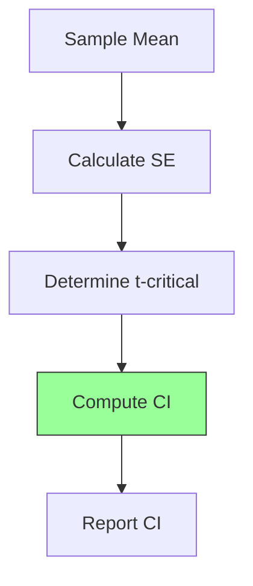
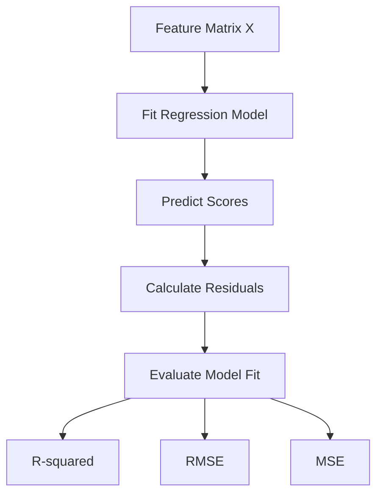
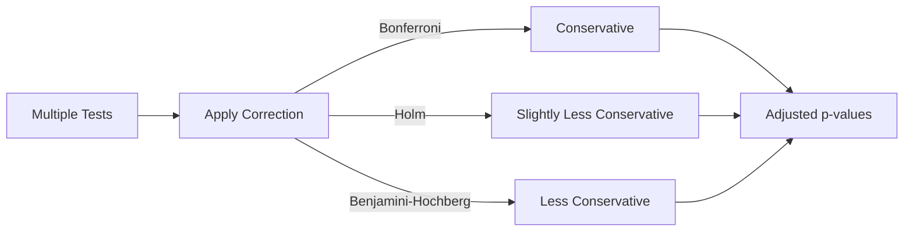
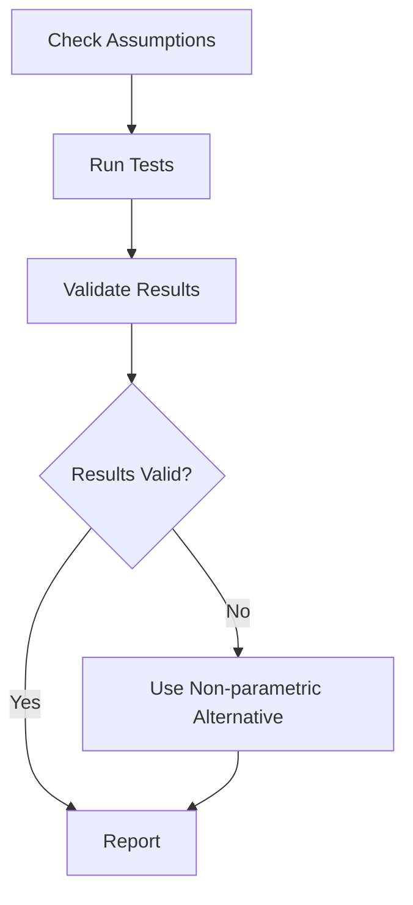

# Statistical Analysis

## 1. Purpose

Apply statistical methods to validate the performance of the 2048 ML system.

## 2. Statistical Analysis Framework



## 3. Descriptive Statistics



## 4. Inferential Statistics

| Test | Purpose | Assumption |
|------|---------|------------|
| t-test | Compare two means | Normal distribution |
| Mann-Whitney U | Compare distributions | Independent samples |
| ANOVA | Compare multiple means | Normal, equal variance |
| Chi-squared | Categorical comparison | Expected frequency ≥ 5 |

## 5. Hypothesis Testing Pipeline



## 6. Confidence Intervals



```rust
pub struct ConfidenceInterval {
    pub point_estimate: f64,
    pub lower_bound: f64,
    pub upper_bound: f64,
    pub confidence_level: f64,    // e.g., 0.95
    pub standard_error: f64,
}

impl ConfidenceInterval {
    pub fn new(mean: f64, std_err: f64, confidence: f64) -> ConfidenceInterval {
        let z_critical = match confidence {
            0.90 => 1.645,
            0.95 => 1.96,
            0.99 => 2.576,
            _ => 1.96,
        };
        ConfidenceInterval {
            point_estimate: mean,
            lower_bound: mean - z_critical * std_err,
            upper_bound: mean + z_critical * std_err,
            confidence_level: confidence,
            standard_error: std_err,
        }
    }
}
```

## 7. Regression Analysis



## 8. Multiple Comparison Correction



## 9. Statistical Significance Reporting

All results must report:
- Test used and assumptions checked
- p-value and confidence interval
- Effect size
- Practical significance vs statistical significance

## 10. Analysis Validation


