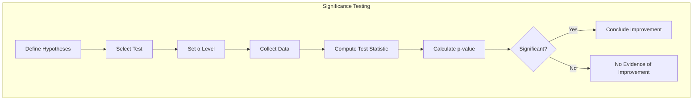
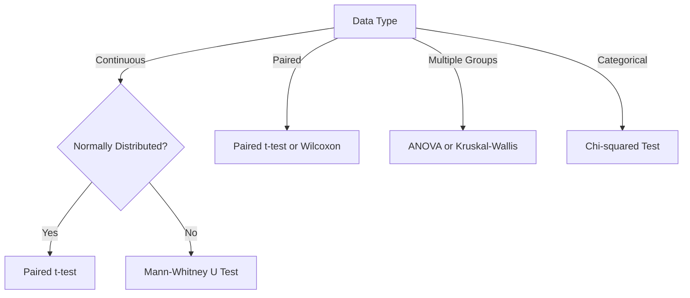
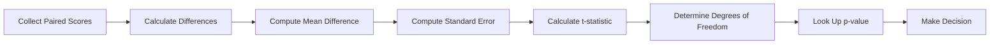
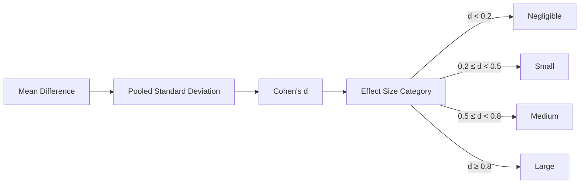
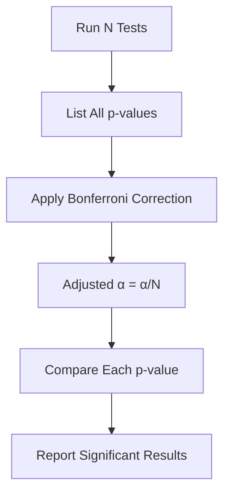
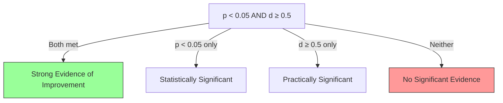

# Significance Testing

## 1. Purpose

Define the significance testing procedures for validating 2048 ML model improvements.

## 2. Significance Testing Framework



## 3. Test Selection Guide



## 4. Paired t-test Procedure



## 5. Test Implementation

```rust
pub struct SignificanceTest {
    pub sample_a: Vec<u64>,
    pub sample_b: Vec<u64>,
    pub test_type: TestType,
    pub alpha: f64,
}

pub struct TestResult {
    pub test_statistic: f64,
    pub p_value: f64,
    pub is_significant: bool,
    pub confidence_interval: (f64, f64),
    pub effect_size: f64,
    pub conclusion: String,
}

impl SignificanceTest {
    pub fn run(&self) -> TestResult {
        // Implementation depends on test_type
        // Returns comprehensive test results
        TestResult {
            test_statistic: 0.0,
            p_value: 1.0,
            is_significant: false,
            confidence_interval: (0.0, 0.0),
            effect_size: 0.0,
            conclusion: String::new(),
        }
    }
}
```

## 6. Effect Size Calculation



## 7. Power Analysis

```mermaid
graph TD
    A[Define Effect Size] --> B[Set α Level]
    B --> C[Set Power (1-β)]
    C --> D[Calculate Required Sample Size]
    D --> E[Run Tests with N Samples]
    E --> F{Achieved Power ≥ 0.8?}
    F -->|Yes| G[Valid Results]
    F -->|No| H[Increase Sample Size]
```

## 8. Multiple Testing Correction



## 9. Reporting Standards

Every significance test report must include:
- Null and alternative hypotheses
- Test statistic value and type
- p-value with precision
- Effect size and interpretation
- Confidence interval
- Practical significance assessment

## 10. Decision Framework


