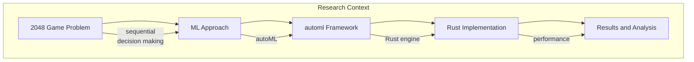
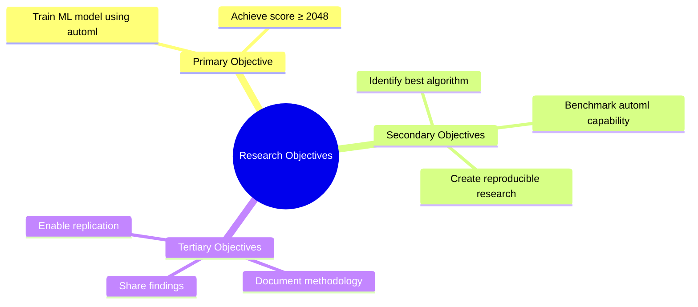
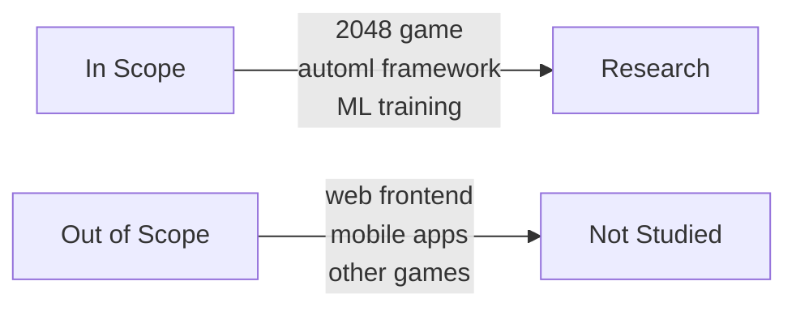

# Introduction

## 1. Background

The 2048 game presents a compelling challenge for machine learning systems. This research investigates whether the Evintkoo/automl framework can train a model capable of achieving high scores in 2048.

## 2. Research Context

## 3. Problem Statement

Can automated machine learning effectively solve the 2048 game, and what performance can be achieved?

## 4. Research Objectives

## 5. Significance

This research contributes to understanding:
- Automated ML effectiveness on sequential games
- Rust-based automl performance
- Model selection for game AI

## 6. Scope and Limitations

## 7. Paper Structure

This paper follows the IMRD structure:
1. **Introduction** (this section)
2. **Methodology** — experimental design and approach
3. **Results** — findings and data analysis
4. **Discussion** — interpretation and implications
