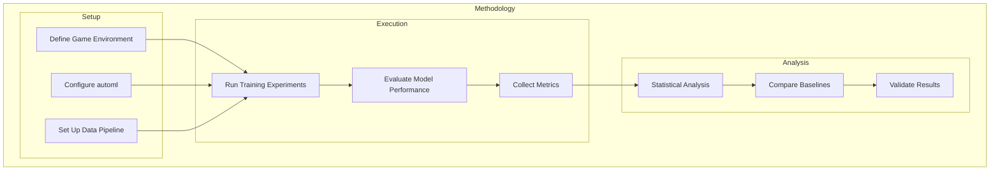
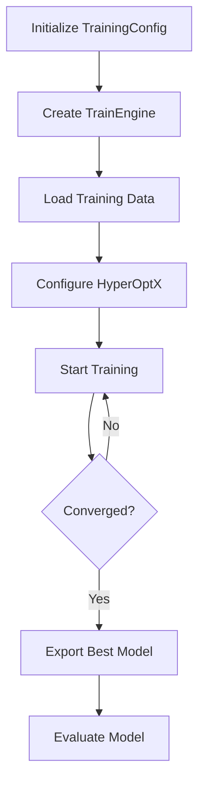
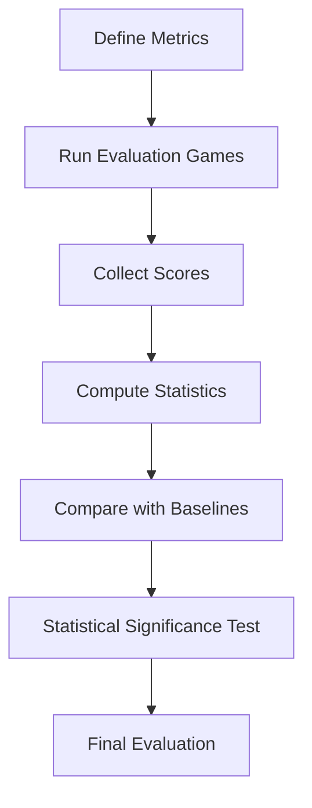
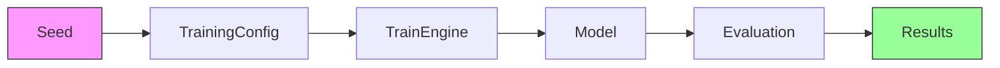

# Methodology

## 1. Experimental Design

The research employs a controlled experimental design to evaluate the 2048 ML system.

## 2. Methodology Framework

## 3. Experimental Setup

| Component | Configuration |
|-----------|--------------|
| Game Engine | Custom Rust 2048 |
| automl Version | v1.0.0 |
| Training Config | Default automl |
| Evaluation Games | 10,000 per model |
| Seed | 42 |

## 4. Data Collection Process

## 5. Model Training Procedure

## 6. Evaluation Methodology

## 7. Controls

- Same game engine for all experiments
- Same data pipeline for all models
- Same evaluation criteria
- Same seed for reproducibility

## 8. Reproducibility

## 9. Ethical Considerations

This research uses simulation only. No human subjects are involved. All data is generated from game simulations.

## 10. Methodology Limitations

- Limited to 2048 game domain
- automl framework constraints
- Computational resource limitations
