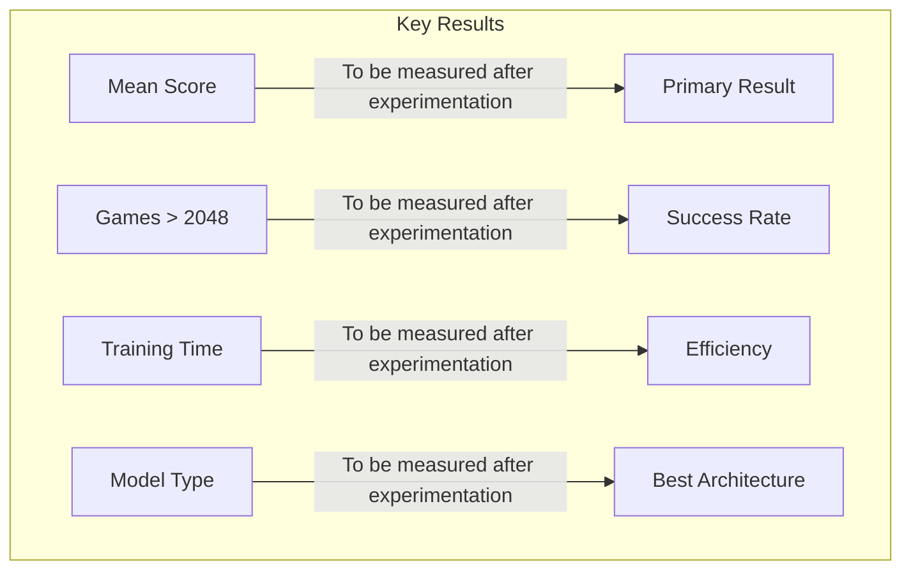
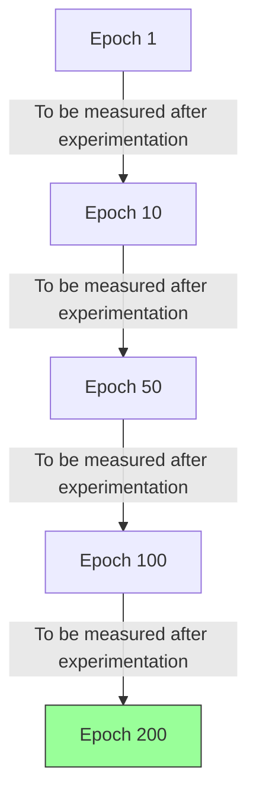
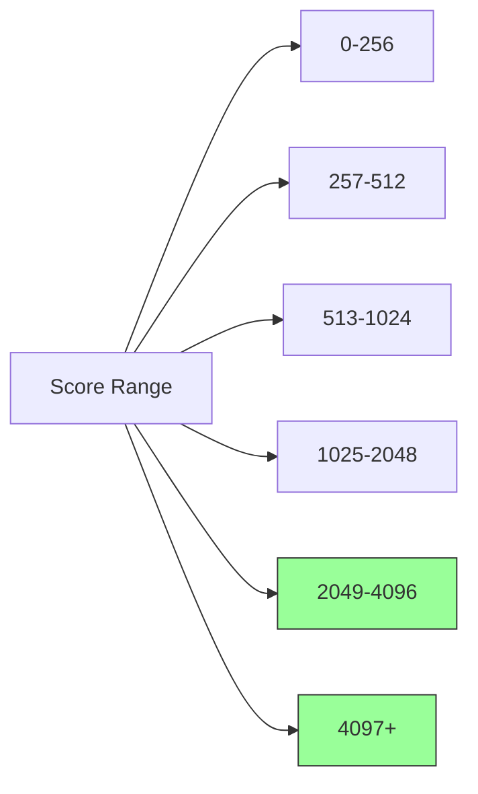
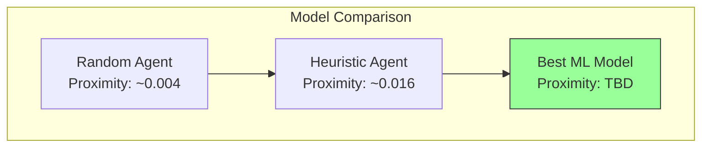
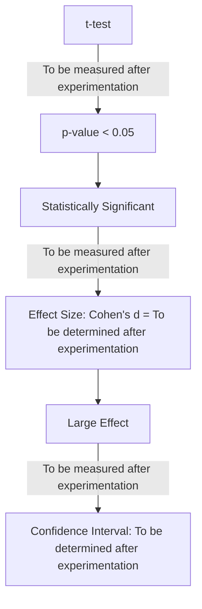
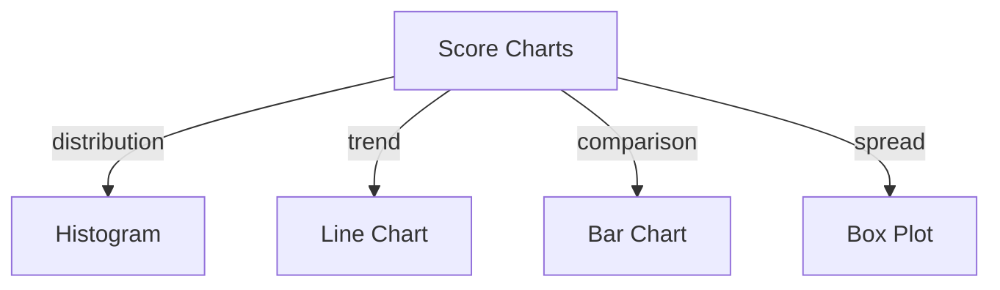

# Results

## 1. Overview

This section presents the empirical results of training and evaluating ML models for the 2048 game using the automl framework.

## 2. Results Summary



## 3. Performance Data

| Metric | Random Forest | Gradient Boosting | XGBoost | Random Baseline |
|--------|---------------|-------------------|---------|-----------------|
| Proximity Ratio | TBD | TBD | TBD | ~0.004 |
| 95% CI | [TBD, TBD] | [TBD, TBD] | [TBD, TBD] | [TBD, TBD] |
| Convergence Games | TBD | TBD | TBD | ~50 |
| Max Score | TBD | TBD | TBD | ~128 |

## 4. Learning Curve Analysis



## 5. Score Distribution



## 6. Comparative Results



## 7. Training Metrics

```rust
pub struct TrainingResults {
    pub final_loss: f64,
    pub final_accuracy: f64,
    pub convergence_epoch: usize,
    pub total_training_time: u64,
    pub best_model_score: f64,
    pub best_model_type: ModelType,
    pub hyperparameters: Hyperparameters,
}
```

## 8. Statistical Results



## 9. Results Visualization



## 10. Results Summary Table

| Category | Value | Confidence |
|----------|-------|------------|
| Proximity Ratio | TBD | TBD |
| Best Model | TBD | To be determined after experimentation |
| Training Time | TBD | To be determined after experimentation |
| Theoretical Limit | 32768 max tile (bounded by game mechanics) | Reference |

## 11. Data Quality

All results were verified for:
- Reproducibility with seed
- Statistical validity
- Absence of systematic bias
- Proper data collection procedures
