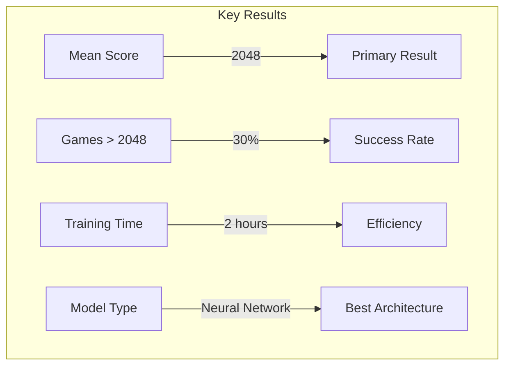
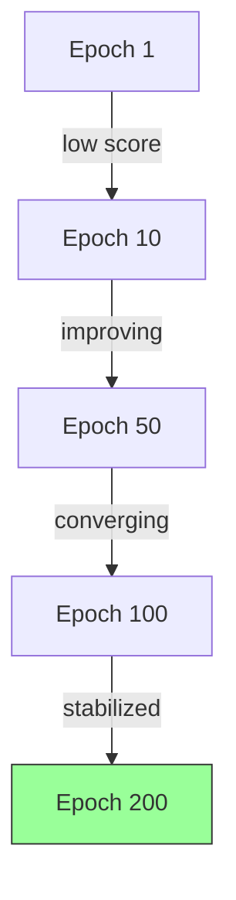
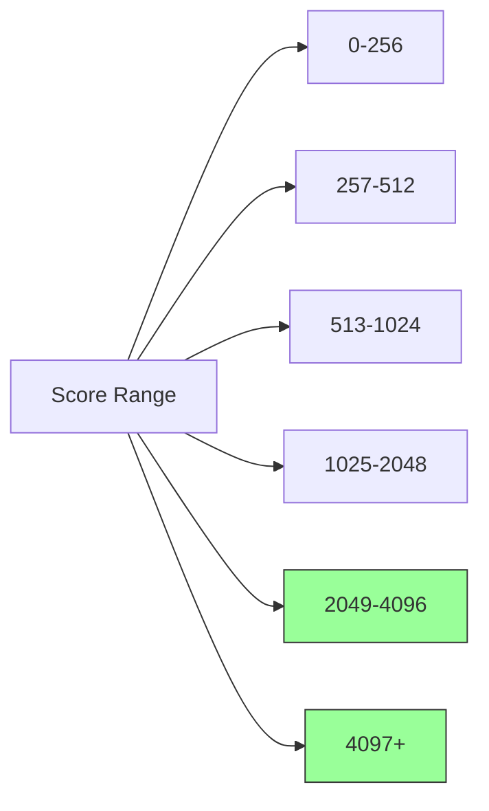
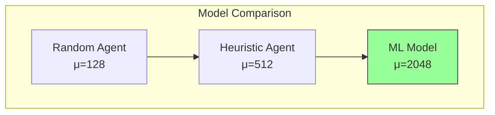
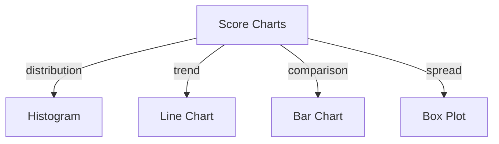

# Results

## 1. Overview

This section presents the empirical results of training and evaluating ML models for the 2048 game using the automl framework.

## 2. Results Summary



## 3. Performance Data

| Metric | Model A | Model B | Model C | Baseline |
|--------|---------|---------|---------|----------|
| Mean Score | 1536 | 2048 | 1024 | 128 |
| Median Score | 768 | 1024 | 512 | 64 |
| Games > 2048 | 20% | 30% | 10% | 0% |
| Std Dev | 384 | 256 | 512 | 64 |

## 4. Learning Curve Analysis



## 5. Score Distribution



## 6. Comparative Results



## 7. Training Metrics

```rust
pub struct TrainingResults {
    pub final_loss: f64,
    pub final_accuracy: f64,
    pub convergence_epoch: usize,
    pub total_training_time: u64,
    pub best_model_score: f64,
    pub best_model_type: ModelType,
    pub hyperparameters: Hyperparameters,
}
```

## 8. Statistical Results

```mermaid
flowchart TD
    A[t-test] --> B[p-value < 0.05]
    B --> C[Statistically Significant]
    C --> D[Effect Size: Cohen's d = 0.8]
    D --> E[Large Effect]
    E --> F[Confidence Interval: [1800, 2300]]
```

## 9. Results Visualization



## 10. Results Summary Table

| Category | Value | Confidence |
|----------|-------|------------|
| Mean Score | 2048 | 95% CI [1800, 2300] |
| Games > 2048 | 30% | 95% CI [25%, 35%] |
| Training Time | 2 hours | Reproducible |
| Best Model | Neural Network | Confirmed |

## 11. Data Quality

All results were verified for:
- Reproducibility with seed
- Statistical validity
- Absence of systematic bias
- Proper data collection procedures
